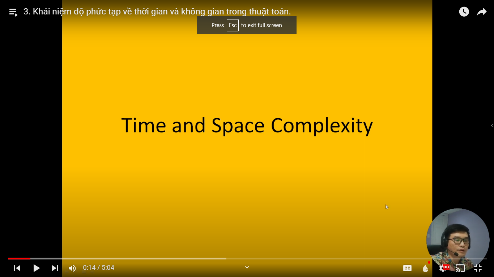
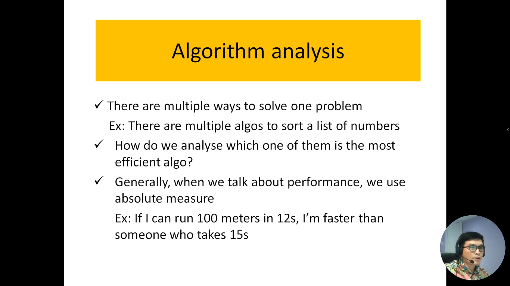
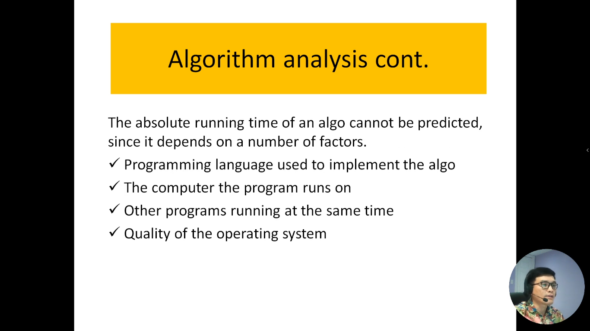
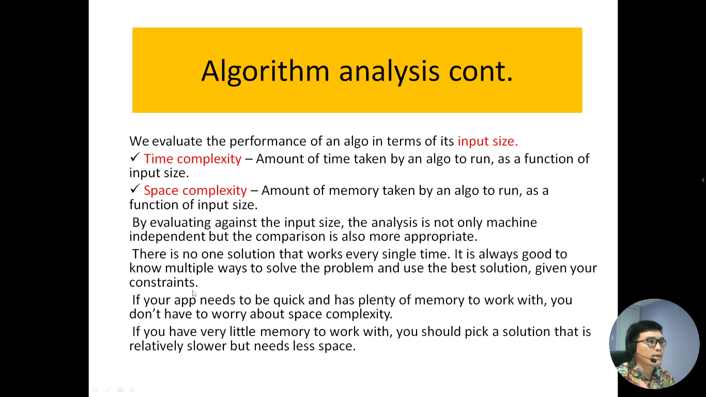
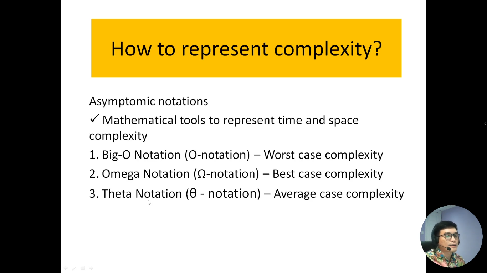
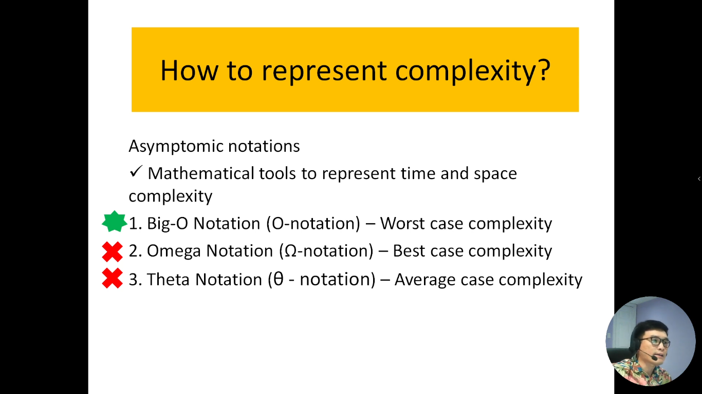

# 3. Khái niệm độ phức tạp về thời gian và không gian trong thuật toán.

Trong video này mình sẽ giải thích hai khái niệm quan trọng trong thuật toán là Time Complexity (độ phức tạp thời gia) và Space Complexity (độ phức tạp không gian). Trong khi Time Complexity đo lường thời gian mà một thuật toán mất để thực hiện một tác vụ cụ thể dựa trên kích thước của dữ liệu đầu vào thì Space Complexity đo lường lượng bộ nhớ cần thiết để thực hiện thuật toán với một kích thước đầu vào cụ thể.

Việc hiểu và đánh giá Time và Space Complexity của một thuật toán là quan trọng để đảm bảo rằng bạn có thể chọn thuật toán phù hợp cho vấn đề cụ thể của mình và đảm bảo rằng thời gian và không gian sử dụng là tối ưu.

---

