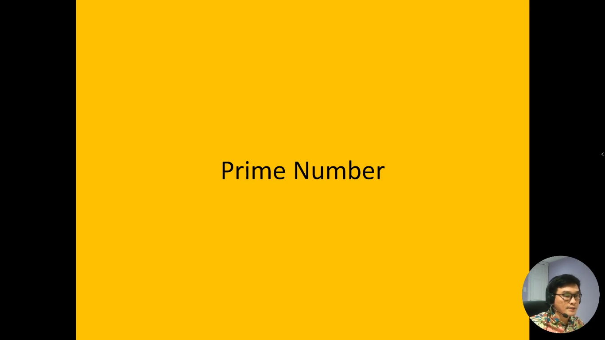
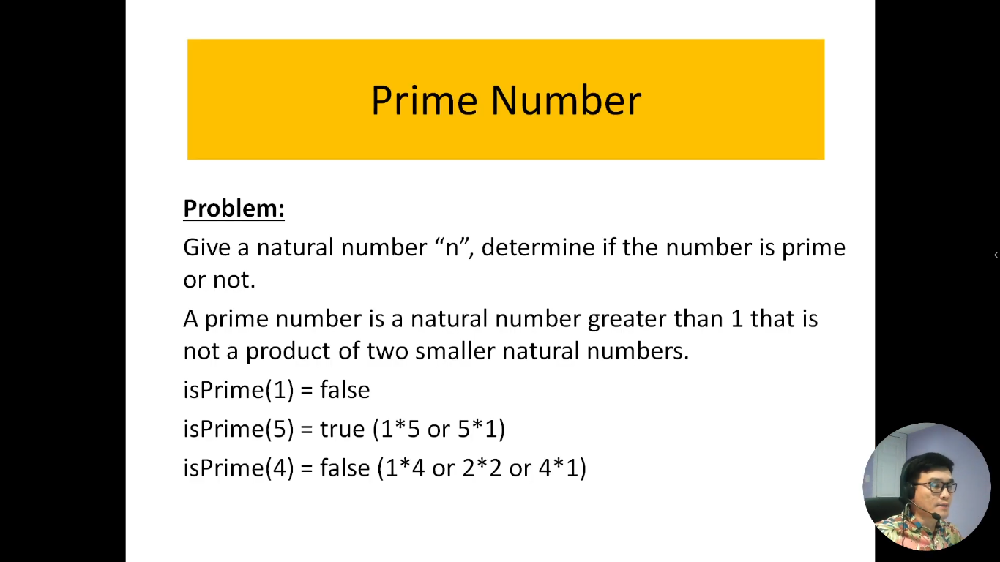
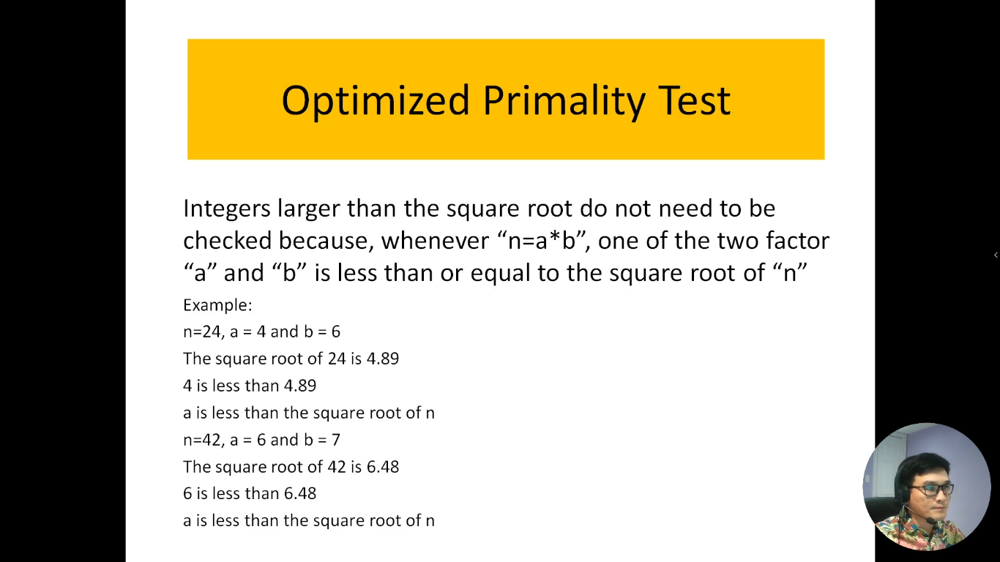
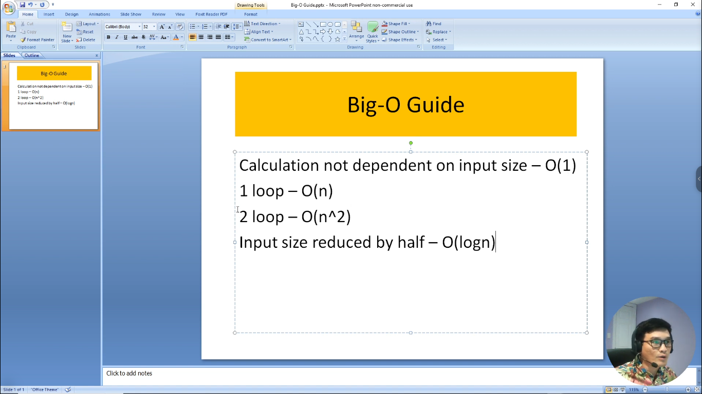

# 8. Thuật toán xác định số nguyên tố

Trong lĩnh vực khoa học máy tính và toán học, việc xác định số nguyên tố là một vấn đề quan trọng. Số nguyên tố là các số tự nhiên lớn hơn 1 mà chỉ có hai ước số dương là 1 và chính nó. Thuật toán xác định số nguyên tố là một quy trình tính toán để kiểm tra xem một số có phải là số nguyên tố hay không. Trong phạm vi giới thiệu này, chúng ta sẽ khám phá các thuật toán phổ biến để xác định số nguyên tố, từ thuật toán kiểm tra ước số đến các phương pháp hiệu quả hơn. Chúng ta sẽ hiểu cách những thuật toán này hoạt động và làm thế nào chúng có thể được áp dụng để giải quyết các vấn đề thực tế trong lập trình và toán học.

---

---

Đây là slide hướng dẫn tính độ phức tạp của thuật toán

- Giả sử thuật toán không phụ thuộc vào kích thước đầu vào thì ta có độ phức tạp là hằng số -> O(1)
- Nếu thuật toán có 1 vòng loop thì độ phức tạp đó là tuyến tính - O(n)
- Nếu thuật toán có 2 vòng loop thì độ phức tạp đó là hàm n mũ 2 - O(n^2)
- Mỗi đầu vào mà kích cỡ nó giảm đi 1 nửa thì độ phức tạp của nó là hàm logaric - O(logn)
