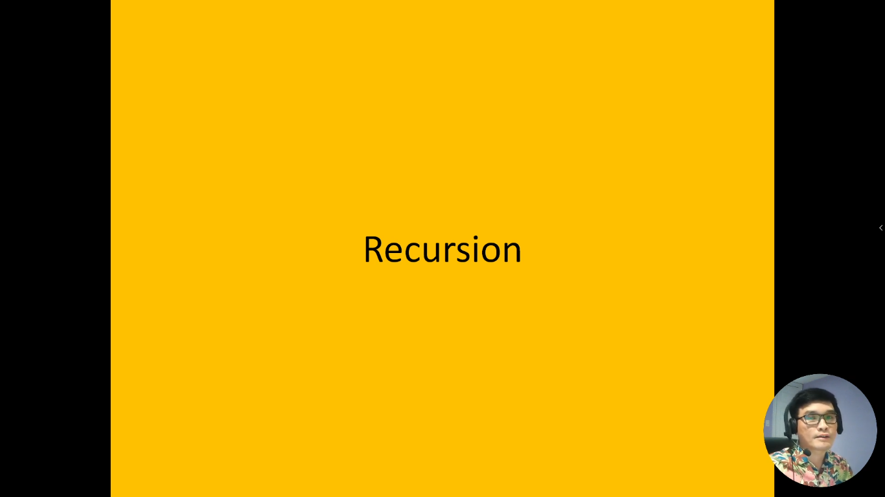
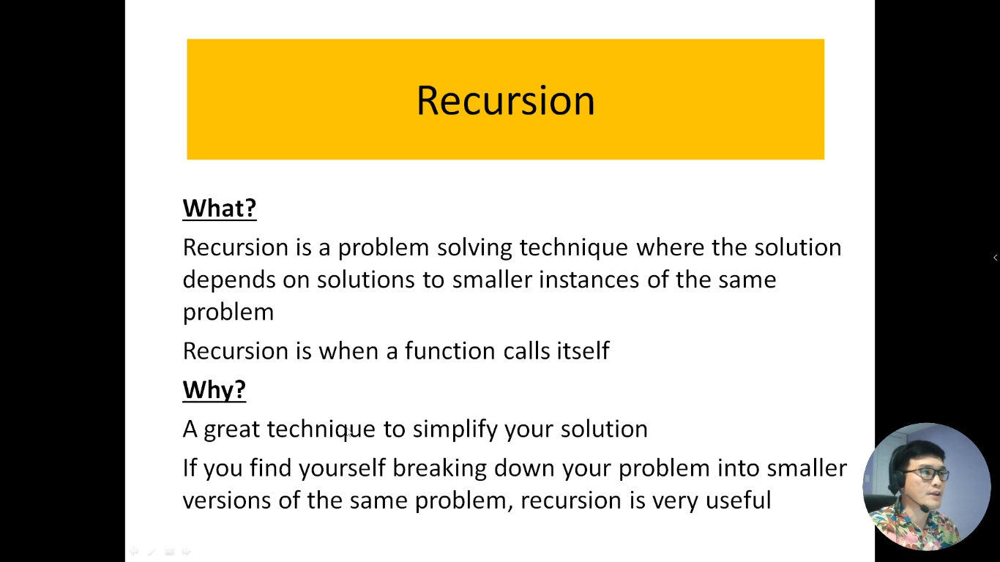
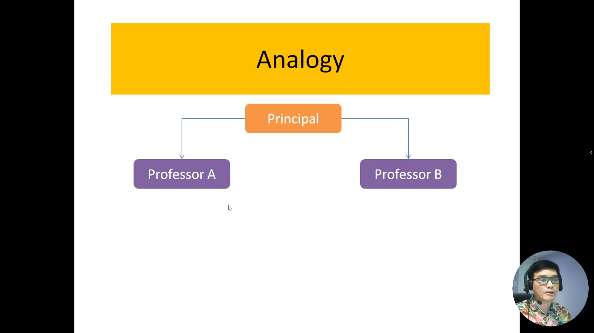
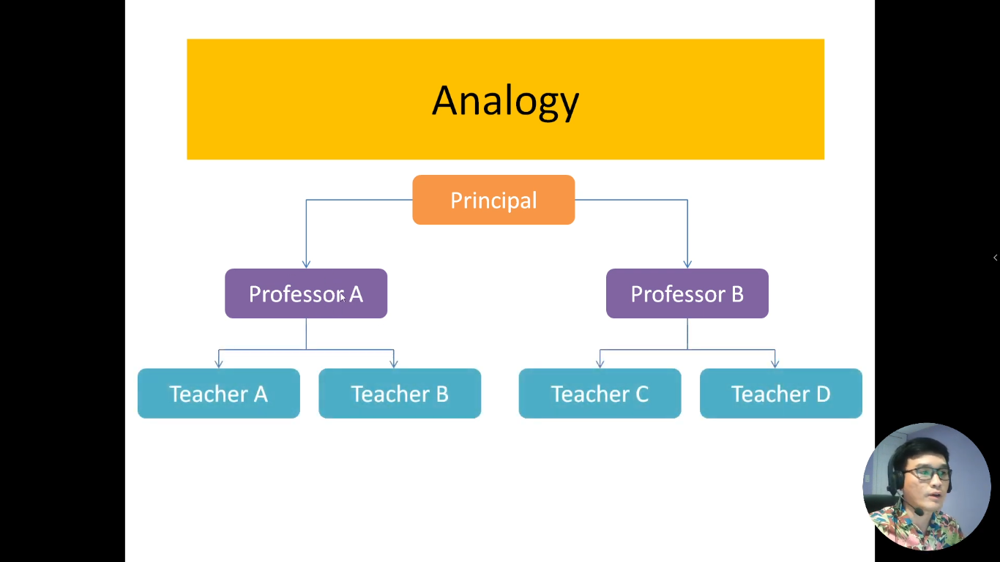
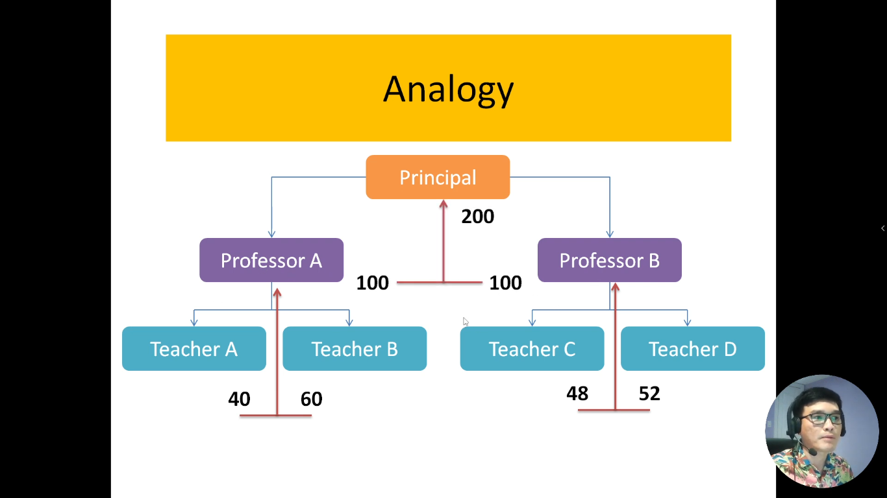
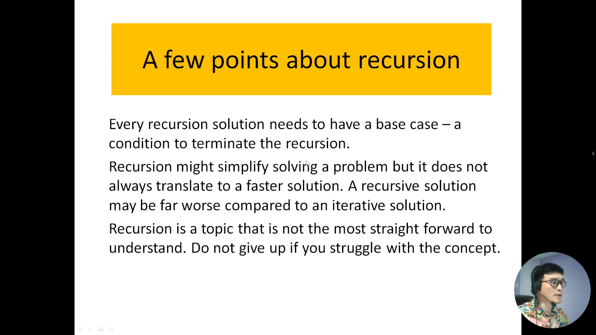

# 11. Hàm đệ quy là gì?

Hàm đệ quy là một khía cạnh quan trọng của lập trình và toán học, đặc biệt trong việc giải quyết các vấn đề mà có tính chất lặp lại hoặc chia nhỏ thành các bài toán con tương tự. Được xây dựng trên nguyên tắc gọi chính nó, hàm đệ quy cung cấp một cách tiếp cận mạnh mẽ để giải quyết các vấn đề phức tạp.

Trong quá trình giới thiệu này, chúng ta sẽ khám phá khái niệm của hàm đệ quy và làm thế nào chúng hoạt động. Chúng ta sẽ thấy rằng hàm đệ quy thường phù hợp cho các bài toán mà có cấu trúc tương tự trong đó giải pháp toàn cục có thể được xây dựng từ giải pháp của các bài toán con. Hàm đệ quy có thể là một cách mạnh mẽ để giải quyết các bài toán như tìm kiếm dãy số, tính toán giai thừa, và nhiều vấn đề toán học phức tạp khác.

Chúng ta sẽ xem xét cách xây dựng và triển khai hàm đệ quy, cũng như điều quan trọng là cách kiểm soát việc gọi đệ quy để tránh việc lặp vô hạn. Hàm đệ quy không chỉ là một khía cạnh quan trọng của lập trình, mà còn giúp chúng ta hiểu rõ hơn về cách tiếp cận giải quyết các vấn đề phức tạp trong khoa học máy tính và toán học.

---

