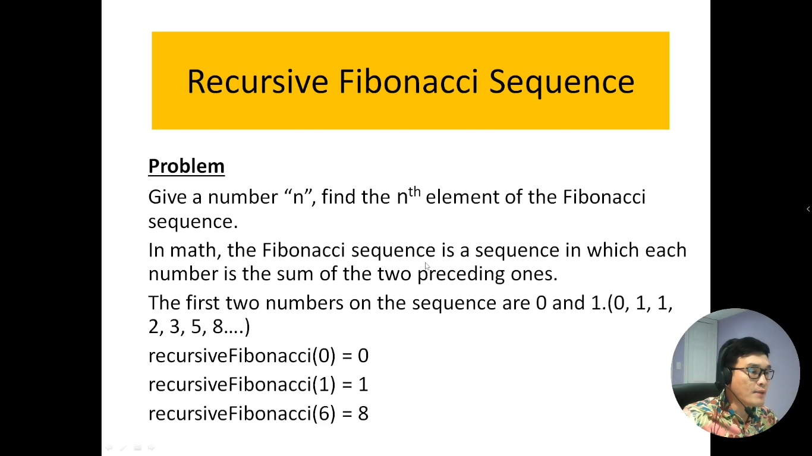
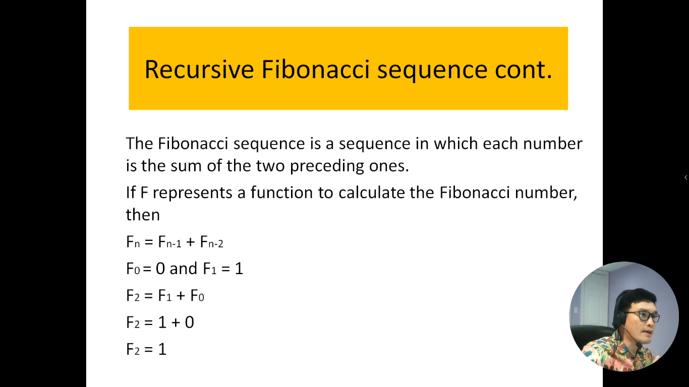
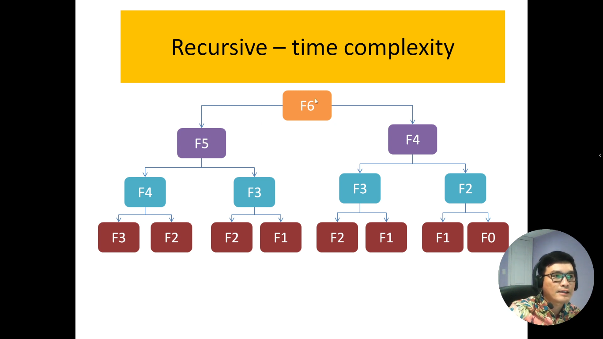
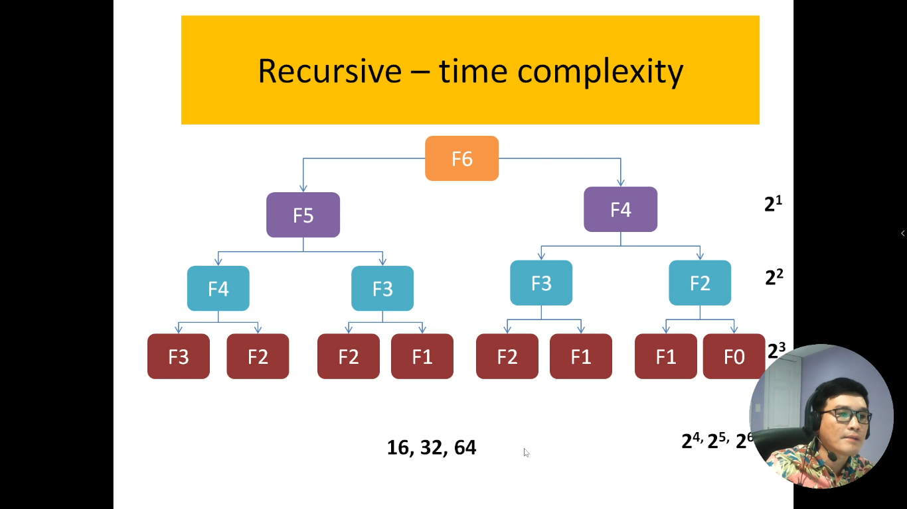

# 12. Tính giá trị thứ n trong chuỗi Fibonacci dùng phương pháp đệ quy

Chuỗi Fibonacci là một chuỗi số tự nhiên rất quen thuộc và thú vị trong lĩnh vực toán học và khoa học máy tính. Chuỗi này bắt đầu bằng hai số 0 và 1, và các số tiếp theo trong chuỗi được tạo ra bằng cách cộng hai số trước đó lại với nhau. Điều này tạo ra một chuỗi số độc đáo với nhiều ứng dụng thú vị, từ tài chính đến phân tích dãy số.

Trong giới thiệu này, chúng ta sẽ tập trung vào cách tính giá trị thứ n trong chuỗi Fibonacci bằng phương pháp đệ quy. Phương pháp đệ quy là một cách giải quyết vấn đề bằng cách chia nhỏ nó thành các vấn đề con nhỏ hơn và giải quyết chúng. Để tính giá trị thứ n trong chuỗi Fibonacci bằng đệ quy, chúng ta sẽ xem xét cách tính giá trị của hai số trước đó và kết hợp chúng để tạo ra giá trị mới.

Chúng ta sẽ khám phá thuật toán đệ quy để tính giá trị Fibonacci, làm rõ cách nó hoạt động, và xem xét cả ưu điểm và hạn chế của việc sử dụng phương pháp đệ quy trong bài toán này. Đồng thời, chúng ta sẽ cung cấp các ví dụ và hướng dẫn cụ thể để giúp bạn hiểu cách tính giá trị thứ n trong chuỗi Fibonacci bằng phương pháp đệ quy.

---

---

## Giải thích bài toán

Cách thực thi của thuật toán fibonacci

nó có kết quả xong -> rồi sau đó nó sẽ trả ngược lên

- Bởi vì mình truyền vào hàm là số 6 nên thuật toán bắt đầu chạy từ số 6 trở xuống
- Nó bắt đầu chạy từ F6 --> xuống F5 và F4 (nó chạy 2 lần có nghĩa là 2^1. Vì 2^1 = 2)
- Tiếp theo đó F5 và F4 mỗi hàm nó chạy 2 lần (tổng cộng là 4 lần. Là 2^2)
- Tiếp theo đó F4, F3, F3, F2, mỗi cái nó chạy 2 lần (tổng cộng là 8 lần. Là 2^3)

=> Vậy thuật toán này có độ phức tạp là: O(2^n)

---

**Bản đồ time-complexity**

