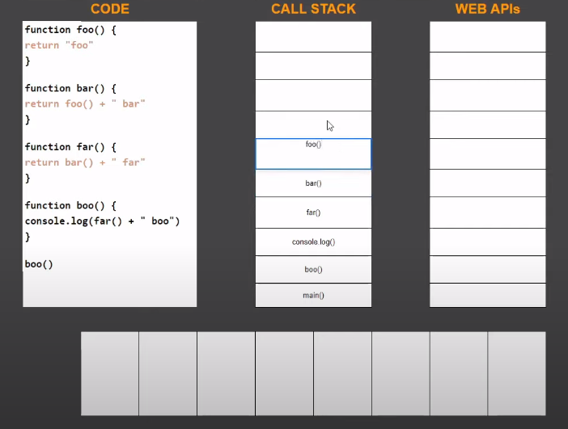
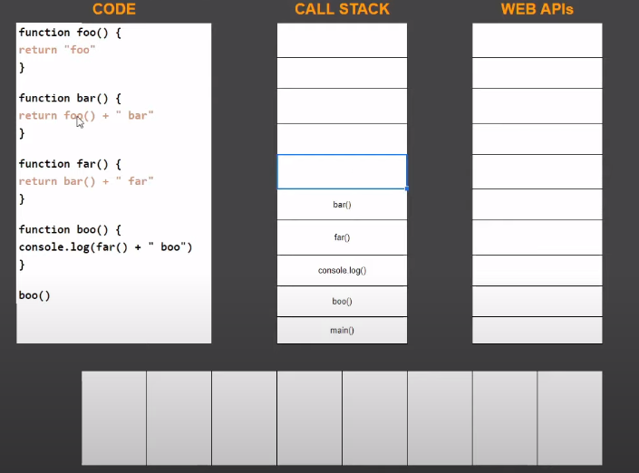
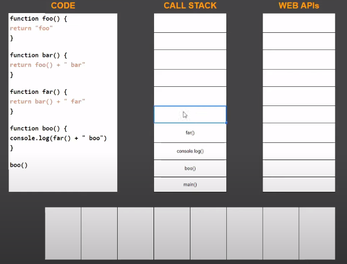

- Dưới đây là các luồng chạy của code trong stack

- Trước tiên thì thằng chạy đầu tiên vào callstack đó là hàm `main()`

- Khi code ở trong hàm `foo()` nó return về giá trị `foo` thì nó sẽ pop ra khỏi callstack  và sau đó nó quay ngược lại thằng `bar()`, nó có data ở đây và nó cộng với thằng `bar`, sau đó thằng `bar()` nó lại pop ra khỏi thằng callstack tiếp . Sau đó nó xuống `far()`, nó có giá trị và nó sẽ pop ra khỏi callstack. Và nó sẽ xuống thằng `boo()`, nó sẽ `console.log()` ra giá trị. Khi nó chạy xong cái `console` á thì nó sẽ pop `console` ra. Sau đó thì xuống thằng `boo()`, nó pop thằng `boo()` ra.
- Và cuối cùng thì nó pop thằng `main()`. Sau đó trong callstack của chúng ra rỗng
