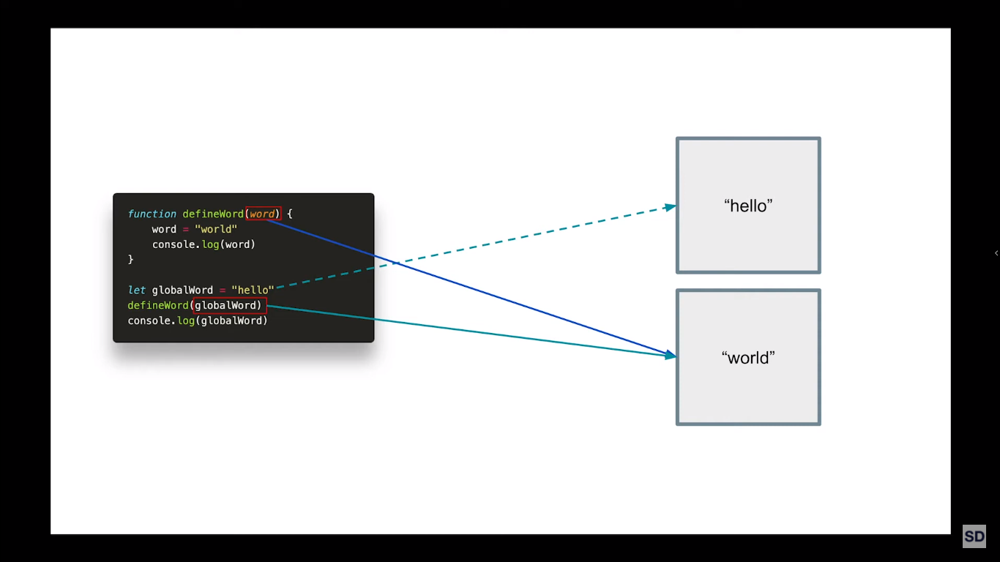
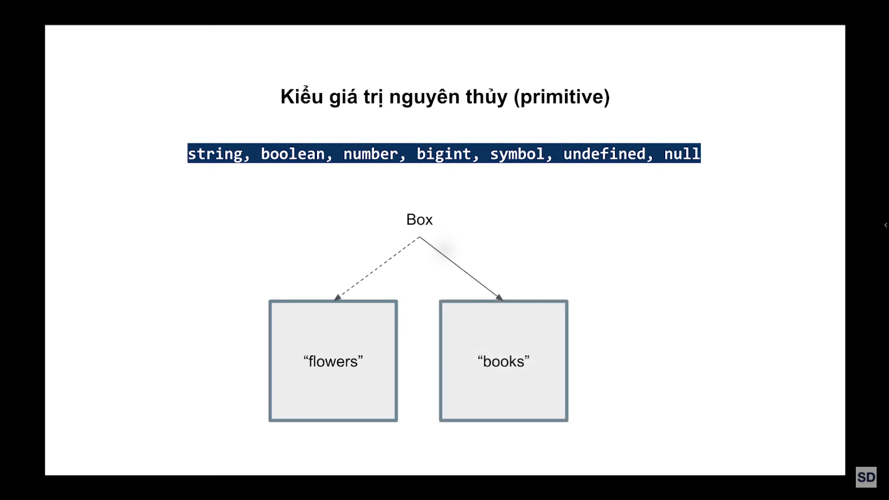
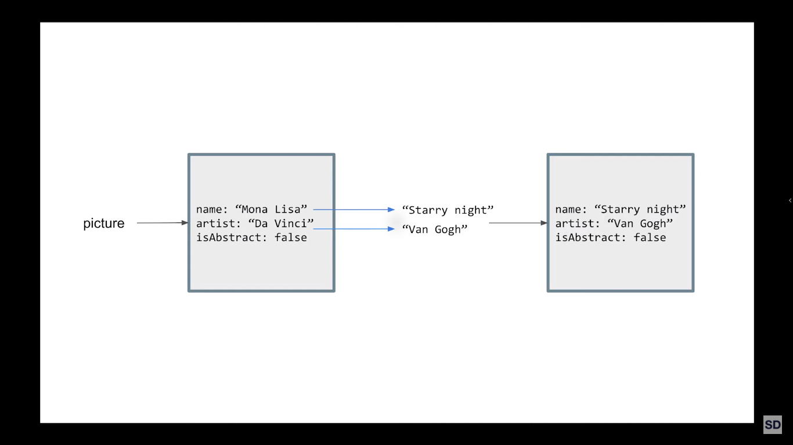

# Hiểu đúng về tham chiếu JavaScript

Có nhiều người hay phàn nàn rằng JavaScript là thứ ngôn ngữ kỳ quặc, tiềm ẩn nhiều thứ làm cho lập trình viên gây nhiều lỗi, tôi cho rằng không hẳn do JS, chẳng qua là chúng ta chưa đủ hiểu nó. Tham chiếu trong JS cũng vậy, mặc dù cơ bản nhưng có những điểm mà ngay cả một số lập trình viên lâu năm bỏ sót và đôi lúc gặp sai lầm khó hiểu.

---

---

- [Link video](https://s.net.vn/8siS)

- [Link Blog](https://viiiprock.com/blog/hieu-dung-ve-tham-chieu-javascript-60444e961d966e6c44778a23#article)
