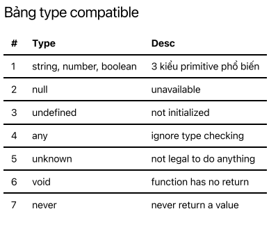
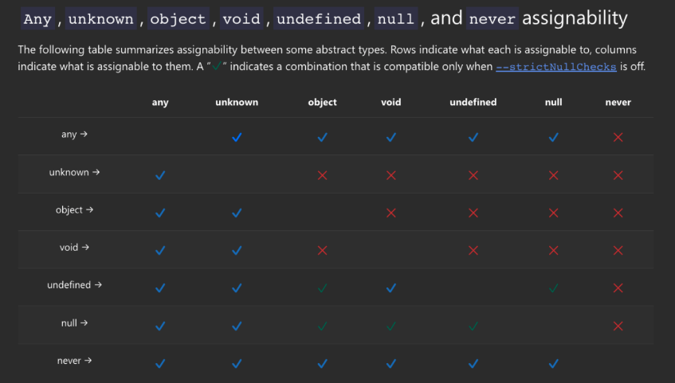

# Trong bài này chúng ta sẽ học về: Typescript: 03-03 Điều cần lưu ý khi làm việc với function 🎉

- void, never là một số lưu ý khi làm việc với hàm trong typescript 😉

- Làm thế nào để định nghĩa optional hay default params cho function?

### Trong bài này chúng mình sẽ học về

- Default function return type
- Explicit return type
- Optional and default parameter
- Function Overload
- Other type: void and never
- Destructuring parameter

### Bảng type compatible

