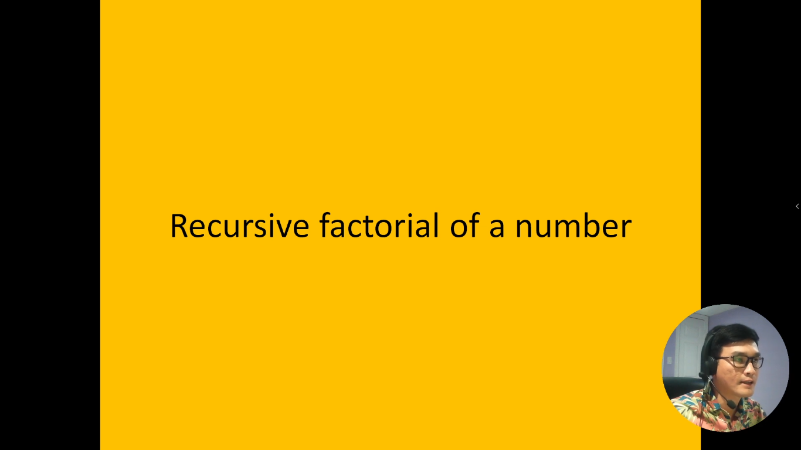
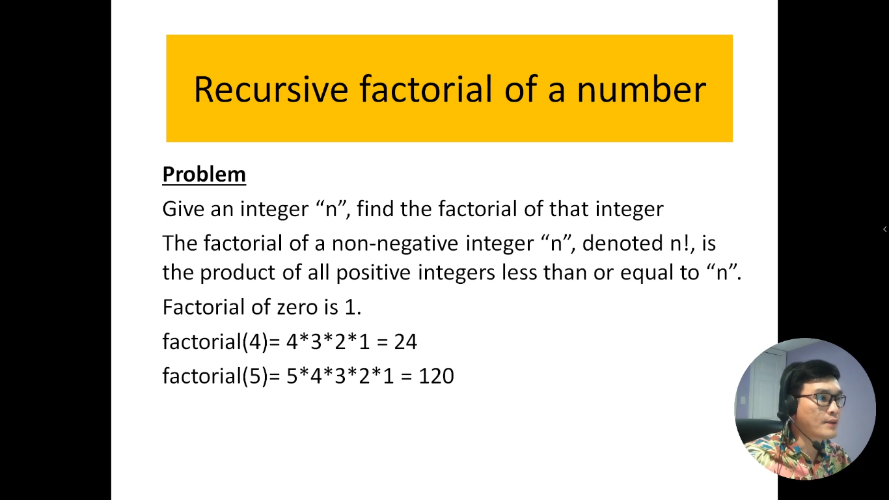
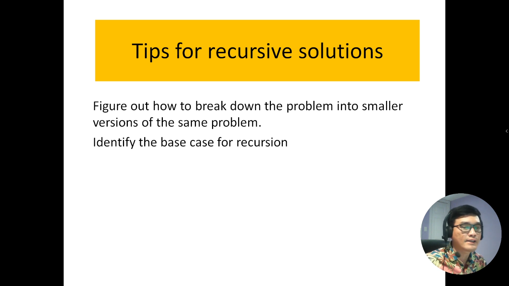
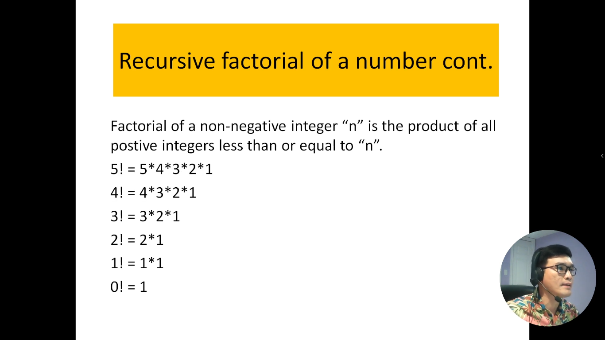
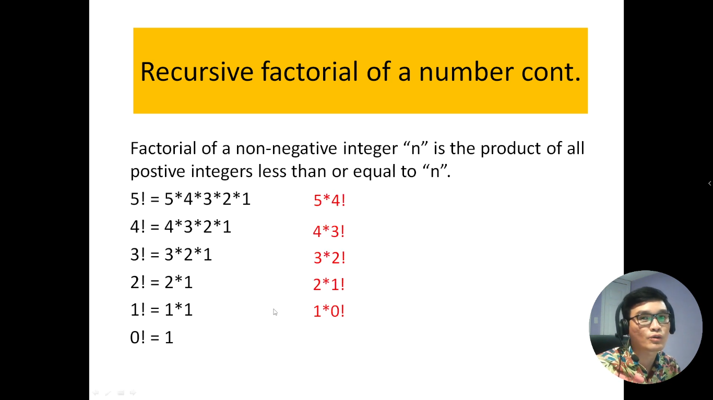
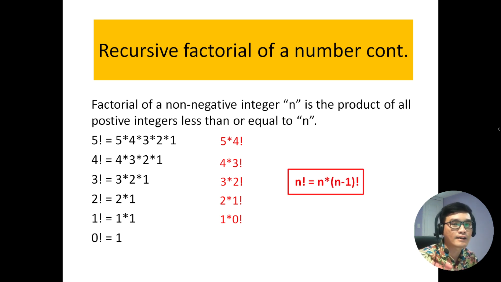
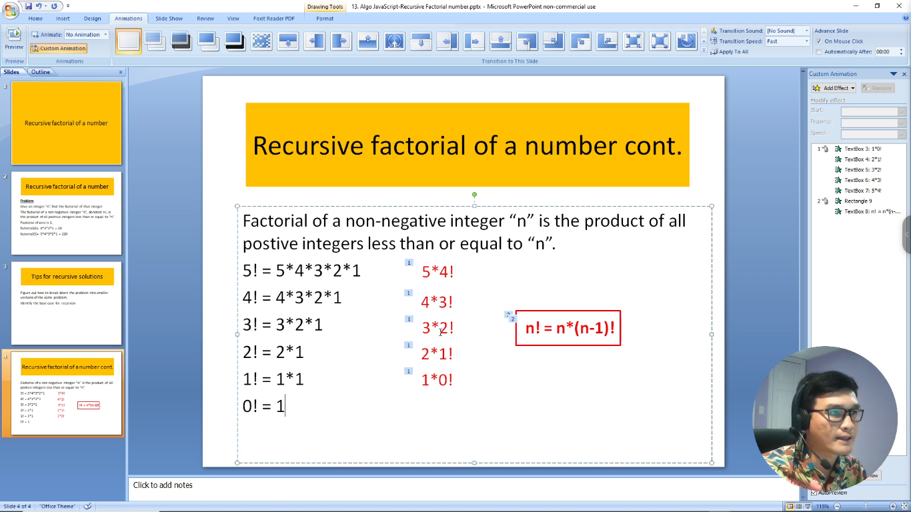

# 13. Tính giai thừa của một số bằng phương pháp đệ quy.

Giai thừa là một phép tính toán quan trọng trong toán học, thường được sử dụng để đo lường sự tăng theo cấp số học của một dãy số. Đặc biệt, giai thừa của một số nguyên dương n (được ký hiệu là n!) là tích của tất cả các số nguyên dương từ 1 đến n. Ví dụ, giai thừa của 5 là 5! = 5 x 4 x 3 x 2 x 1 = 120.

Trong giới thiệu này, chúng ta sẽ khám phá cách tính giai thừa của một số bằng phương pháp đệ quy. Phương pháp đệ quy là một cách tiếp cận trong giải quyết vấn đề bằng cách chia nhỏ nó thành các vấn đề con nhỏ hơn và giải quyết chúng. Để tính giai thừa bằng đệ quy, chúng ta sẽ xem xét cách tính giai thừa của số (n) dựa trên giai thừa của số nhỏ hơn (n - 1).

Chúng ta sẽ tìm hiểu về cách thuật toán đệ quy tính giai thừa hoạt động, cũng như xem xét cả ưu điểm và hạn chế của việc sử dụng phương pháp đệ quy trong bài toán tính giai thừa. Bên cạnh đó, chúng ta sẽ cung cấp ví dụ cụ thể và hướng dẫn để giúp bạn hiểu cách tính giai thừa của một số bằng phương pháp đệ quy.

---

---

# Giải thích bài toán

## Độ phức tạp thời gian (Time-Complexity) của thuật toán

- Nếu giai thừa của 5 thì thuật toán gọi 5 lần
- Nếu giai thừa của 4 thì thuật toán gọi 4 lần
- ...
- Giai thừa của n thì nó gọi n lần

=> Vậy độ phức tạp thời gian của nó là tuyến tính: `Big-O = O(n)`
