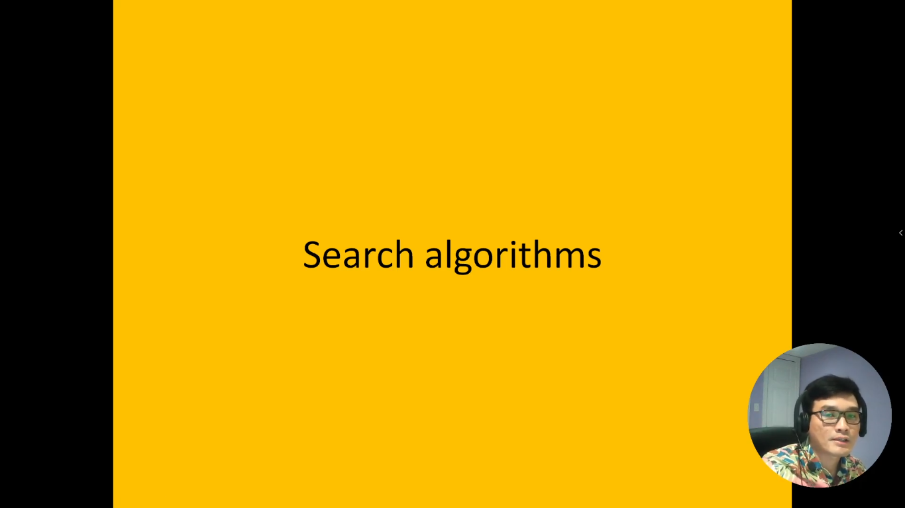
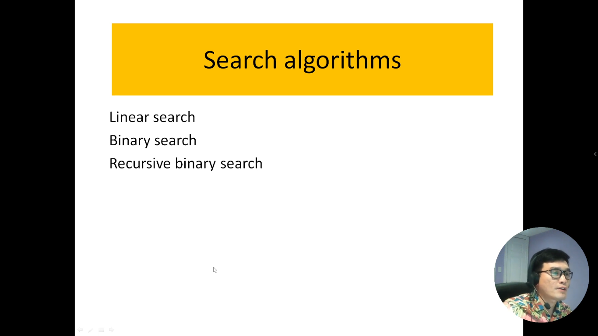
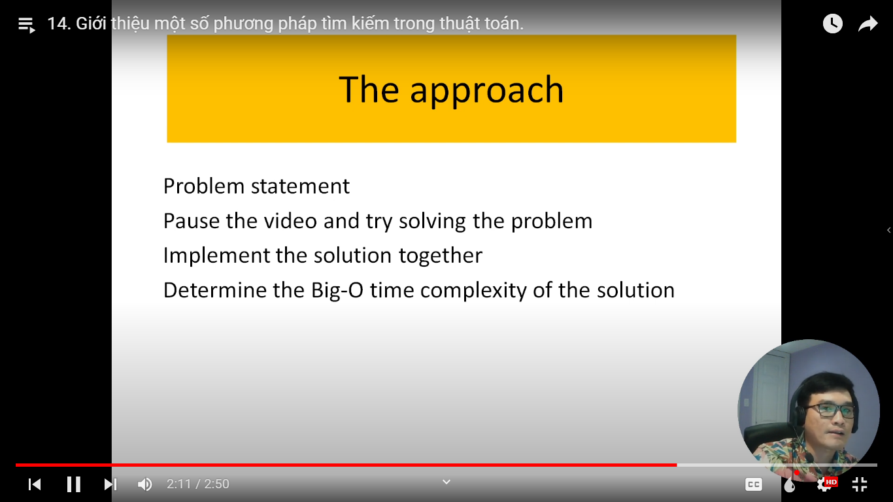

# 14. Giới thiệu một số phương pháp tìm kiếm trong thuật toán.

Khi chúng ta nói về tìm kiếm trong dãy số hoặc dãy dữ liệu, có một số phương pháp quan trọng và thường được sử dụng để tìm kiếm một phần tử cụ thể. Trong bài này, chúng ta sẽ tìm hiểu về ba phương pháp quan trọng này: tìm kiếm tuyến tính, tìm kiếm nhị phân và tìm kiếm nhị phân đệ quy.

Tìm kiếm tuyến tính: Phương pháp tìm kiếm tuyến tính là cách đơn giản nhất để tìm kiếm một phần tử trong một danh sách. Nó hoạt động bằng cách duyệt qua từng phần tử của danh sách cho đến khi tìm thấy phần tử cần tìm hoặc đến cuối danh sách. Đây là một phương pháp dễ hiểu và áp dụng cho danh sách không được sắp xếp. Tuy nhiên, nó có độ phức tạp thời gian là O(n) trong trường hợp xấu nhất, nơi n là kích thước của danh sách.

Tìm kiếm nhị phân: Tìm kiếm nhị phân là một phương pháp tìm kiếm hiệu quả hơn, nhưng yêu cầu danh sách phải được sắp xếp theo thứ tự tăng dần. Phương pháp này hoạt động bằng cách so sánh phần tử cần tìm với phần tử giữa của danh sách và loại bỏ một nửa danh sách dựa trên kết quả so sánh. Tìm kiếm nhị phân có độ phức tạp thời gian là O(log n) trong trường hợp xấu nhất, nơi n là kích thước của danh sách.

Tìm kiếm nhị phân đệ quy: Tìm kiếm nhị phân đệ quy là một biến thể của tìm kiếm nhị phân, nhưng nó được thực hiện bằng cách sử dụng đệ quy. Phương pháp này tách danh sách thành hai nửa và tiếp tục tìm kiếm trên nửa phù hợp bằng cách gọi đệ quy. Điều này giúp giảm thiểu mã nguồn và làm cho mã trở nên dễ đọc hơn. Tuy nhiên, cần lưu ý rằng việc sử dụng đệ quy có thể gây ra vấn đề tràn bộ nhớ nếu không kiểm soát cẩn thận.

Các phương pháp tìm kiếm này đều có ưu điểm và hạn chế riêng, và việc lựa chọn phương pháp phụ thuộc vào bài toán cụ thể và cấu trúc dữ liệu bạn đang làm việc. Trong bài viết này, chúng ta sẽ xem xét từng phương pháp chi tiết hơn và cách thực hiện chúng trong các tình huống khác nhau.

---

- Nên search google về các khái niệm các thuật toán này
- Mỗi thuật toán mình nên tìm hiểu về ưu điểm và khuyết điểm

