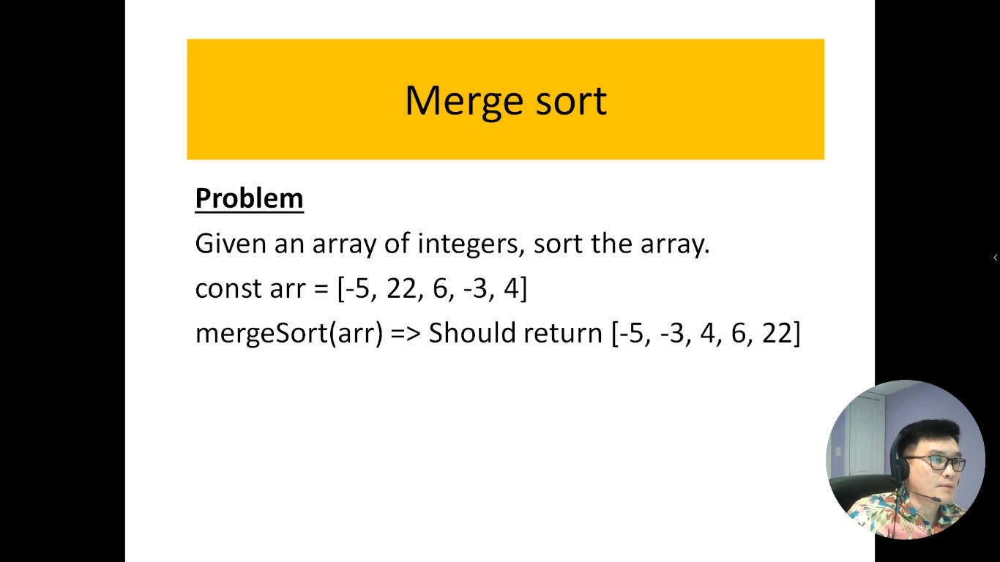
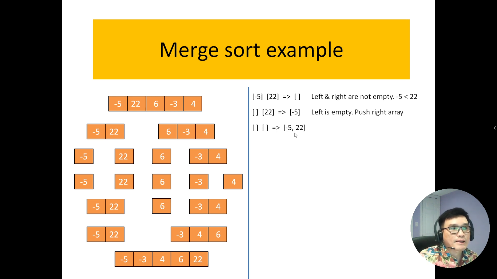
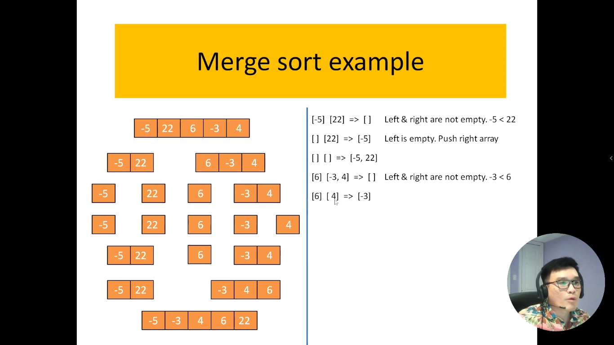
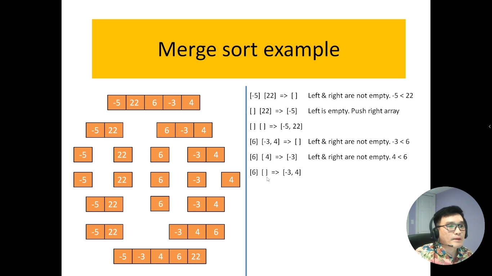
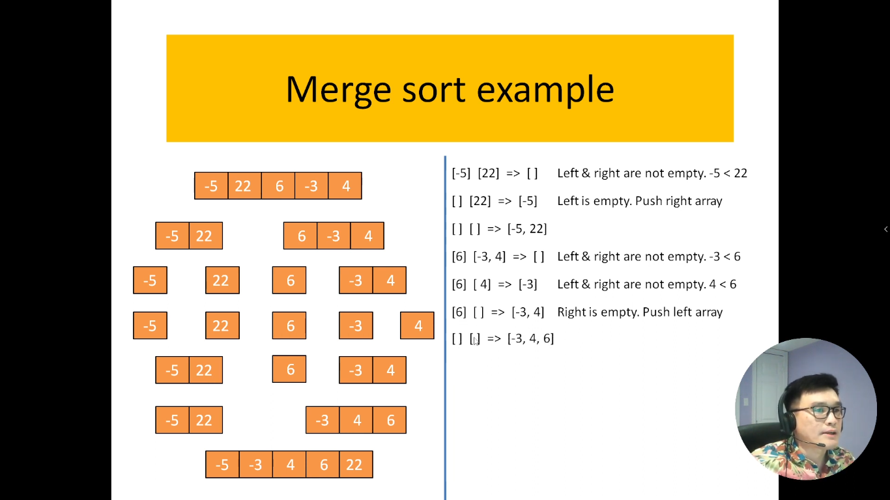
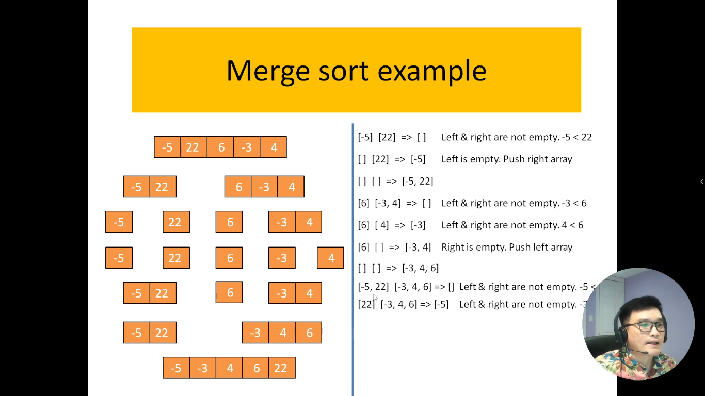
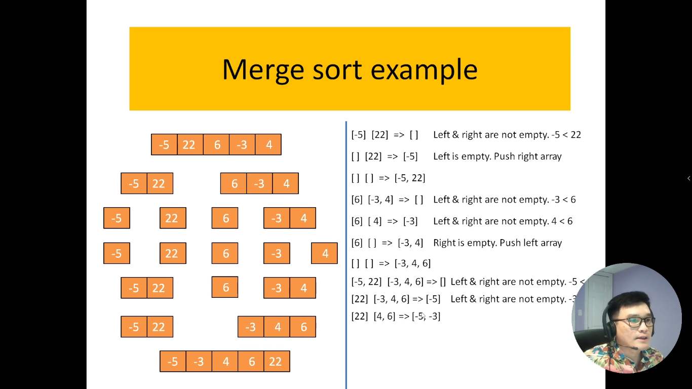
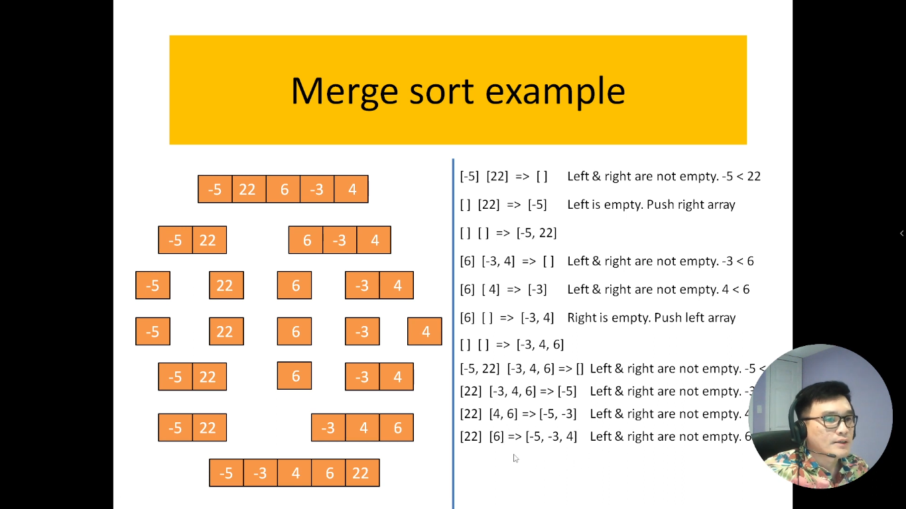
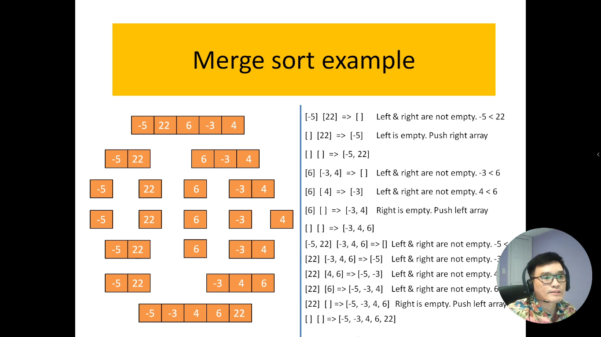
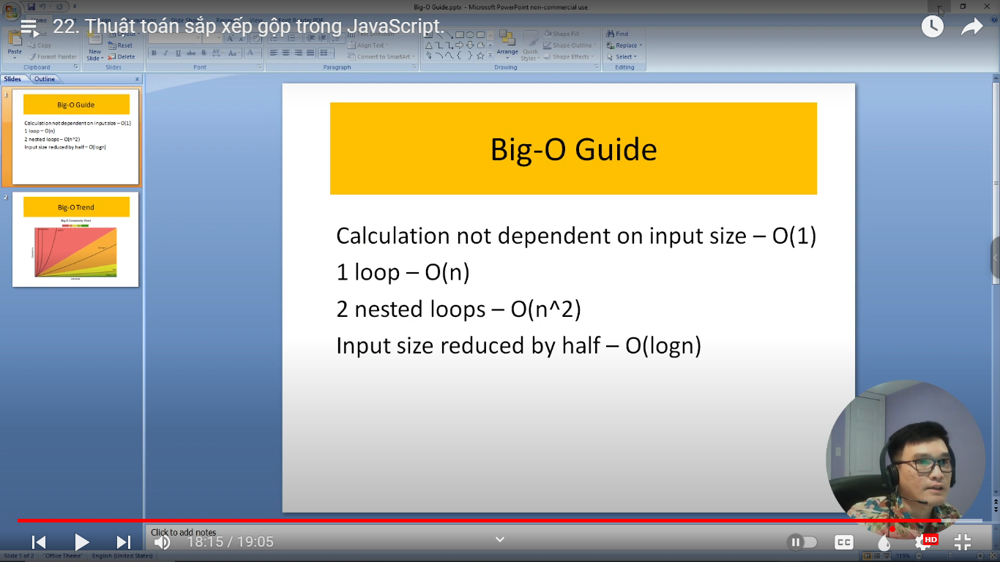

# 22. Thuật toán sắp xếp gộp trong JavaScript.

Sắp xếp gộp, hay còn được gọi là Merge Sort, là một thuật toán sắp xếp được thiết kế để sắp xếp một danh sách hoặc mảng thành thứ tự tăng dần hoặc giảm dần. Phương pháp này thực hiện việc chia nhỏ dãy số ban đầu thành các đoạn con nhỏ hơn, sau đó sắp xếp từng đoạn con đó và gộp chúng lại để tạo ra dãy số đã được sắp xếp.

Thuật toán Merge Sort có độ phức tạp thời gian ổn định và đảm bảo hiệu suất tốt trong trường hợp trung bình và tốt nhất. Quy trình sắp xếp gộp bao gồm ba bước chính:

Chia đoạn (Divide): Dãy số ban đầu được chia thành hai phần bằng nhau (hoặc gần bằng nhau).

Sắp xếp từng đoạn con (Conquer): Các đoạn con được sắp xếp đệ quy bằng cách áp dụng thuật toán Merge Sort cho từng nửa.

Gộp các đoạn con (Combine): Kết quả của hai đoạn con đã sắp xếp được gộp lại thành một dãy số đã được sắp xếp.

Thuật toán Merge Sort là một lựa chọn phổ biến trong lập trình và có ứng dụng rộng rãi, đặc biệt là khi cần đảm bảo tính ổn định của thứ tự sắp xếp. Mặc dù có độ phức tạp thời gian (time complexity) là O(nlogn), nhưng Merge Sort thường được ưa chuộng vì tính ổn định và khả năng sắp xếp các danh sách liên kết.

---

---

Ví dụ về thuật toán Merge Sort

1. So sánh [-5] và [22]

- Số nào nhỏ nào thì mình sẽ bỏ vào mảng rỗng
- Bên tay trái sẽ có 1 cái mảng rỗng -> sau đó mình sẽ đem mảng có giá trị đó chuyển qua bên trái luôn
  
- Cuối cùng ta thu được `[-5, 22]`

2. So sánh [6] và [-3, 4]

- Do 6 lớn hơn -3 nên bỏ -3 vào mảng tạm
  
- Do 4 nhỏ hơn 6 nên bỏ 4 vào mảng tạm
  
- Bỏ 4 vào mảng tạm rồi, nên bây giờ mảng đó thành mảng rỗng
  
- Do bên trái có 1 mảng rỗng -> thì ta lấy giá trị trong mảng hiện tại bỏ qua bên phải luôn
  
- Cuối cùng ta thu được `[-3, 4, 6]`

3. So sánh 2 mảng `[-5, 22]` và `[-3, 4, 6]`

- Bên phải chúng ta cũng có 1 mảng tạm
  
- So sánh -5 với -3 => -5 < -3 => -5 bỏ vào mảng tạm
  
- So sánh 22 với -3 => 22 > -3 => -3 bỏ vào mảng tạm
  
- So sánh 22 với 4 => 22 > 4 => 4 bỏ vào mảng tạm
  
- So sánh 22 với 6 => 22 > 6 => 6 bỏ vào mảng tạm
  

Do bên vế trái có 1 phần mảng bên phải bị rỗng nên ta thực hiện đêm giá trị của mảng không rỗng bỏ vào mảng bên phía tay phải

Cuối cùng ta sẽ được mảng `[-5, -3, 4, 6, 22]`

---

## Tổng quan lại ví dụ của thuật toán trên

## Ví dụ về thuật toán Merge Sort

### Bước 1: So sánh [-5] và [22]

- Số nào nhỏ nào thì mình sẽ bỏ vào mảng rỗng.
- Bên tay trái sẽ có 1 cái mảng rỗng -> sau đó mình sẽ đem mảng có giá trị đó chuyển qua bên trái luôn.

### Bước 2: So sánh [6] và [-3, 4]

- Do 6 lớn hơn -3 nên bỏ -3 vào mảng tạm.
- Do 4 nhỏ hơn 6 nên bỏ 4 vào mảng tạm.
- Bỏ 4 vào mảng tạm rồi, nên bây giờ mảng đó thành mảng rỗng.
- Do bên trái có 1 mảng rỗng -> thì ta lấy giá trị trong mảng hiện tại bỏ qua bên phải luôn.

### Bước 3: So sánh 2 mảng `[-5, 22]` và `[-3, 4, 6]`

- Bên phải chúng ta cũng có 1 mảng tạm.
- So sánh -5 với -3 => -5 < -3 => -5 bỏ vào mảng tạm.
- So sánh 22 với -3 => 22 > -3 => -3 bỏ vào mảng tạm.
- So sánh 22 với 4 => 22 > 4 => 4 bỏ vào mảng tạm.
- So sánh 22 với 6 => 22 > 6 => 6 bỏ vào mảng tạm.

Do bên vế trái có 1 phần mảng bên phải bị rỗng nên ta thực hiện đêm giá trị của mảng không rỗng bỏ vào mảng bên phía tay phải.

## Cuối cùng ta sẽ được mảng `[-5, -3, 4, 6, 22]`.

---

# Phân tích độ phức tạp về thời gian của thuật toán (Time-Complexity)

- Vòng lặp thứ 1: Trong bài toán của mình có dùng phép toán chia 1 nửa, khi nó chạy thì array sẽ giảm 1 nửa. Nên độ phức tạm là `O(logn)`

- Vòng lặp thứ 2: Trong đó nó lặp bình thường, khi hết vòng lặp này thì đến vòng lặp khác. Cho nên nó là tuyến tính. Nên độ phức tạp là `O(n)`

=> Kết hợp 2 vòng lặp lại mình có được độ phức tạp: `O(nlogn)`

Vậy `BigO = O(nlogn)`
