# [JavaScript chuyên sâu] : Đồng bộ và bất đồng bộ của JavaScript - phần 1: Callback

JavaScript là ngôn ngữ đơn luồng (single threaded) đồng bộ (synchronous), nhờ vào môi trường browser và nodejs, JavaScript có thể chạy được bất đồng bộ (asynchronous), đa luồng (mutiple threaded).

Video giới thiệu về sự khác biệt giữa đồng bộ và bất đồng bộ của JavaScript và về callback function, giúp xử lý dữ liệu bất đồng bộ.

Callback pattern còn là một hình thức thiết kế giúp DRY (Don't Repeat Yourself): tránh lặp lại code, giúp bảo trì code tốt hơn trong JavaScript.

JavaScript bất đồng bộ là nội dung phức tạp và và khá lạ, khi chúng ta cần tìm hiểu về cơ chế xử lý event loop của trình duyệt và nodejs. Như vậy để hiểu rõ dược cơ chế đồng bộ và bất đồng bộ của JavaScript, tức synchronous và asynchronous, chúng ta phải nắm được toàn bộ bức tranh tổng thể.

---

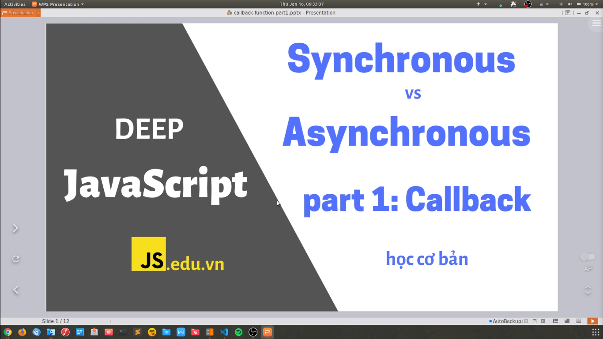
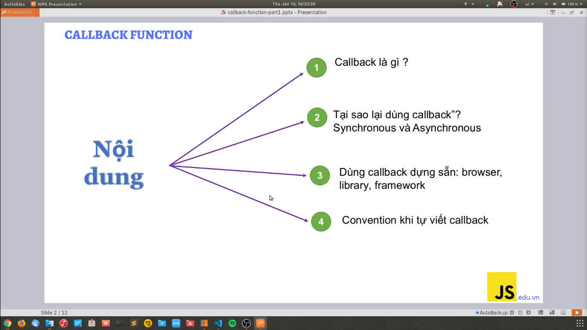
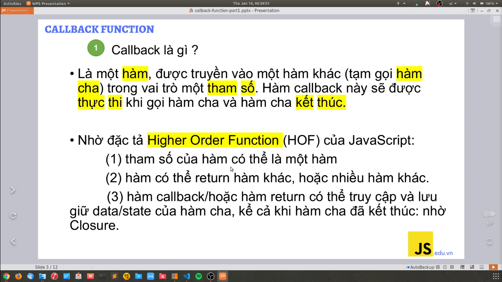
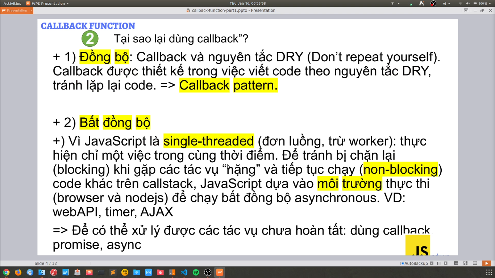

---

Callback trong việc xử lý bất đồng bộ

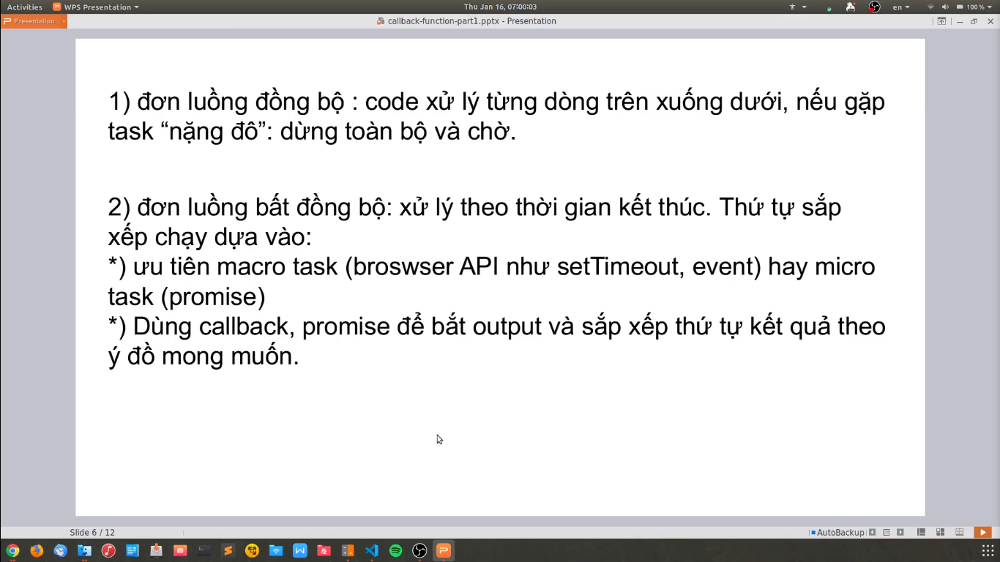

- Engine của JavaScript là xử lý đồng bộ, nó thực thi từng dòng code, từ trên xuống dưới
- Thật chất ra ngôn ngữ JavaScript là ngôn ngữ đồng bộ, nhờ vào Browser và NodeJS mà nó có thể xử lý bất đồng bộ được
- Khi những hàm này chạy trên browser và nó thực thi theo thứ tự của callstack và cuối cùng nó sẽ trả kết quả về cho chúng ta
- Tóm lại: chúng ta phải dùng callback để có thể viết code dễ hiểu, dễ maintain, đồng thời nó giúp cho chúng ta xử lý code theo kiểu đồng bộ, và chúng ta sẽ lấy được các kết quả theo mong muốn của chúng ta

---

Các ví dụ về JavaScript xử lý đồng bộ và bất đồng bộ như thế nào?

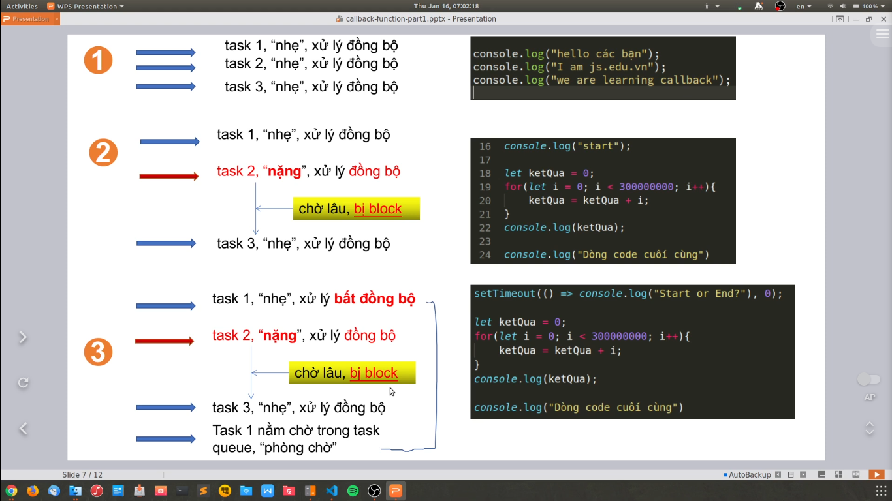
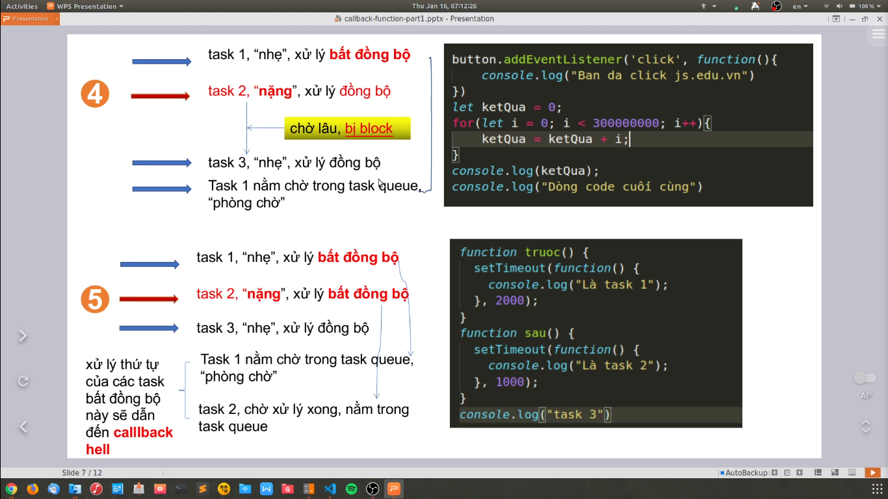

Các thư viện, framework xử lý nodejs như thế nào?

- Hàm request là 1 hàm mà nó nhận vào callback

- Nó nhận vào 2 tham số:
  - tham số 1 là object
  - tham số 2 là callback

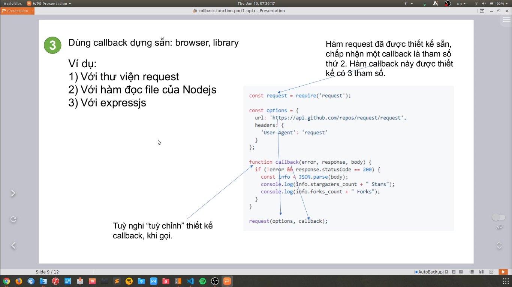

Các hàm trong NodeJS

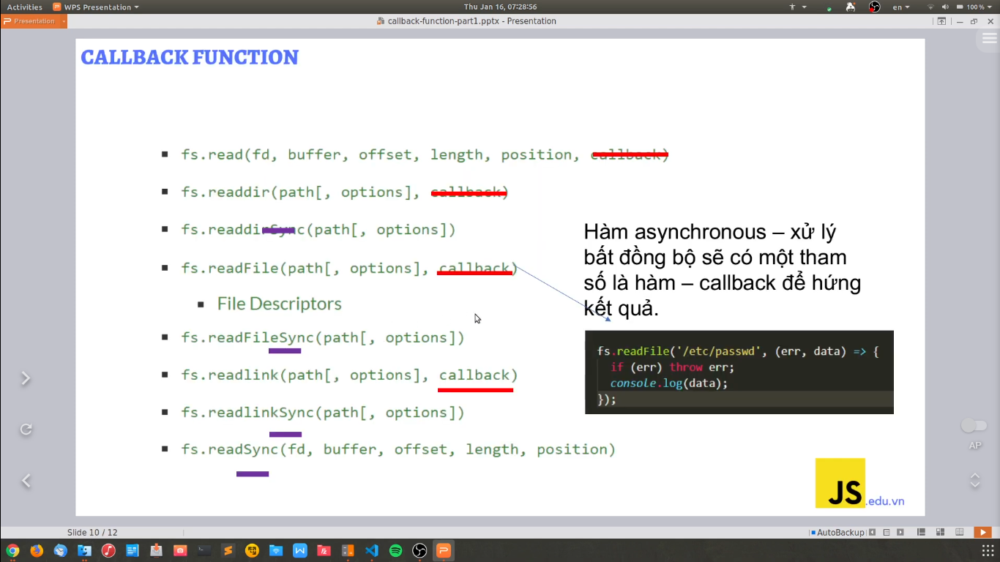

- Đó là các hàm đọc file theo đồng bộ (`Synchronous`) và đọc file theo bất đồng bộ (`Asynchronous`)
- Những cái hàm mà đọc file theo bất đồng bộ (`Asynchronous`) thì nó có tham số `callback`

---

# Cách viết convenition khi tự viết callback

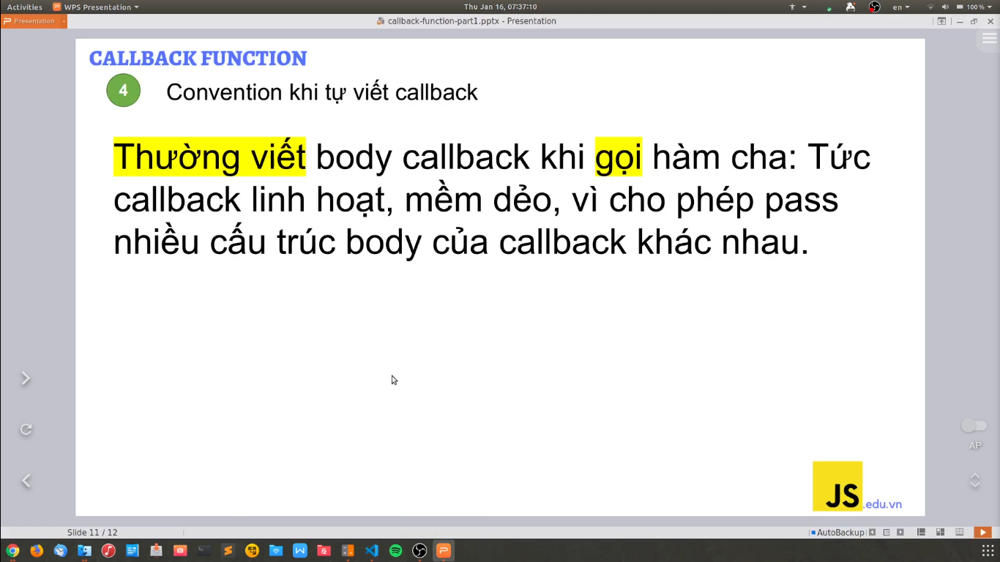

- Thông thường thì chúng ta gọi hàm ra trước rồi sau đó chúng ta mới viết body của callback

---

# Kết luận:

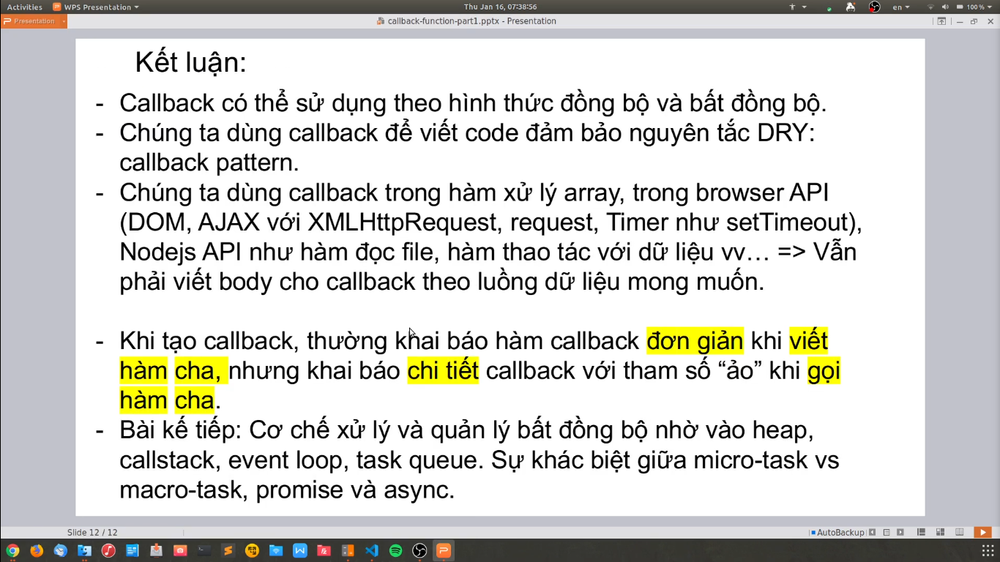

- JavaScript thì có thể chạy đồng bộ thôi
- Nó nhờ vào Browser và NodeJS có thể chạy bất đồng bộ (các task nặng chạy sau, task nhẹ chạy trước)
- Dùng callback để đảm bảo nguyên tác DRY (Don't Repeat YourSelf)

---

# Những bình luận hay trong video

Phần mềm test code bất đồng bộ: http://latentflip.com/loupe/

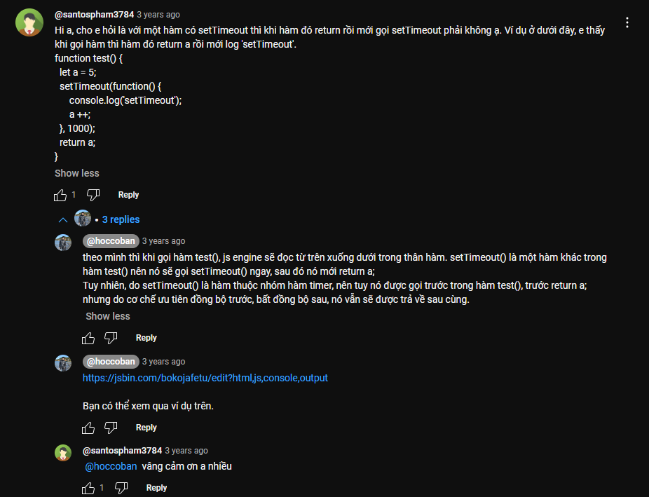
-> link code trong bình luận: https://jsbin.com/bokojafetu/edit?html,js,console,output

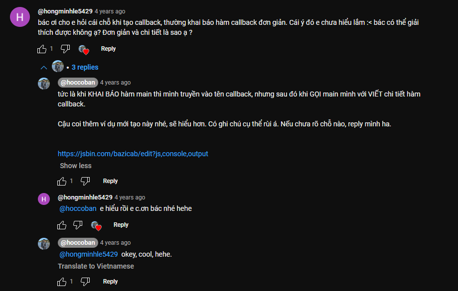
-> link code trong bình luận: https://jsbin.com/bazicab/edit?js,console,output

-> link code trong bình luận: https://github.com/yeungon/In-JavaScript-we-trust

-> nên tìm hiểu về 2 khái niệm này

---
