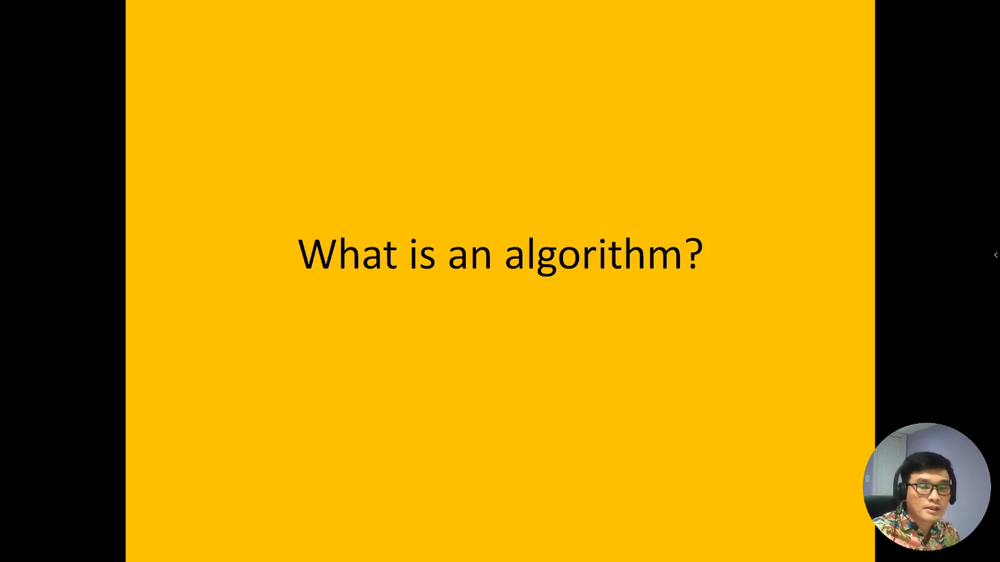
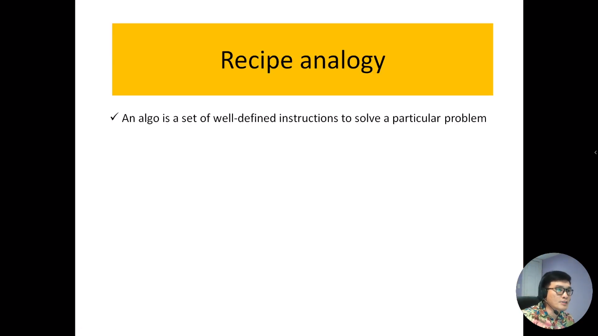
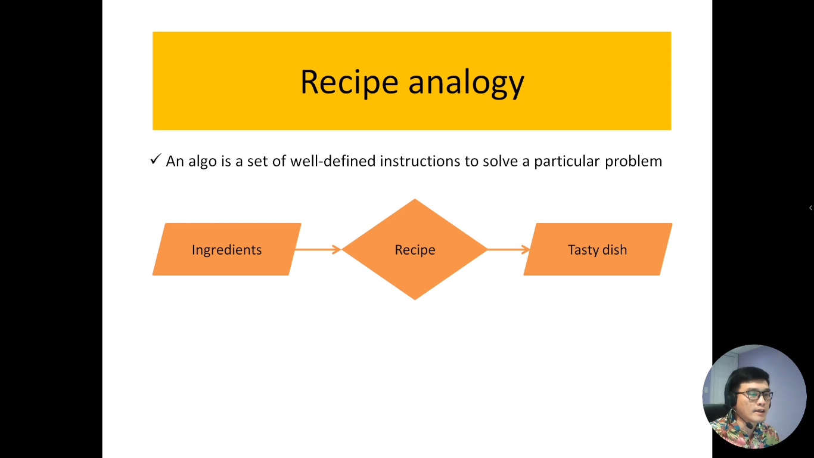
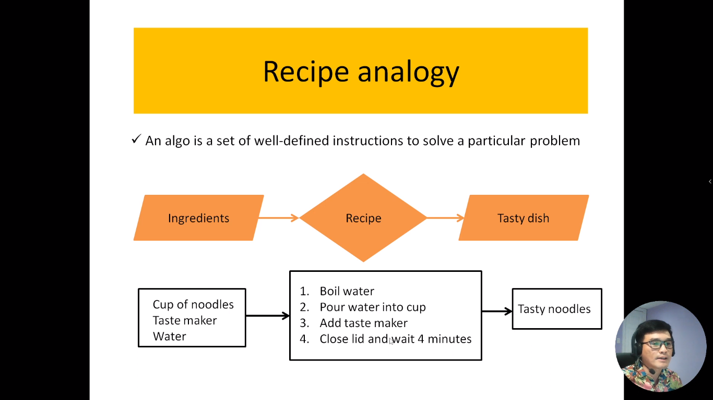
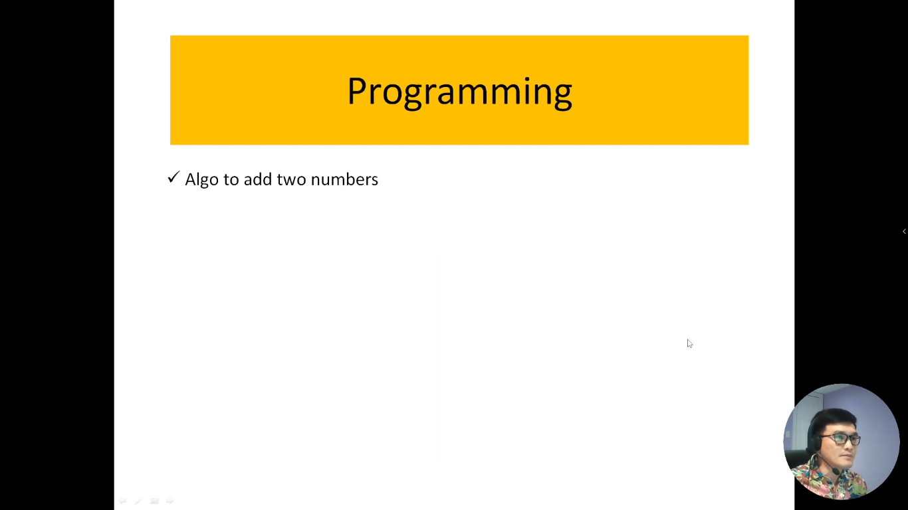
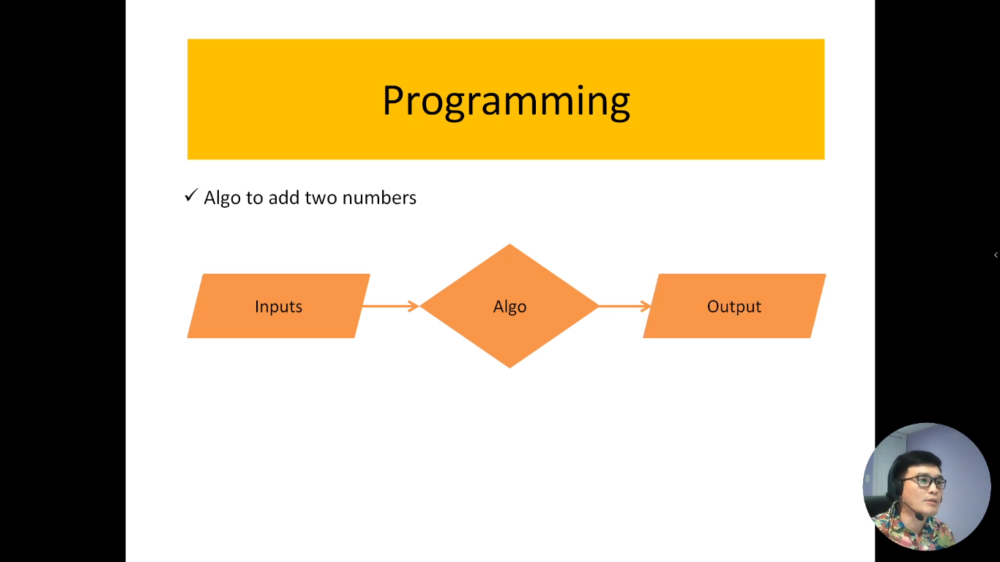
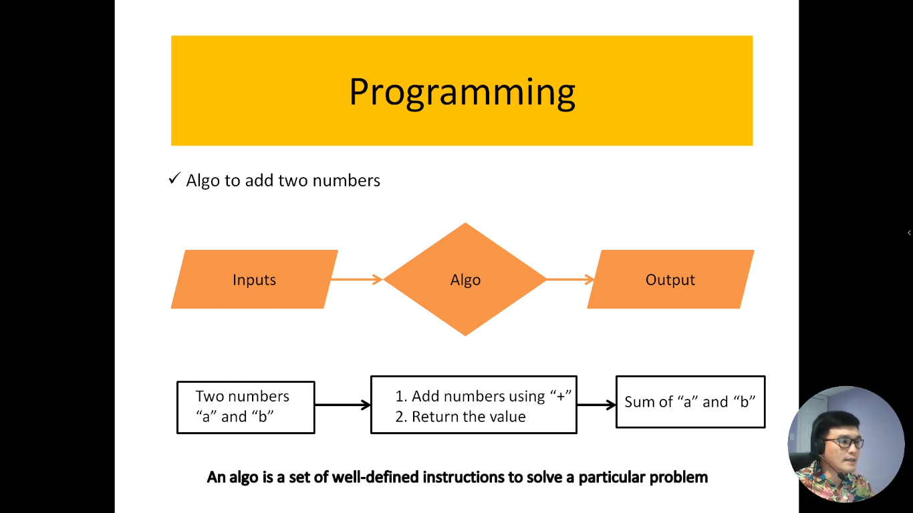
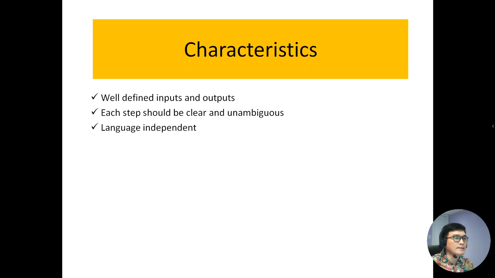
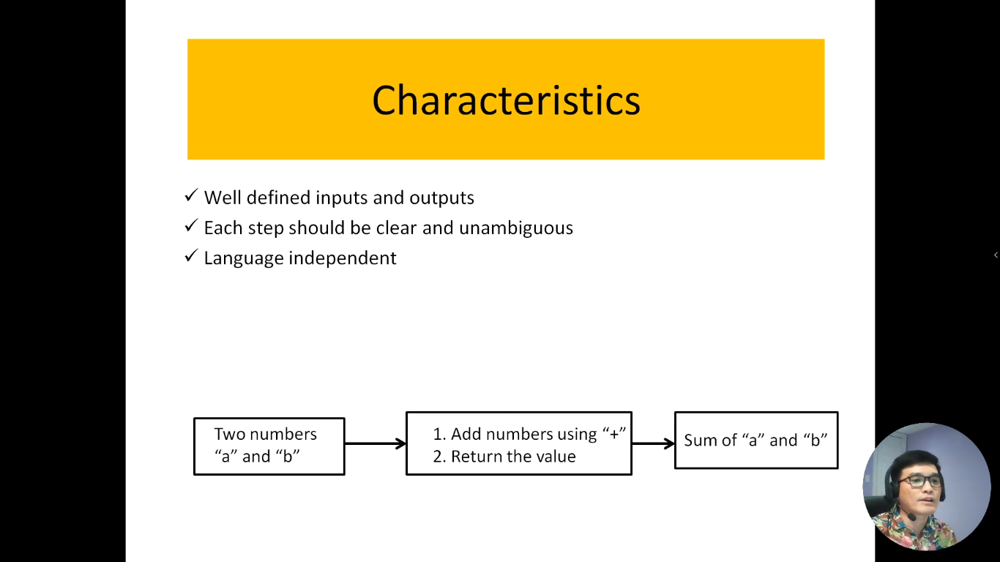
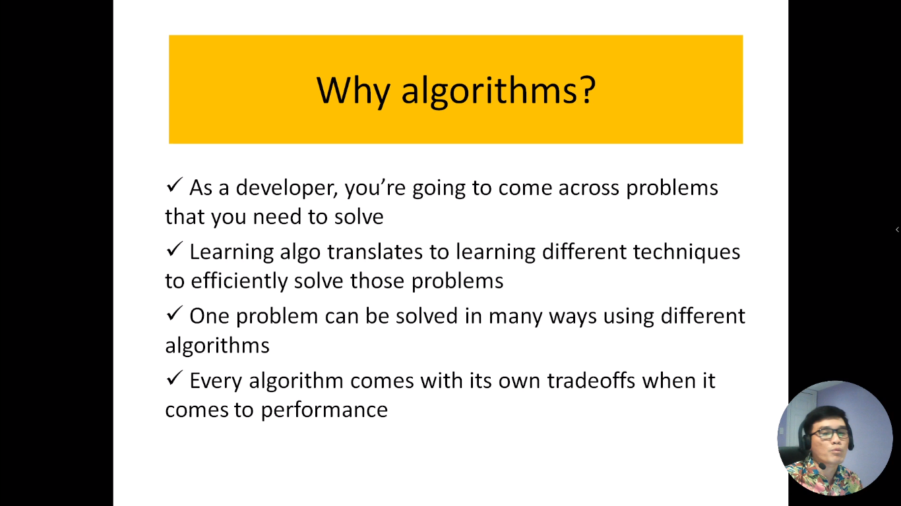

Trong video này, chúng tôi sẽ trình bày khái niệm về thuật toán và giải thích tại sao chúng ta cần nắm vững nó. Điều này sẽ giúp bạn hiểu rõ hơn tầm quan trọng của thuật toán trong lĩnh vực lập trình và làm thế nào nó ảnh hưởng đến việc giải quyết các vấn đề thực tế.

---

