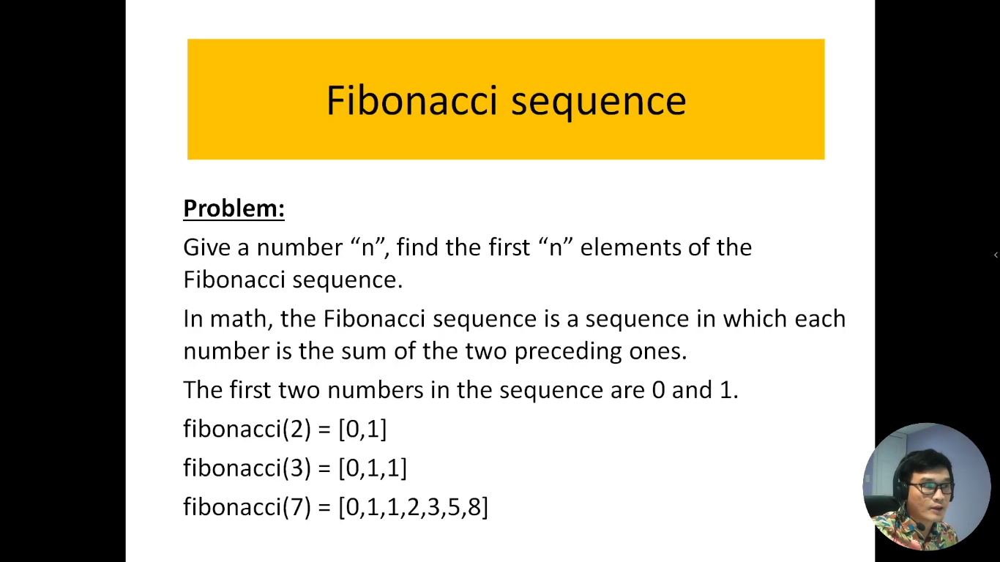
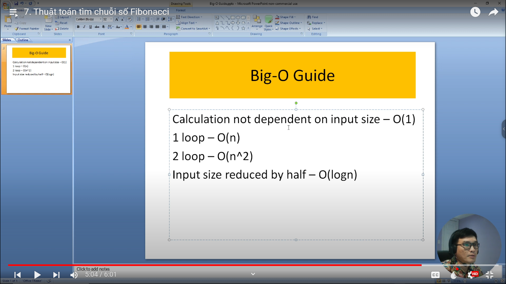

# 7. Thuật toán tìm chuỗi số Fibonacci

Thuật toán tìm chuỗi số Fibonacci là một trong những thuật toán phổ biến và quan trọng trong lĩnh vực toán học và khoa học máy tính. Chuỗi Fibonacci bắt đầu bằng hai số 0 và 1, và các số tiếp theo trong chuỗi được tạo ra bằng cách cộng hai số trước đó lại với nhau. Điều này tạo ra một chuỗi số tự nhiên độc đáo với nhiều ứng dụng thú vị trong thế giới thực.

Thuật toán tìm chuỗi số Fibonacci là cách để tính và hiển thị các số trong chuỗi Fibonacci một cách hiệu quả. Nó có thể được thực hiện bằng nhiều cách khác nhau, bao gồm sử dụng vòng lặp, đệ quy, hoặc thậm chí ma trận. Việc tìm chuỗi Fibonacci không chỉ giúp ta hiểu về cách làm việc với thuật toán mà còn mở ra cửa vào để tìm hiểu về các khái niệm toán học quan trọng như đệ quy, cộng trừ, và sự tăng dần.

Trong giới thiệu này, chúng ta sẽ khám phá thuật toán tìm chuỗi số Fibonacci bằng vòng lặp, cách nó hoạt động, và tại sao nó có giá trị trong lĩnh vực khoa học máy tính và toán học.

---

---

Đây là slide để tính ra độ phức tạp của thuật toán

- Giả sử thuật toán không phụ thuộc vào kích thước đầu vào thì ta có độ phức tạp là O(1)
- Nếu thuật toán có 1 vòng loop thì độ phức tạp đó là tuyến tính - O(n)
- Nếu thuật toán có 2 vòng loop thì độ phức tạp đó là hàm n mũ 2 - O(n^2)
- Mỗi đầu vào mà kích cỡ nó giảm đi 1 nửa thì độ phức tạp của nó là hàm logaric - O(logn)
