# [JavaScript chuyên sâu ] - Xử lý bất đồng bộ - phần 2: Event loop trên browser và Nodejs

Phần 2 trong nội dung xử lý đồng bộ và bất đồng bộ của JavaScript trên hai môi trường browser và nodejs. Video mô tả sự giống và khác nhau của cơ chế xử lý bất đồng bộ trên trình duyệt và trên run time xử lý back-end nodejs. Các API khác nhau của Nodejs và đặc thù của browser sẽ giúp chúng ta xử lý các tác vụ tương ứng.

Nội dung của video rất dài và có thể nói, là toàn diện nhất hiện nay về event loop trên browser và nodejs. Những vấn đề phức tạp như các phase của event loop trên Nodejs, sự khác biệt giữa tác vụ microtask và tác vụ macrotask sẽ được trình bày đầy đủ cả lí thuyết và ví dụ cụ thể.

Chúng ta sẽ tìm hiểu lí do vì sao JavaScript là ngôn ngữ single-threaded đơn luồng, nhưng lại xử lý rất tốt các tác vụ đa luồng. Bản chất của JavaScript có thể blocking các tác vụ I/O, nhưng nhờ cơ chế xử lý bất đồng bộ, chúng ta dễ dàng scale up nâng cấp mở rộng hệ thống, cân bằng tải (trong trường hợp backend với Nodejs).

---

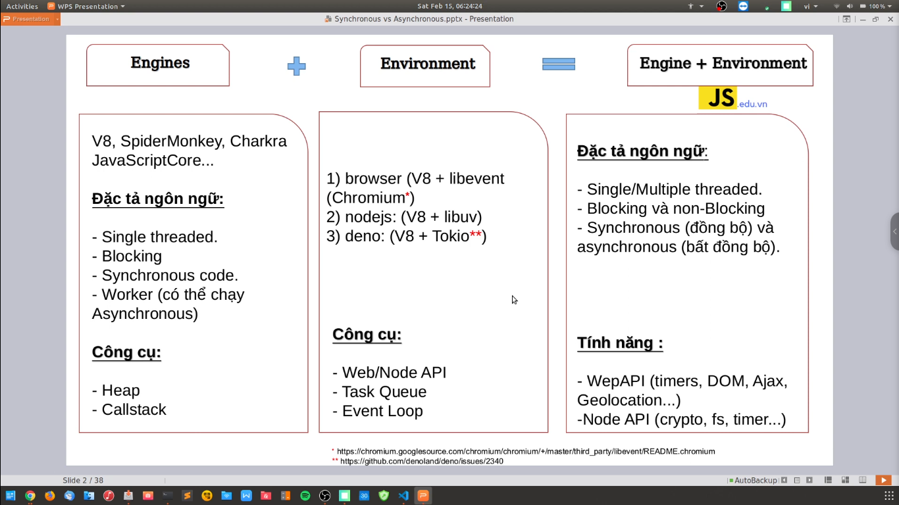

- Về cơ bản thì JavaScript nó không chạy bất đồng bộ được.

- Nếu nó chạy được thì nó phải nhờ vào cái môi trường của nó (`browser`) thì mới có thể chạy được. Môi trường đấy nó sử dụng môi trường `libevent`.

- Còn trên `NodeJS` thì nó sử dụng thư viện `libuv`.

- Còn trên `deno` thì chạy `Tokio`

- **Lưu ý:** NodeJS nó chỉ là môi trường runtime thôi. Ngoài NodeJS thì vẫn còn những môi trường khác

---

# Phân biệt giữa Browser và NodeJS

- V8 nó biên dịch mã JavaScript thành mã máy
- Task Queue nó là những hành động, trong đó có: Micro Task, Macro Task

---

# Trong bài này thì chúng ta tập trung vào kiến thức `Event Loop` trong JavaScript

Độ ưu tiên khi có các task trong Web API -> sau khi nó xử lý xong -> và sau đó nó sẽ render ra màn hình cho user

👉 Rendering Queue (Browser) 👉 Micro Task 👉 Macro Task

Về cơ bản thì trong những trường hợp mình gặp thì ít khi gặp trường hợp `Rendering Queue` (Browser). Chúng ta thường xuyên phải xử lý `Micro Task` và `Macro Task` là nhiều nhất

---

# Các ví dụ cơ bản về Event Loop (code đồng bộ và bất đồng bộ)

## 1. Ví dụ 1

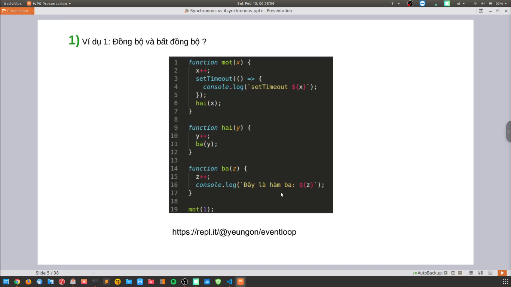

Đây là ví dụ của file `script_1.js`

Trong callstack thì nó thực thi theo phương pháp LIFO (Last In First Out -> Vào sau ra trước)

Thì code chạy tới đoạn có setTimeout thì callstack sẽ chuyển nó qua Web API. Khi mà callstack trống (không còn task nào thực thi nữa) thì lúc đó Web API sẽ chuyển setTimeout đó qua bên callstack -> và thực hiện nó.

setTimeout luôn thực hiện cuối cùng

## 2. Ví dụ 2

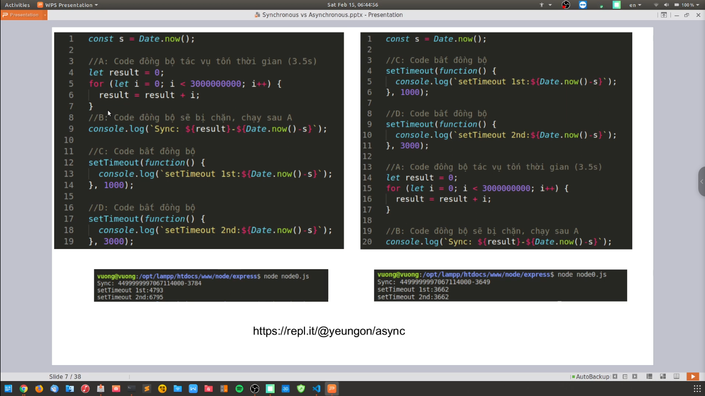

- Đây là thứ tự code chạy trong file `script_2.js`

- Dưới đây ở những bước thứ tự mà code thực thi

  - Những code đồng bộ thì nó vào `callstack` và log ra kết quả
  - Còn những code bất đồng bộ (`setTimeout`,...) thì nó cũng sẽ vào `callback` và -> sau đó nó sẽ chuyển `setTimeout` quá bên `Web API`. Khi mà bên nó chạy xong thời gian `setTimeout` mà chúng ta đã quy định thì nó sẽ được chuyển xuống hàng đợi (`queue`) -> nó sẽ đợi khi mà `callstack` trống thì nó sẽ thực thi -> có thể hiểu code bất đồng bộ nó sẽ chạy cuối cùng khi mà code đồng bộ chạy xong hết

=> Lời khuyên là khi mà chúng ta thực thi đoạn code nào lâu thì chúng ta nên sử dụng code bất đồng bộ

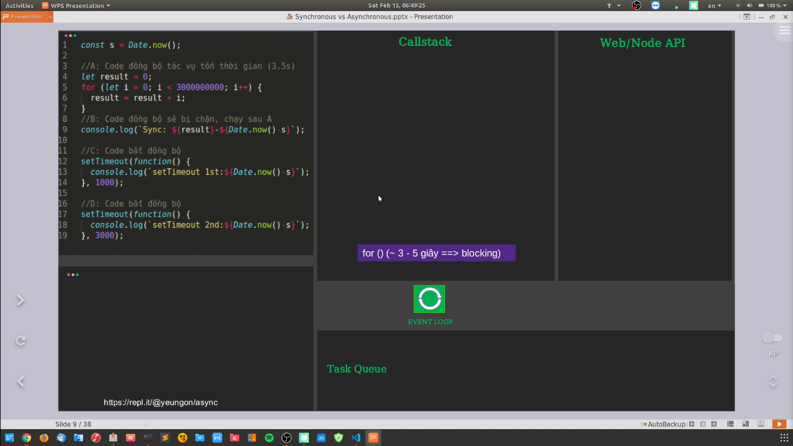

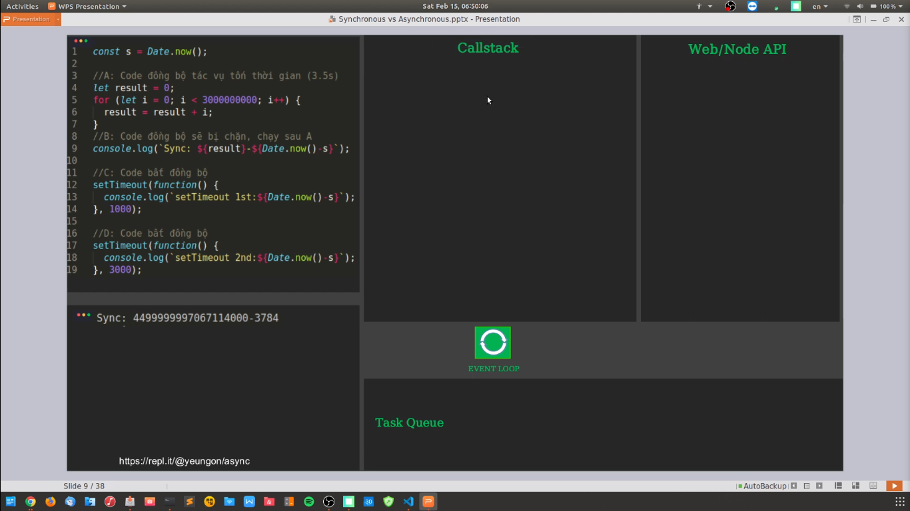

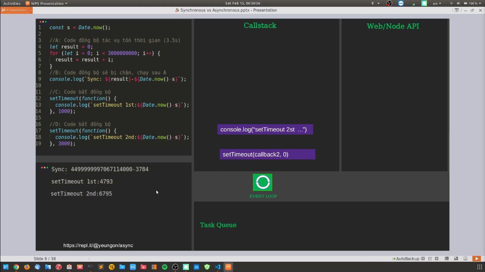

Tuy 2 cái setTimeout nó vẫn log ra sau dòng log `Sync` nhưng mà cách ta viết code bất đồng bộ nhìn code nó sẽ tối ưu hơn, và thời gian thực thi code bất đồng bộ nhanh hơn xí. Còn nếu chúng ta viết code đồng bộ thì nó sẽ mất nhiều thời gian hơn.

- Đây là thứ tự chạy trong file `script_3.js`

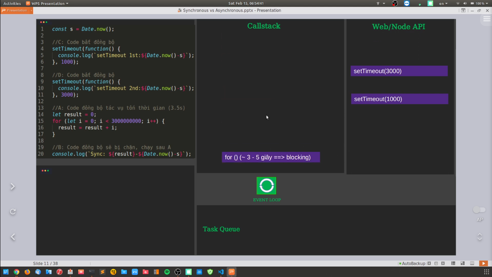

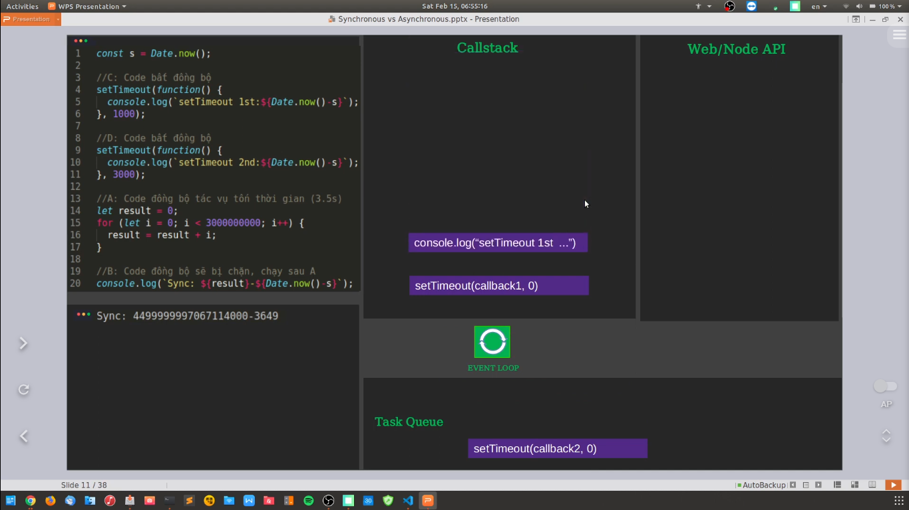

---

# Sự khác biệt giữa Micro Task và Macro Task trên Browser

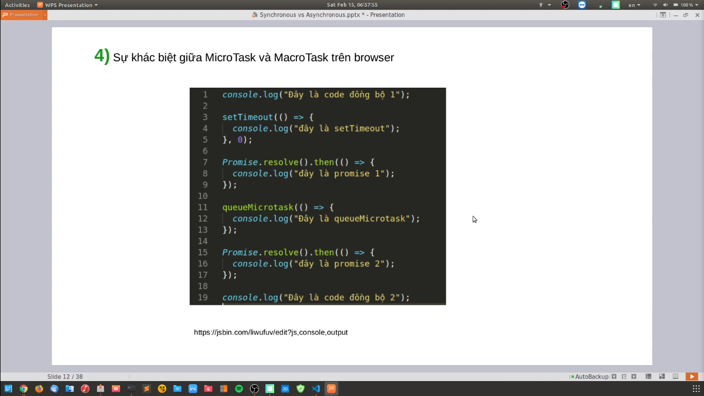

Code này trong file `script_4.js`

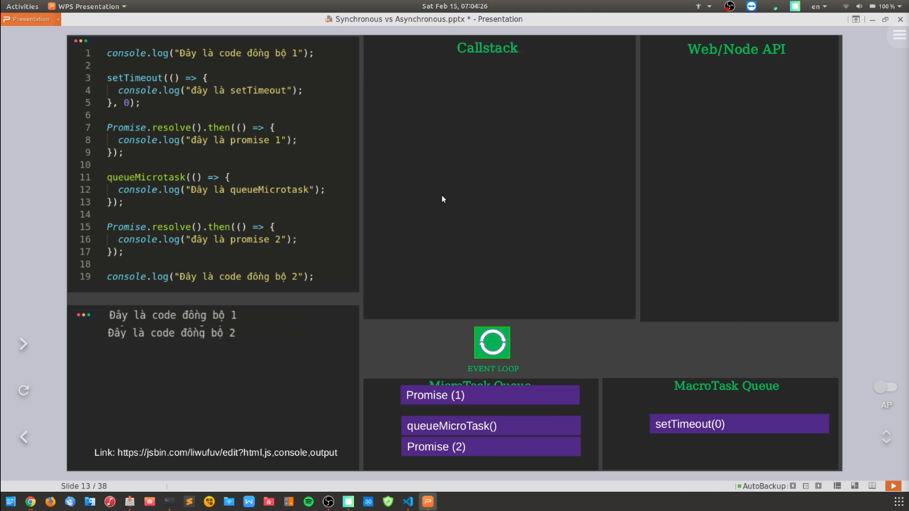

`Micro Task` thực hiện trước, sau đó đó tới `Macro Task`

- `Micro Task` gồm: Promise, queueMicrotask,...(tự tìm hiểu thêm)
- `Macro Task` gồm: setTimeout

---

# Những sự khác biệt giữa các hành động `onClick`

Đây là kết quả khi mình sử dụng method `addEventListener`, thì khi mình bấm `click` thứ tự chạy sẽ là nó code đồng bộ in ra trước, code bất đồng bộ in ra sau --> dễ hiểu đúng không? (nhìn vào mũi tên **màu tím**)

Đây là code sử dụng method `click()`, thì khi mình bấm `click` nó sẽ chạy từ trên xuống dưới lun, code nào mà đồng bộ thì nó sẽ in ra hết, sau đó nó sẽ chạy code bất đồng bộ sau (nhìn vào mũi tên **màu xanh**)

---

# Kiến trúc NodeJS

Kiến trúc của NodeJS

Event Loop trên NodeJS

Event Loop là 1 cái hệ thống quan sát sự thay đổi của các file -> từ đó nó sẽ đưa ra các bước xử lý (đó là khái niệm thôi)

---

# Các API của NodeJS được thiết kế bất đồng bộ

Giải thích Pending callback

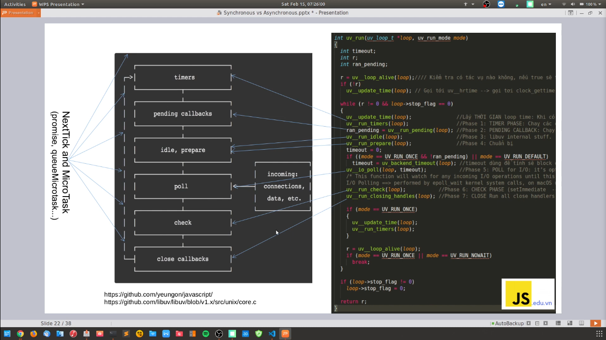

---

# Sơ đồ về Event Loop

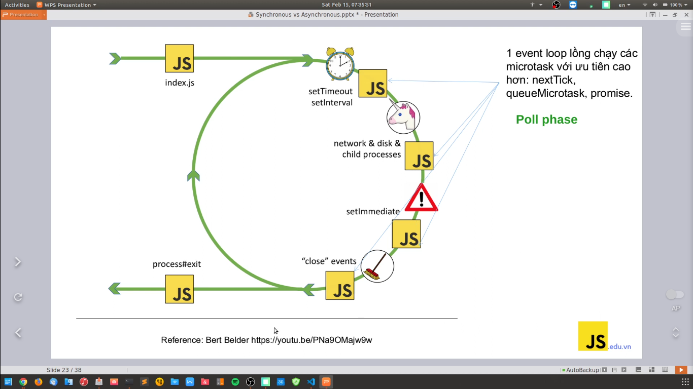

Trong ảnh này có 4 giai đoạn xảy ra: timer -> pause -> set immediate -> close. Thì trong 4 giai đoạn này thì giai đoạn `pause` sẽ sử dụng `pause` hệ điều hành để xử lý

---

# Đây là các giai đoạn trong vòng lặp (Event Loop)

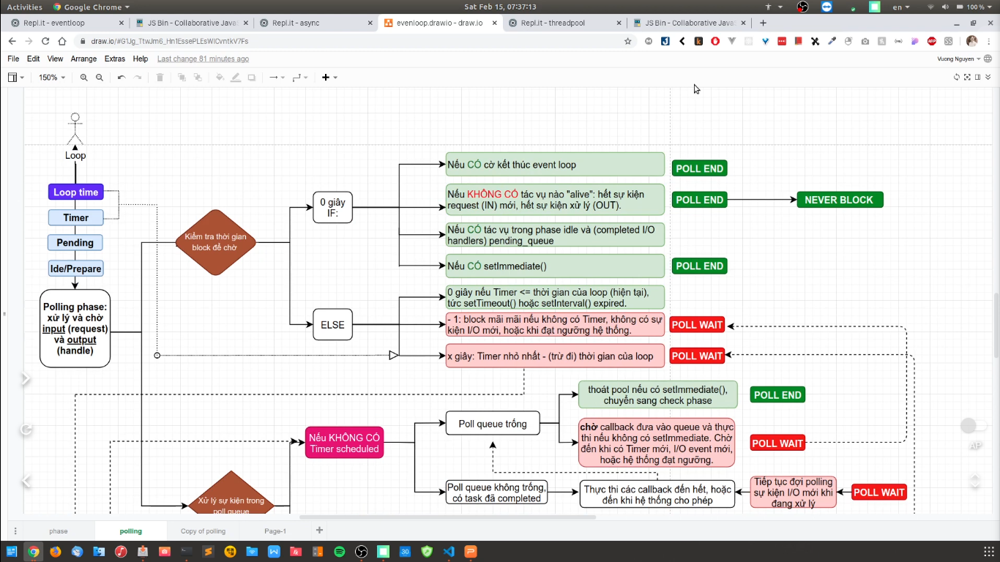

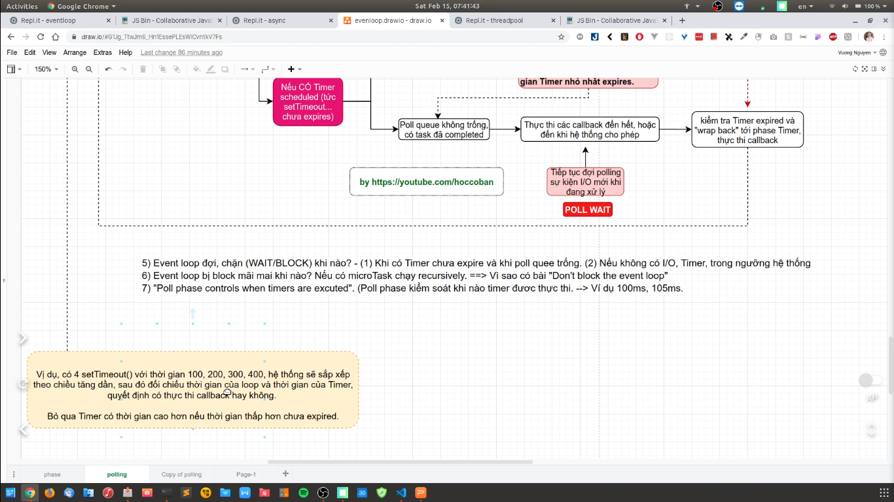

- Giai đoạn này, khi mới bắt đầu chạy thì nó sẽ thực hiện 2 nhiệm vụ đó là: `Kiểm tra thời gian block để chờ` và `Xử lý sự kiện trong poll queue`

# Đây là một mô phỏng khác về Event Loop

hình này trông trực quan hơn và dễ hiểu hơn
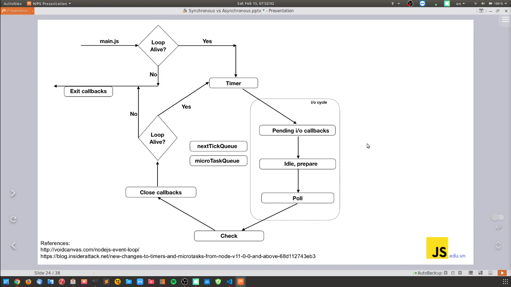

- **Chú ý:** cái thằng `nextTickQueue` là của thằng NodeJS, còn thằng `microTask` là của thằng V8. Trong Event Loop thì 2 thằng này có độ ưu tiên cao hơn, khi thằng này chạy xong thì mới đến lượt các thằng `timer` và `poll` tiếp tục xử lý. Việc hiểu rõ sự khác biệt giữa `nextTickQueue` và `microTask` giúp tối ưu hóa hiệu suất và tránh các vấn đề không mong muốn trong ứng dụng NodeJS.

- Khi `timer` nó gọi xong thì nó lập tức gọi qua `nextTickQueue`, xong `nextTickQueue` thì nó chạy qua `microTaskQueue`. Đấy, tuần tự của nó là như thế, chứ không phải như này nhé (khi `timer` chạy xong thì nó chưa chạy qua `I/O Cycle` đâu -> cái này nó không phải chạy như thế)

- Nên nhớ là khi mà 2 thằng đó xuất hiện trong queue thì nó luôn luôn đứng đầu trong queue -> Nó luôn có sự ưu tiên cao nhất

---

# Sự khác biệt giữa Micro Task và Macro Task

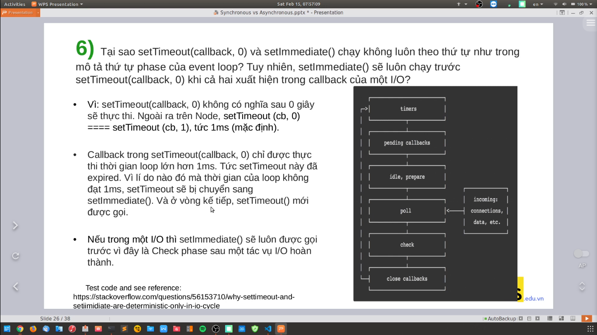

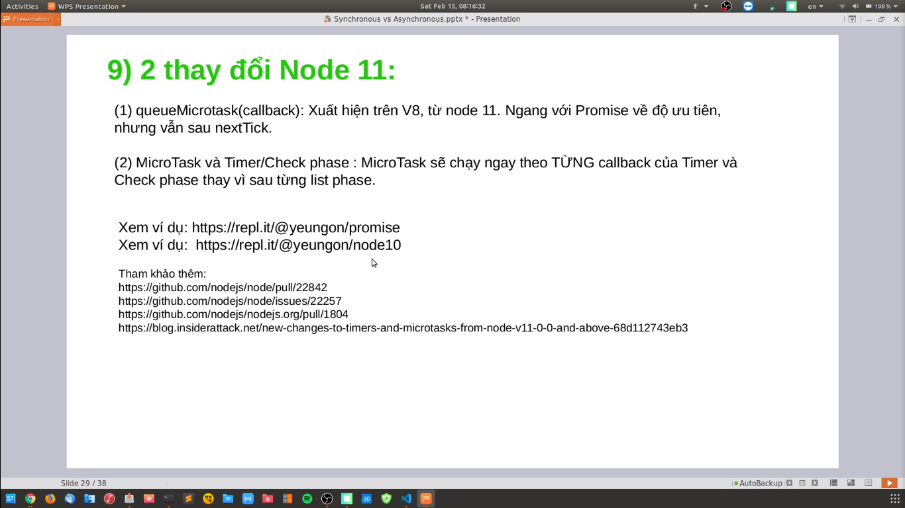

---

# Các ví dụ ở mỗi version khác nhau của NodeJS

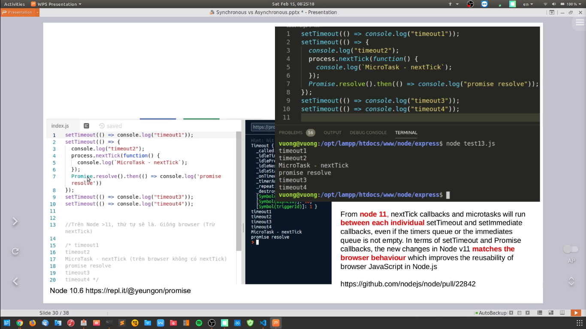

Đây là dụ rất hay về sử lý các cái phase (giai đoạn) của NodeJS và các phase của Event Loop
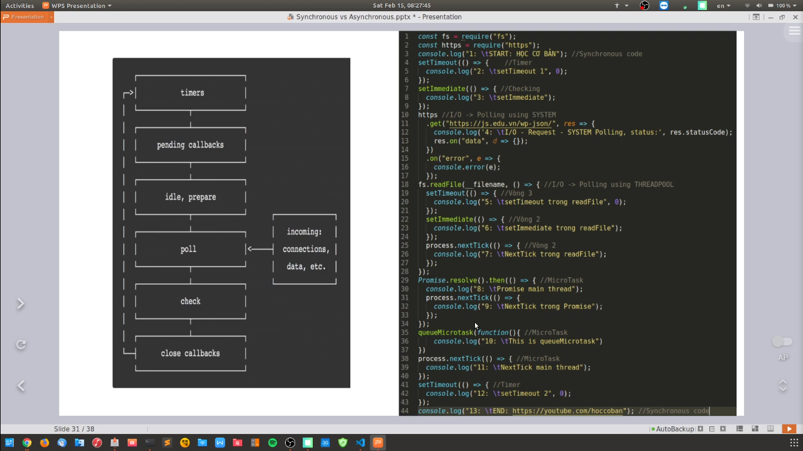

Code này trong file `node6.js`

---

# Thread Pool

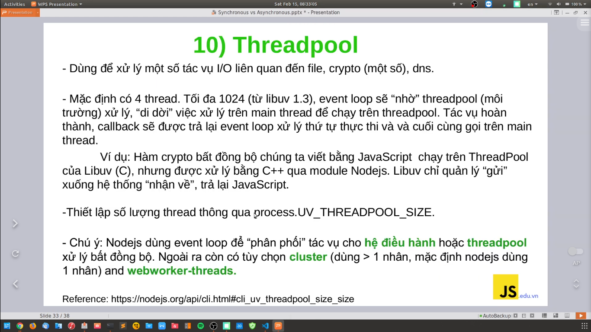
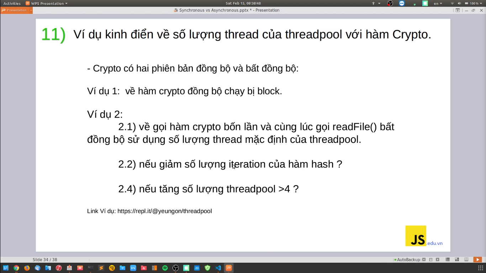

---

# Đây là video có ví dụ rất hay -> bạn nên xem qua

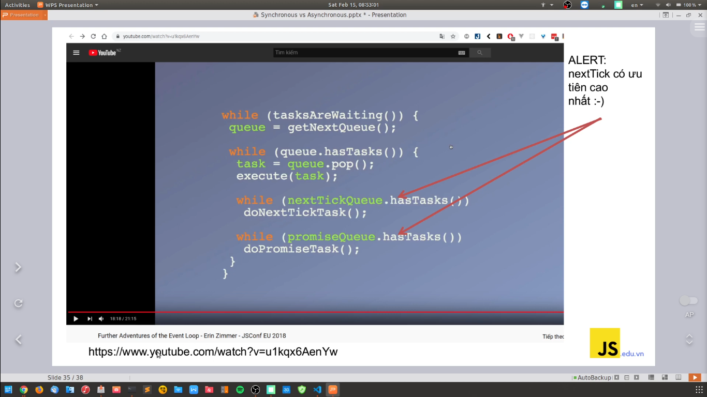
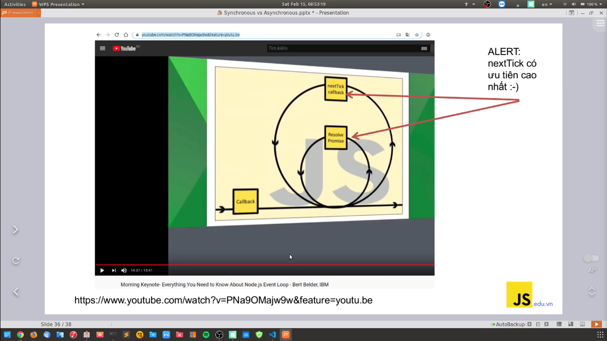

---

# Best Practices

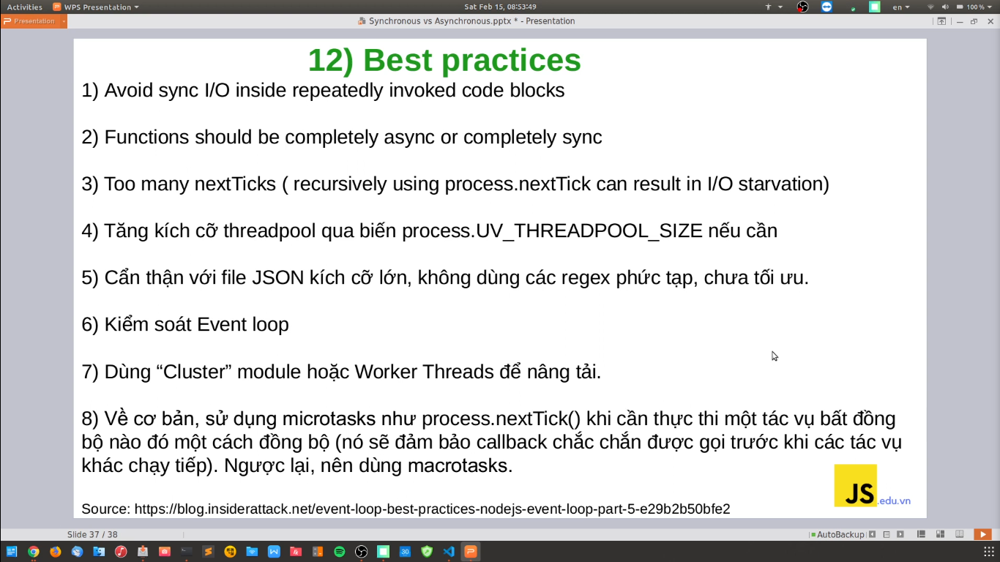

- Tránh các tác vụ lặp đi lặp lại
- Chúng ta nên viết đồng bộ và bất đồng bộ riêng -> không nên viết chung
- không nên gọi quá nhiều nextTick. Bởi vì gọi theo kiểu recursive thì có thể khiến block I/O này, làm cho nó không truyền qua được cái key loop tiếp theo
- Nếu chúng ta xử lý các tác vụ liên quan đến fs hay là crypto -> thì chúng ta nên cân nhắc tăng kích cở `UV_THREADPOOL_SIZE` (cái này có sẵn trong JavaScript) nếu cần
- Nên cẩn thận với những file JSON có kích cở lớn -> thời gian và tốc độ xử lý nó gặp vấn đề (nên tính toán trước khi sử dụng)
- Kiểm soát Event Loop nhờ những cái package mà nó giúp cho chúng ta theo dõi cái thời gian hoặc tốc độ xử lý -> nó tính size bao nhiêu đó, mà nó sẽ giúp tốc độ xử lý code của chúng ta

---

# Tài liệu tham khảo

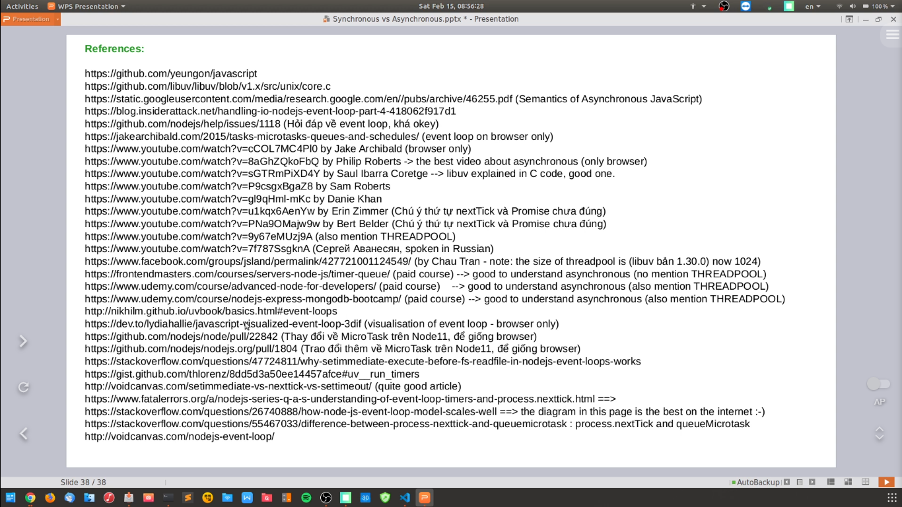

---

# Những bình luận hay trong video

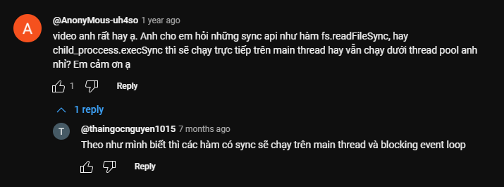

-> Link code trong video tác giả đã xóa code rồi, mình vô không thấy code nữa

Đây là phần bình luận dài nhất trong video
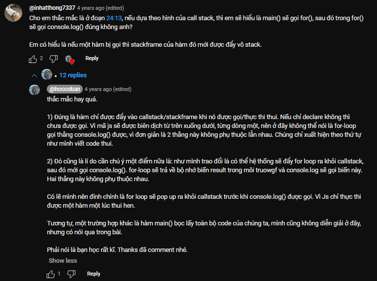

Phần này thảo luận về khi ta chạy code JavaScript thì trình biên dịch V8 sẽ dịch ra code C++...và từ đó trình duyệt sẽ dịch code từ C++ ra kết quả

Phần này hỏi về Event Loop trong NodeJS

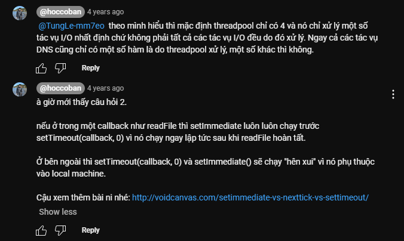

