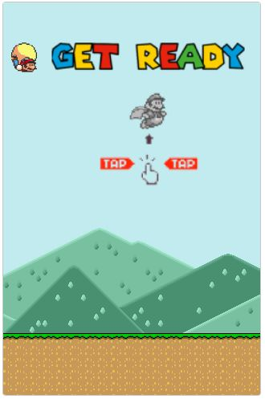

Source code: https://github.com/lucianakyoko/flappy-mario

  

---

  <a href="https://flappy-mario.vercel.app/">Jogar</a> &nbsp;&nbsp;&nbsp;|&nbsp;&nbsp;&nbsp;
  <a href="#-sobre">Sobre</a> &nbsp;&nbsp;&nbsp;|&nbsp;&nbsp;&nbsp;
  <a href="#-tecnologias">Tecnologias</a> &nbsp;&nbsp;&nbsp;|&nbsp;&nbsp;&nbsp;
  <a href="#-jogabilidade">Jogabilidade</a> &nbsp;&nbsp;&nbsp;

---
## 🌈 Sobre 
Jogo baseado no Flappy Bird (lançado em 2013 - extinto em 2014), desenvolvi esse joguinho para praticar um pouco mais o JavaScript.

## 🔨 Tecnologias
Flappy Mario foi desenvolvido com as seguintes tecnologias e ferramentas:

<ul>
  <li>Figma</li>
  <li>Canvas API</li>
  <li>JavaScript</li>
  <li>Sprites</li>
</ul>

## 🎮 Jogabilidade
O objetivo do jogo é fazer o Super Mario passar entres os dois canos. Caso o Mario esbarre em um dos canos ou caia no chão, você perde.

  📱 pelo celular: basta tocar na tela do seu smartphone para manter o Mario flutuando.

  💻 pelo desktop/notebook: funciona com a maioria das teclas do seu teclado.

  🐭 você também pode usar o clique do seu mouse.

