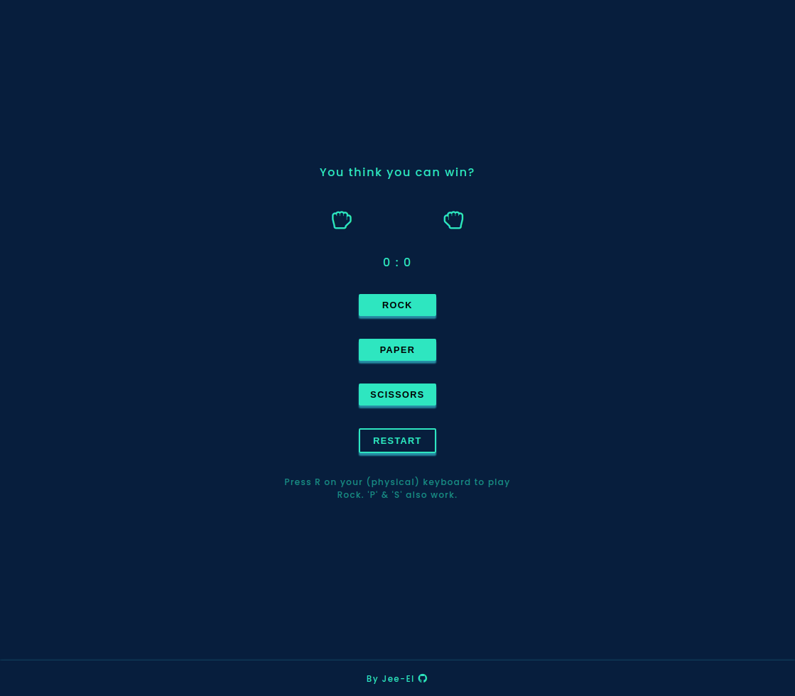

Source code: https://github.com/Jee-El/rock-paper-scissors

# Rock-Paper-Scissors

## Where to play it?

https://jee-el.github.io/rock-paper-scissors/

## the game's UI

## Some info

I relied solely on CSS & JavaScript to make the game to get the most out of the process, which made me struggle at some parts but that's where the fun lies at, as it teaches a lot more than anything else.

It was a pretty fun project honestly.
