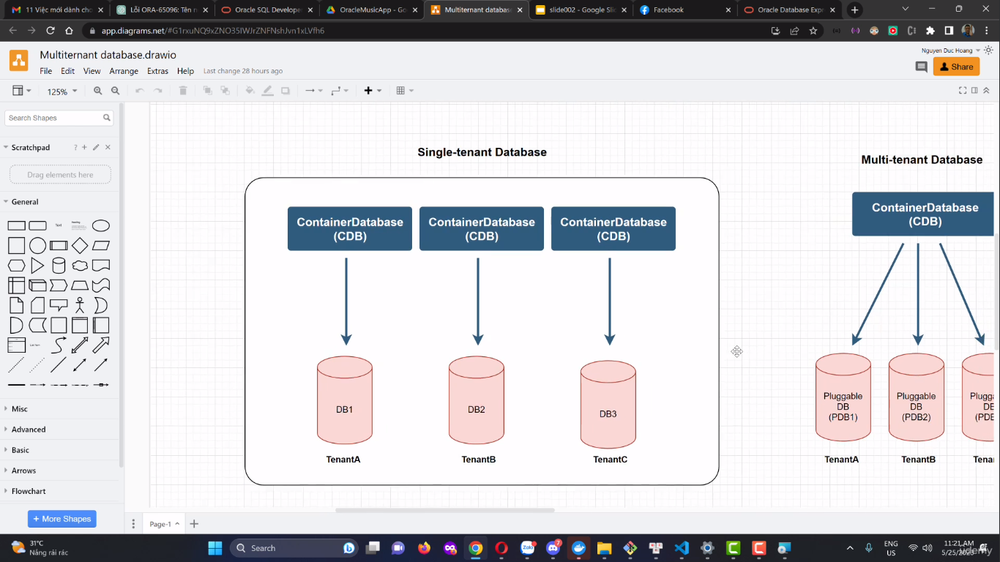
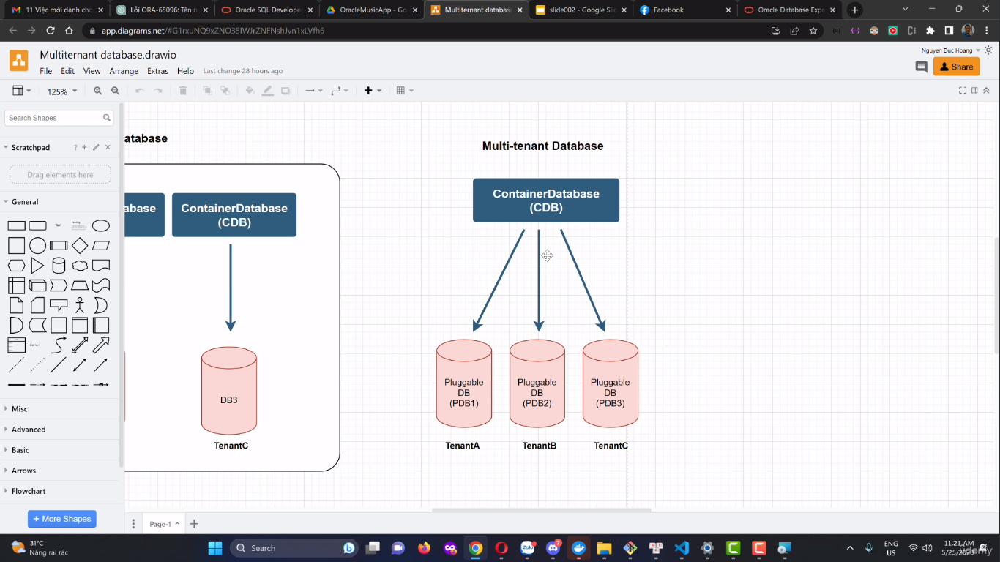

- Đây là cơ sở dữ liệu đơn khách hàng. Thì mỗi Container Database thì có 1 Ternant Database. Như vậy thì dẫn đến chúng ta rất tốn tài nguyên

- Trước đó thì người ta sử dụng `Single Database`. Mô hình đó tốn rất nhiều tài nguyên. Vì thế mà bây giờ họ đã cải tiến hơn là mô hình Multiternant Database (cơ sở dữ liệu đa khách hàng).

- Ví dụ như hình của chúng ta có 3 khách hàng là 3 database riêng, thì chúng nó sẽ dùng chung 1 `Container Database`

- Mỗi ông thì mình sẽ cấu hình riêng. Quy chung lại là nó dùng chung 1 container database sẽ tiết kiệm được tài nguyên. Mà vẫn tái sử dụng được cái chung
