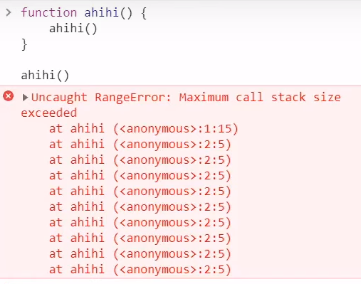
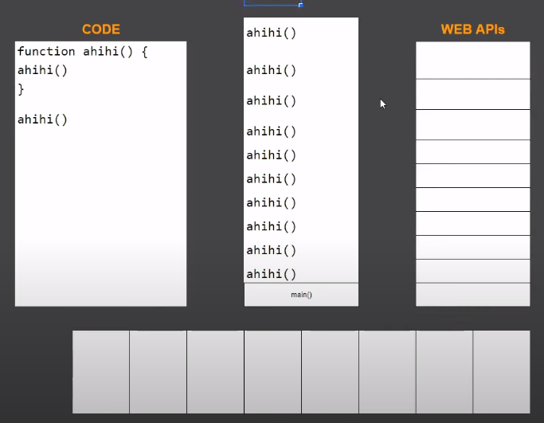

- Lưu ý: trong hàm `ahihi()` gọi hàm `ahihi()` thì cái này mọi người hay gọi là đệ quy

- Khi chạy thì nó sẽ gọi hàm `ahihi()` và vô hàm `ahihi()` thì sẽ gọi hàm `ahihi()` => Nó chạy đến 1 lúc nào đó thì sẽ bị tràn bộ nhớ.
- Mà khi mà vào nhiều quá thì cái stack nó bị tràn. Còn được gọi là stack over flow

