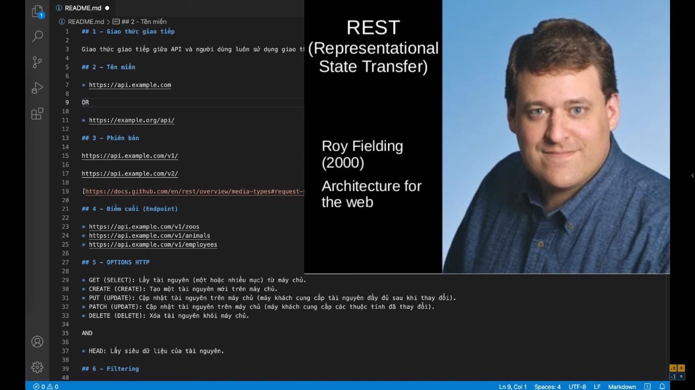
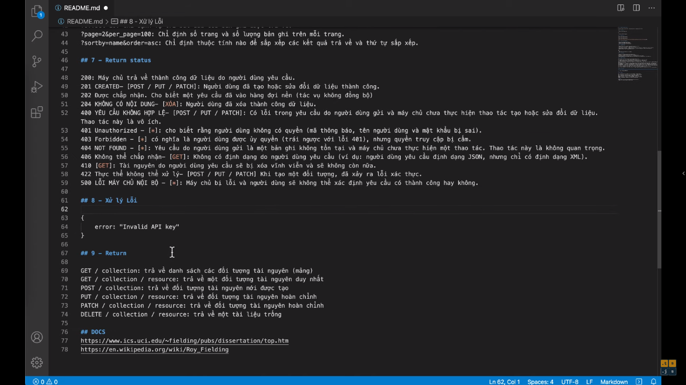

# 9 Nguyên tắc và lưu ý thiết kế Rest API khi chúng tôi phát triển backEnd cho shopDEV

[Link video](https://s.net.vn/RbUf)

## 1 - Giao thức giao tiếp

Giao thức giao tiếp giữa API và người dùng luôn sử dụng giao thức HTTPS

## 2 - Tên miền

- https://api.example.com

OR

- https://example.org/api/

## 3 - Phiên bản

https://api.example.com/v1
https://api.example.com/v2

## 4 - Điểm cuối (Endpoint)

- https://api.example.com/v1/zoos
- https://api.example.com/v1/animal
- https://api.example.com/v1/employees

## 5 - Option HTTP

- GET (SELECT): Lấy tài nguyên (một hoặc nhiều mục) từ máy chủ
- CREATE (CREATE): Tạo một tài nguyên mới trên máy chủ
- PUT (UPDATE): Cập nhật tài nguyên trên máy chủ (máy khách cung cấp tài nguyên đầy đủ sau khi thay đổi)
- PATCH (UPDATE): Cập nhật tài nguyên trên máy chủ (máy khách cung cấp các thuộc tính đã thay đổi)
- DELETE (DELETE): Xóa tài nguyên khỏi máy chủ

AND

- HEAD: Lấy siêu dữ liệu của tài nguyên

## 6 - Filtering

- ?limit=10: Chỉ định số lượng bản ghi được trả về
- ?offset=10: Chỉ định vị trí bắt đầu của bản ghi được trả về
- ?page=2&per_page=100: Chỉ định số trang và số lượng bản ghi trên mỗi trang
- ?sortby=name&order=acs: Chỉ định thuộc tính nào để sắp xếp các kết quả trả về và thứ tự sắp xếp

## 7 - Return status

200: Máy chủ trả về thành công dữ liệu do người dùng yêu cầu
201: CREATE - [POST / PUT / PATCH]: Người dùng đã tạo hoặc sửa đổi dữ liệu thành công
202: Không có nội dung - [XÓA]: Người dùng đã xóa thành công dữ liệu
400: Yêu cầu không hợp lệ - [POST / PU / PATCH]: Có lỗi trong yêu cầu do người dùng gửi và máy chủ chưa thực hiện thao tác tạo hoặc sửa đổi dữ liệu. Thao tác này là vô ích
401: Unauthorized - [*]: Cho biết rằng người dùng không có quyền (mã thông báo, tên người dùng, và mật khẩu bị sai)

