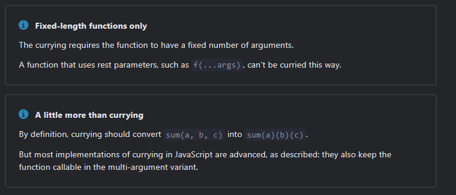

This is exercise so I to get on this website: https://javascript.info/currying-partials

## Summary

- **`Currying`** is a transform that makes `f(a,b,c)` callable as `f(a)(b)(c)`. JavaScript
  implementations usually both keep the function callable normally and return the partial if the
  arguments count is not enough.

- Currying allows us to easily get partials. As we’ve seen in the logging example, after currying
  the three argument universal `function log(date, importance, message)` gives us partials when
  called
  with one argument (like `log(date)`) or two arguments (like `log(date, importance)`).