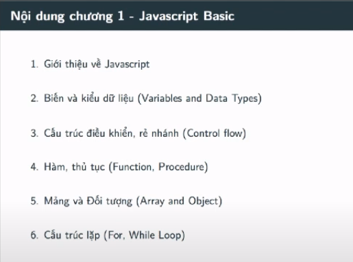
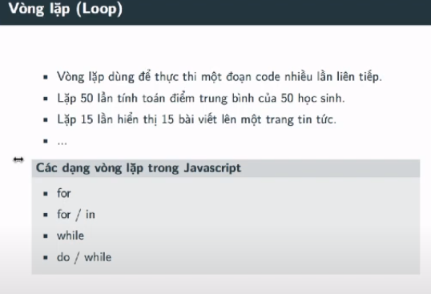
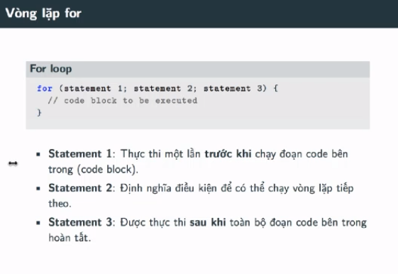
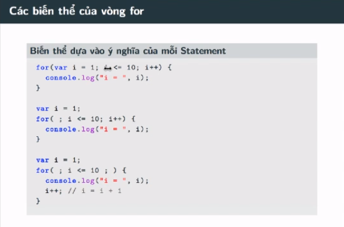
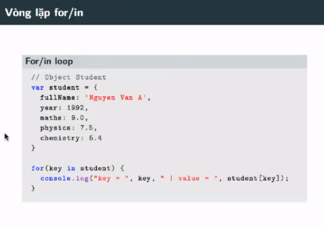
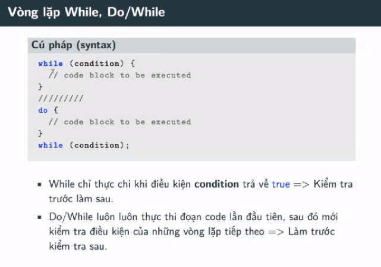

## Javascript Cơ Bản - #13 - Vòng lặp trong Javascript

- Đây là phần cuối cùng trong chương javascript cơ bản trong khóa này. Đó là vòng lặp

- Đây là kiến thức vô cùng quan trọng nên mọi người cần nắm vững nhé!!
---

---

- Dưới đây là dạng lặp for in
- for in là một dạng lặp trong object. Nó thường được sử dụng lặp trong object

---

- Vòng lặp while và do while

