# Đây là những video từ bài giảng MERN Stack từ kênh Tu Tran

[Link tutorial](https://bom.so/FrfhFj)

---

## There are some images about of project

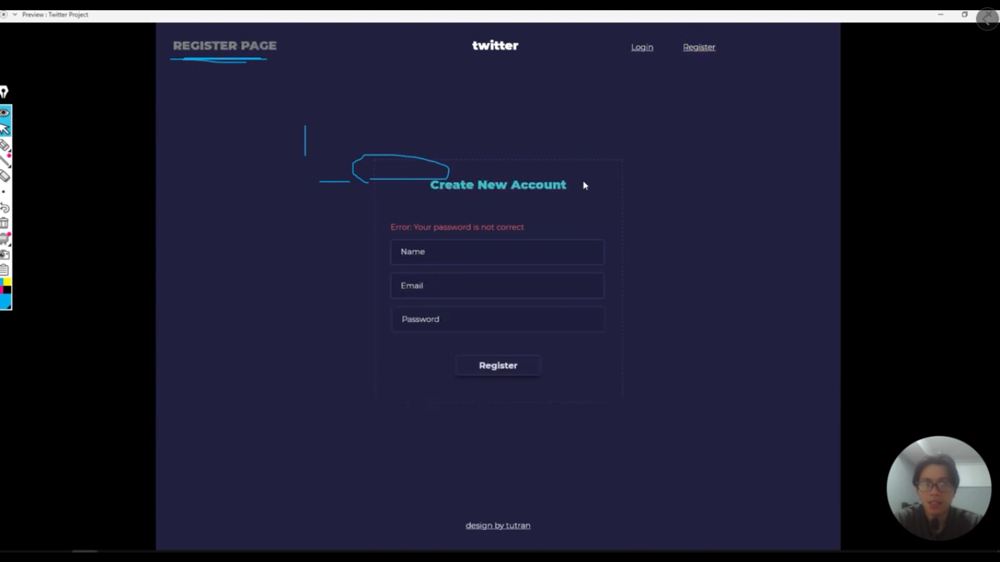

---

---

**Analysis Back-end**

---

**Back-end work flow**

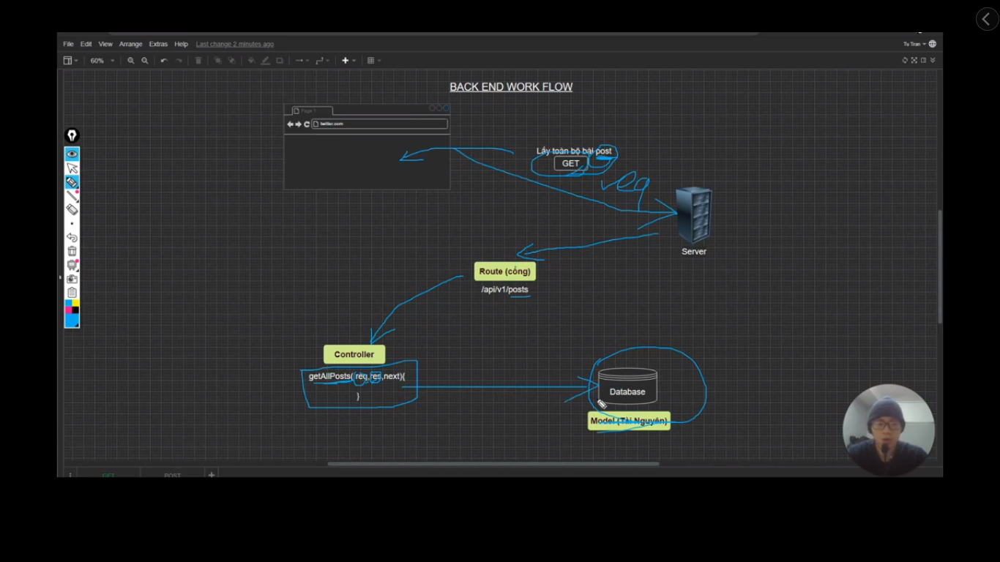
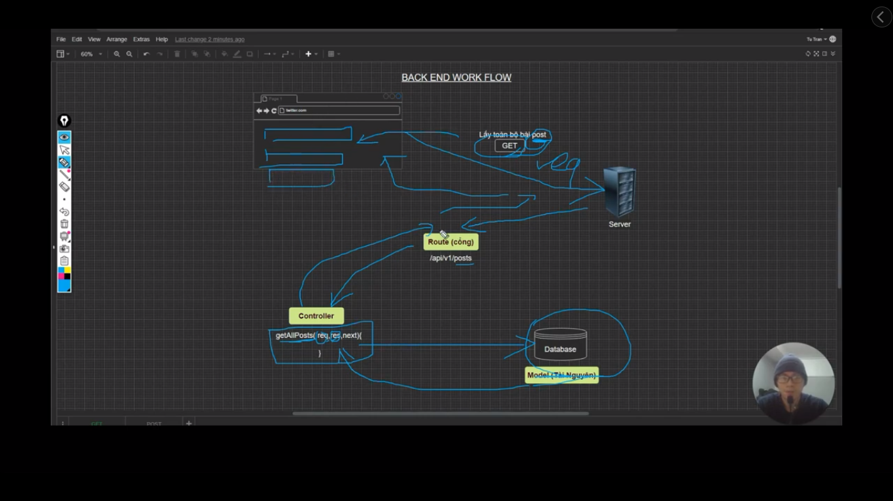

- Tạo mới thì dùng phương thức POST.
- Phương thức POST thì khi gửi lên thì nó sẽ gửi 1 object (dữ liệu được gửi lên server thì sẽ gọi đó là request)
- Sau khi vào `router` thì nó sẽ vào `controller`. Nhiệm vụ của `controller` là điều khiển dữ liệu. Controller sẽ truy cập vào `database` sẽ lấy dữ liệu -> và sau khi nó có dữ liệu thì nó sẽ trả ngược về `router` đó -> và cuối cùng nó sẽ render ra giao diện cho người dùng

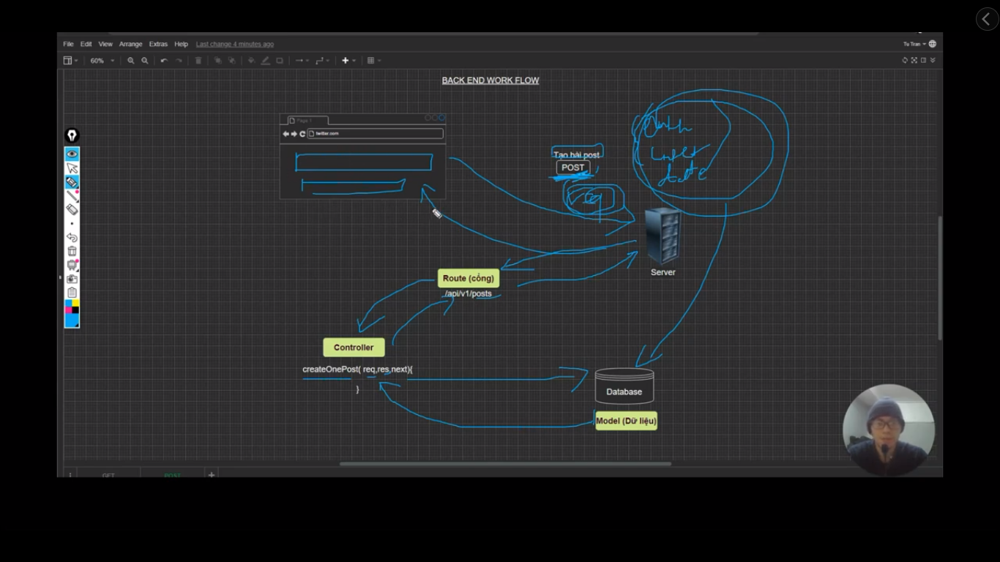

---

> Design and Identify Controller

---

> General agreement on the response structure (Thống nhất chung về cấu trúc phản hồi)

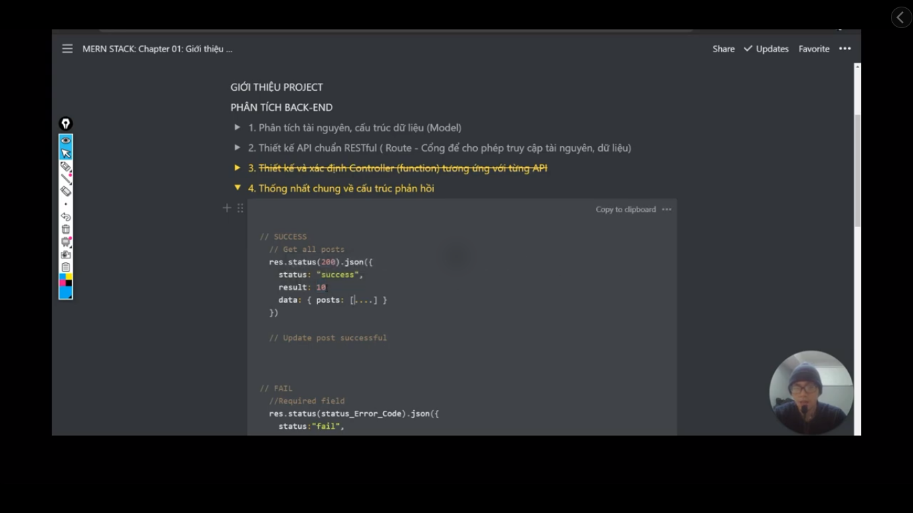

---

> This is course MERN Stack 🤷‍♀️

> Suitable person of this course (Đối tượng phù hợp với khóa này 👨‍💻)

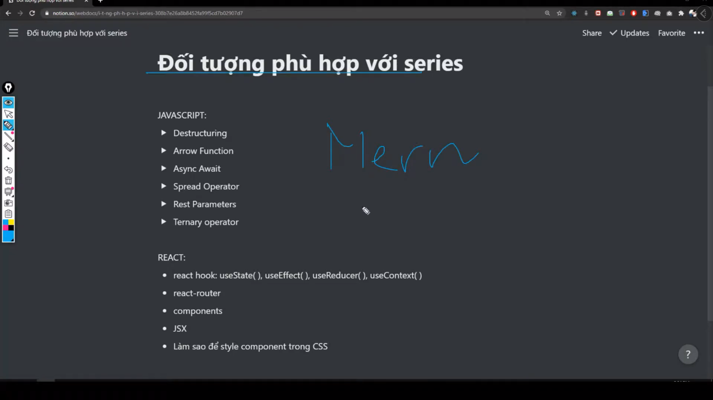

---

> There are principle in JavaScript 🚀

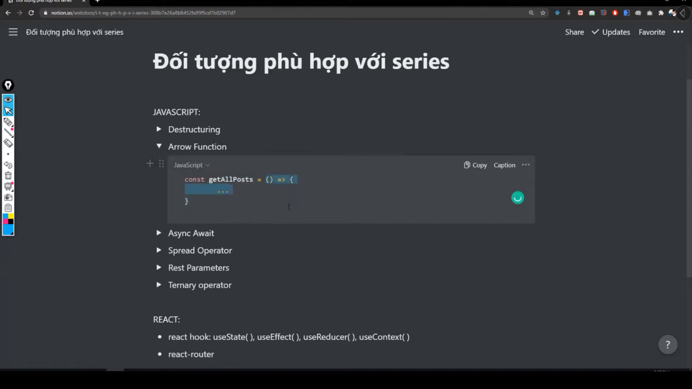
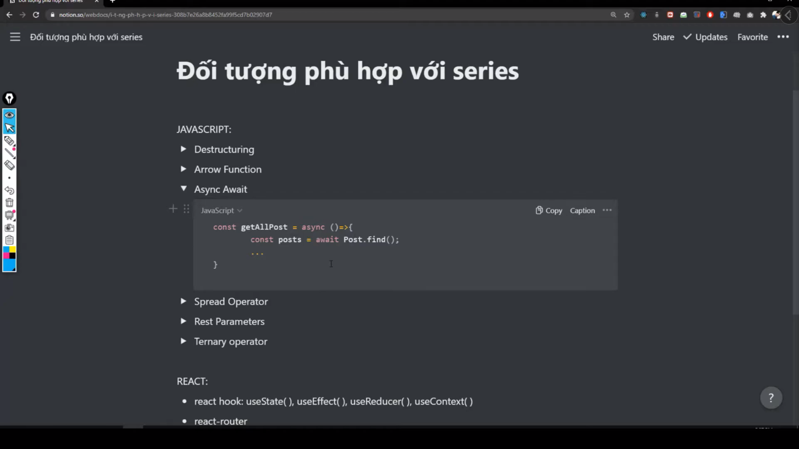

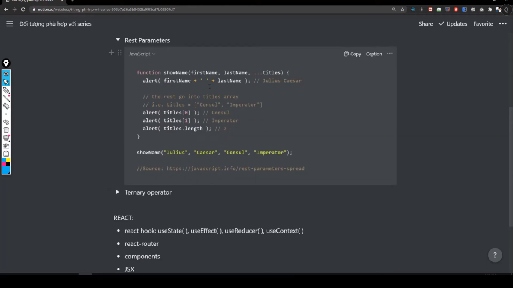

Reference: 🌈

- https://developer.mozilla.org/en-US/docs/Web/JavaScript
- https://javascript.info/

---

> Determine the specific tasks that need to be performed (Xác định các task cụ thể cần thực hiện 🎯) --> Sprint

---

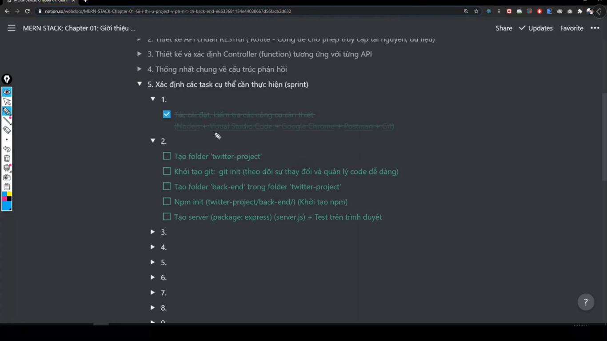

- ExpressJS là Web framework của NodeJS
- Trong ExpressJS có những tính năng nổi bật là error handling (xử lý lỗi), middleware, body parse, route,...

**Lưu ý:**

- file `server.js` là file entry point. Khi mà client gửi request lên server thì nó sẽ vào `server.js` đầu tiên
- entry point -> có nghĩa là điểm bắt đầu

---

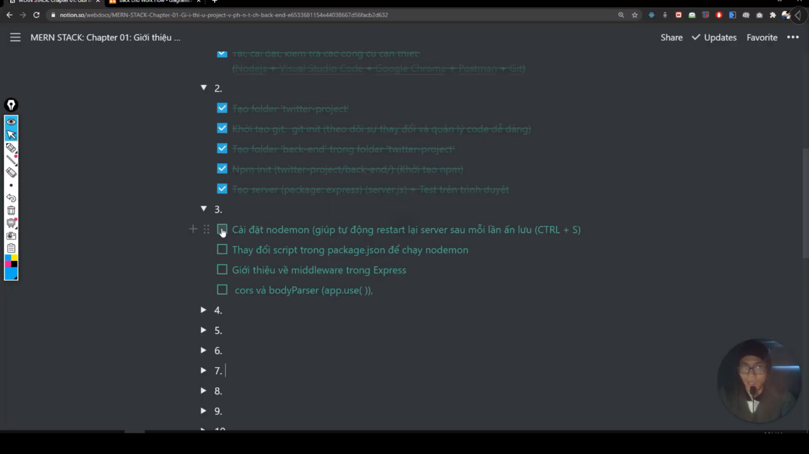

**Lưu ý:**

- Trong phần này mình sẽ học về `middleware`

**`Middleware` là gì?**

- `Middleware` là 1 function, nó nằm giữa request và response (yêu cầu từ client và phản hồi từ phía server)

- Ví dụ: 🎉

  - Khi mình tạo bài post thì request sẽ đi vào server -> server đi vào route -> route nó đi vào controller để tạo bài viết -> controller nó liên kết với database -> và cuối cùng nó sẽ trả về theo thứ tự đó -> xong nó render ra giao diện

- Nhược điểm: ✅

  - Bất cứ người dùng nào (kể cả người có account và người không có account) thì có thể vào để tạo bài viết. Thì để làm sao mà xác thực người dùng kiểm tra là: mình chỉ cho những người dùng có tài khoản thôi thì người ta mới có quyền tạo bài post

  👉 Thì lúc đó thằng `middleware` mới nhảy vào giữa và dùng. Khi mà server nó vào route. Thì bình thường nó sẽ vào controller, thì lúc này nó sẽ vào thằng `middleware` (nó là 1 function để giúp xác thực người dùng). Nếu người dùng OK, có tài khoản trong database thì nó mới vào tiếp controller. Thì thằng controller này mới cho tạo bài post, và nó phản hồi lại route -> route phản hồi lại server -> server phản hồi lại client -> client sẽ thấy được bài post của mình

Hình ảnh minh họa: 🌈

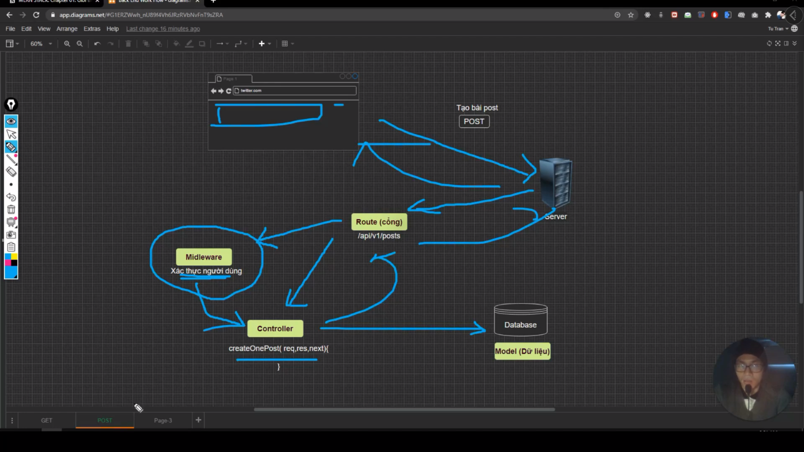

- Cũng tương tự đó: khi người dùng (client) đăng kí người dùng, người ta sẽ gửi (request) các thông tin như: email, số điện thoại,...

👉 Thì nó sẽ vào route

👉 và nó kiểm tra thông tin có đạt yêu cầu hay không (như là: có đủ kí tự hay không, mật khẩu có đúng định dạng hay không...)

👉 Thì sau đó nó sẽ vào middleware kiểm tra các yêu cầu đó (email đúng định dạng, mật khẩu đúng yêu cầu,...)

👉 Sau đó nó sẽ vào thằng controller để cho người ta đăng kí

👉 và nó sẽ vào database để lưu các thông tin vào đó

👉 cuối cùng nó sẽ trả về thằng client

Hình ảnh minh họa: 🌈

✅ Bởi vậy thằng `middleware` này nó rất quan trọng, nó nằm giữa thằng request và thằng response

✅ Nó sẽ ứng dụng vào trong các ứng dụng thực tế như: đăng kí, đăng nhập, tạo bài post, xác thực người dùng,...

✅ Nó ứng dụng vào trong các ngôn ngữ khác nhau như là: php, c#, java,...

---

**Hãy tìm hiểu về `CORS` và `Body Parse`:**

- `CORS` này nó giúp chúng ta kết nối front-end và back-end
- Cụ thể là khi mà front-end (reactjs) yêu cầu đến server (nodejs) thì `CORS` này nó cho phép client nói chuyện được với server

- `Body Parse` là 1 middleware
- Nó có tác dụng, khi người dùng nhập email, password, name,... thì làm sao server nó đọc được mấy thứ đó. Nó sẽ đọc được, nhưng phải thông qua thằng `body parse` để chuyển thành dạng `object`, và cho chúng ta truy cập vào từng phần tử trong đó. Thì đó là các dụng của body parse
- Tóm lại: cứ cái gì liên quan đến, khi mà người dùng gửi dữ liệu hoặc cái input vào cái server thì thằng `body parse` nó sẽ chuyển đổi thành các `object` để cho chúng ta làm việc với các phần tử trong object đó

**Tổng kết CORS và Body Parse:**

✅ CORS cho phép front-end giao tiếp với back-end

✅ Body parse dùng để chuyển đổi dữ liệu của người dùng thành object. Để từ đó server dễ dàng thao tác với các thuộc tính trong đó

---

> Setup structure folder (config, middleware, route, controller, model,...)

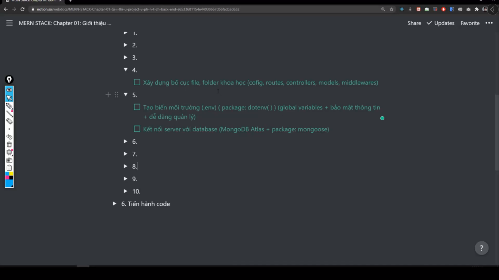

---

> Process login, register (Quy trình đăng ký, đăng nhập) 🔑

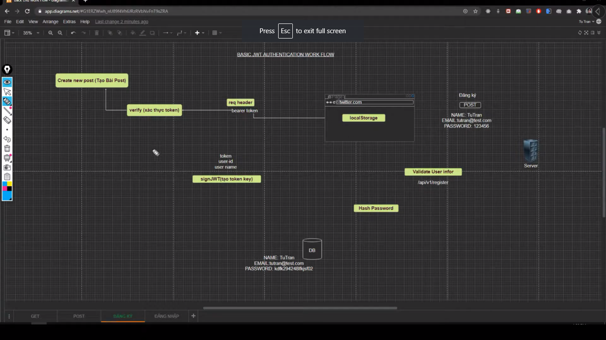

**- Quy trình đăng ký: 🎦**

- Khi người dùng gửi yêu cầu đến server (ví dụ người dùng nhập name: duynghia, email: duynghia@gmail.com), những dữ liệu đó được gửi lên server. Server lúc đó validate các thông tin đó (email có bị trùng với email trong database không, password có đủ ký tự không,...).

- Sau khi mà nó validate xong thì nó tiến hành hash (mã hóa) password đó, rồi sau đó nó mới lưu vào database. Mục đích bảo hóa password đó là nó bảo mật tài khoản người dùng. Khi mà người quản trị website vào database xem thì họ sẽ không thấy được cái password của user đó (vì password đã được mã hóa rồi).

- Tiếp theo đó khi lưu người dùng thành công, thì sẽ tạo tiếp 1 cái token key.

- Token key có nghĩa là:

  - Ví dụ: khi mình đi thuê nhà, khi mình thuê nhà thành công (lưu data vào database thành công) thì chủ nhà sẽ đưa cho bạn 1 cái chìa khóa (key). Mục đích đưa chìa khóa để làm gì? Mục đích để lần sau vào cái nhà thuê này, anh lấy chìa khóa đó anh mở cửa ra là được, tôi (chủ nhà) không cần phải đến để đưa chìa khóa anh nữa. Tóm lại, khi anh đặt nhà thành công thì tôi đưa luôn cái chia khóa cho anh luôn

- Trong ngữ cảnh development thì key này, có nghĩa là token key. Mà bên server đã tạo cho client (user) sử dụng

- User được lưu token key ở local Storage ở trong browser (trình duyệt).

- Mục đích để lưu trong local storage để làm gì? Để khi các bạn tạo bài post, thì bạn phải có 1 cái key, thì nó sẽ lấy cái key ở ngay trong local storage ở trong browser và nó gửi cái request. Trong cái request thì nó sẽ đưa cái token vào trong request header này. Và ngay lúc đó bên back-end nó sẽ verify cái token này. Nếu nó xác nhận cái token đó OK ĐÚNG, và tôi cho phép anh tạo cái bài post

- Tóm lại: 🔥

  - Đầu tiên khách hàng đăng ký, người ta đưa những thông tin như (name, email, password,...) vào. Sau đó server kiểm tra xem (validate) có đủ tiêu chuẩn không. Nếu đủ tiêu chuẩn thì nó hash password, và nó lưu trong database

  - Lưu xong thì nó bắt đầu tạo cái token key gửi về cho người dùng, người dùng sẽ lưu trong cái local storage. Và trong những lần request sau, như là tạo bài post thì nó chỉ việc gửi cái token này vào trong cái request header và bên server xác nhận nếu đúng thì nó sẽ cho tạo bài post

**- Quy trình đăng nhập: 🎦**

- Tương tự, khi mà người dùng đăng nhập:

- Thì người dùng cũng gửi cái request điền thông tin (email, password) vào rồi gửi cho server. Bên server nó validate kiểm tra OK THÔNG TIN ĐÚNG.

- Sau khi nó kiểm tra xong thì nó sẽ compare (so sánh) password. Có nghĩa là nó so sánh password đã lưu trong database với password khi người dùng nhập vào ô input.

- Sau khi mà nó so sánh xong, nó thấy password nhập vào và password đã hash trong database TRÙNG NHAU thì nó tiến hành tạo cái token key cho người dùng. Và cái token key đó được lưu vào trong local storage.

- Trong mỗi lần request sau đó, ví dụ như là tạo bài post, thì nó chỉ cần gửi cái token này vào cái request header và sau đó server nó verify. Sau khi server verify thành công thì nó sẽ tiến hành tạo bài post

---

> Trong bài học hôm này (Video #13), chúng ta sẽ tìm hiểu về MongoDB

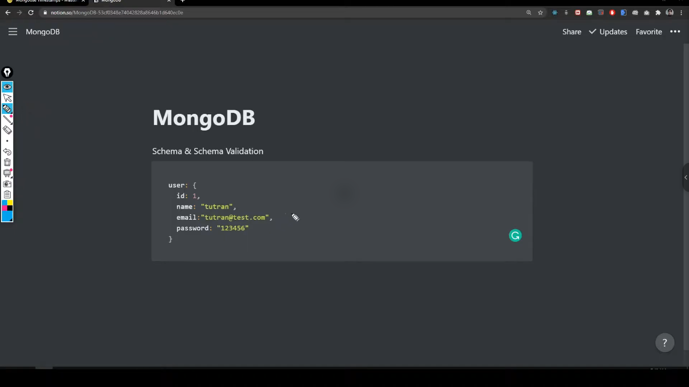

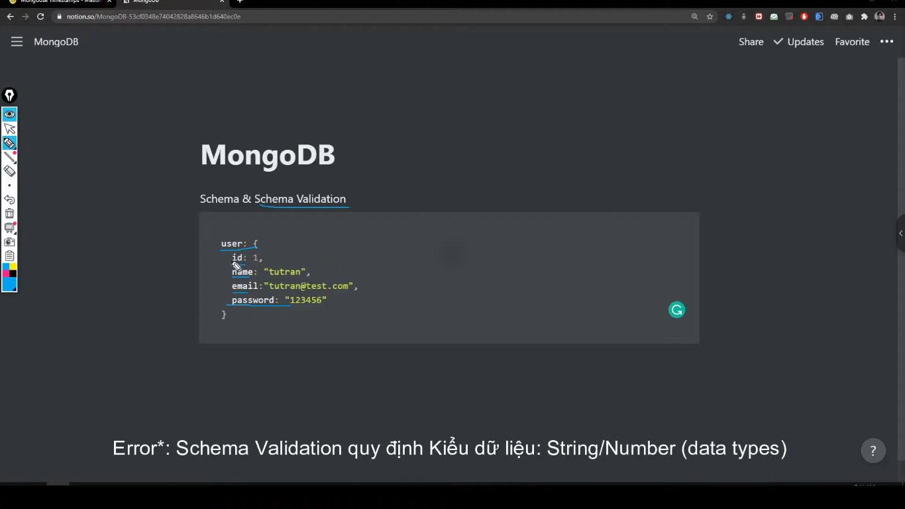

- Schema là cấu trúc của bộ khung mà chúng ta lưu dữ liệu vào trong database

- Ví dụ:

- Cấu trúc của User thì có:

  - name, email, password
  - Ngoài ra thì có thêm Id, mà Id nó tự động tạo bởi mongoseDb, nên chúng ta không cần tạo nữa

- Schema validation nó quy định các quy chế, như là: cấu trúc dữ liệu (string), unique (true,false), trim,...

- timestamps: nó giúp cho mongose tự động tạo 2 cái thuộc tính createdAt (ngày bắt đầu tạo), updatedAt (ngày cập nhật dữ liệu)

---

> Trong bài học hôm nay (Video #15), chún ta sẽ học về Mã hóa password và tạo Token Key

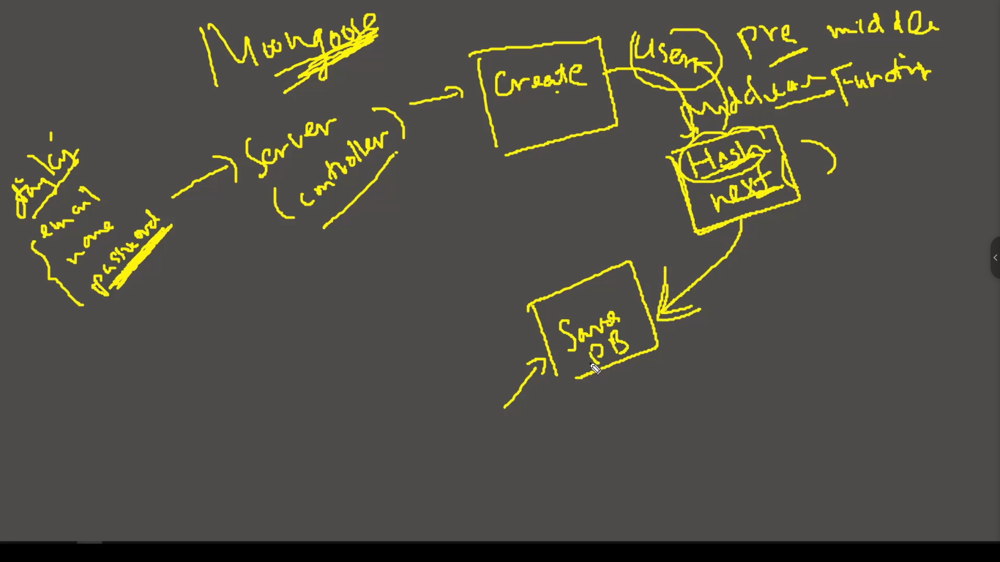

- Quy trình mã hóa password: 🎦

- Khi người dùng đăng ký, thì sẽ gửi lên server (cụ thể là controller) các thông tin như: email, name, password. Thì trong controller này thằng mongoose sẽ nhảy vào. Mongoose sẽ qua 2 bước đó là create (tạo) và save (lưu)

- Nếu đi theo cách bình thường thì sẽ như này:

  - register (name, email, password) 👉 server (controller) 👉 create 👉 save vào trong database

- Tuy nhiên chúng ta cần thêm bước để mã hóa cái password này (hass password) trước khi chúng ta lưu vào trong database. Thì chúng ta sẽ cần 1 hàm nào đấy, đó là `middleware function`, nó nhảy vào giữa để làm có thể mã hóa được cái password này.

- Chúng ta đang dùng NoSQL đó là Mongoose DB, thì trong đó có 1 hàm sẵn đó là `Pre Middleware` nó sẽ nhảy vào giữa create và save. Thì khi mà user tạo thì nó sẽ gửi lên các thông tin của user, sau đó nó sẽ vào thằng `middleware function`. Trong hàm đấy, nó sẽ thực hiện hash password, sau đó nó sẽ trả cái password đó lại user. Thì trong hàm `middleware function` đó, ta sẽ gọi hàm `next()` để nó sẽ lấy thông tin user và cái hash password nó lưu vào trong database

- Tóm lại: 🎯

  - Khi người dùng register thì sẽ vào hàm `middleware function`, cụ thể ở đây là hàm `Pre Middleware` có sẵn trong Mongoose DB.
  - Thằng hash password (pre middleware) đó nó sẽ nằm ở giữa thằng `create` và `save`. Khi mà mã hóa xong rồi, thì thực hiện gọi hàm `next()`. Trong đó nó sẽ lấy thông tin user đó và password đã mã hóa, xong nó lưu vào trong database

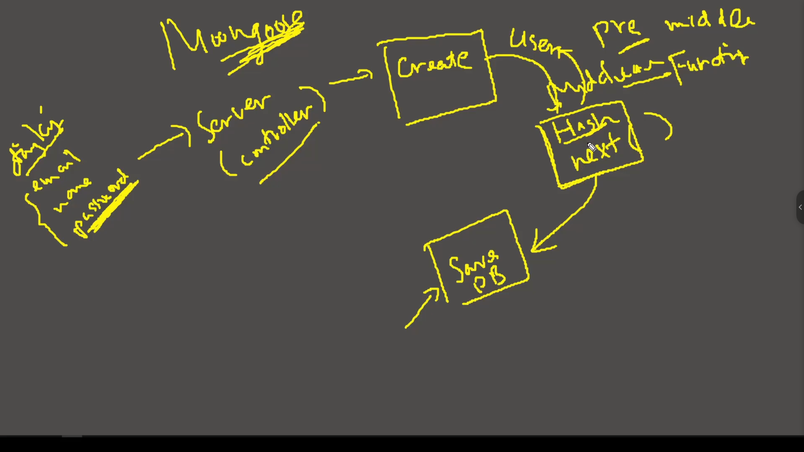

---

- Quy trình mã hóa Token Key: 🎦

- Khi user đăng ký/đăng nhập thành công thì sẽ tạo 1 token key

- Token key khi được tạo thì sẽ cần 3 thứ: `data`, `app key`, `expire date` (optional).

- Token này nó có khi user đăng ký/đăng nhập thành công thì mình sẽ tạo 1 token key cho user đó. Và cho những lần đăng ký/đăng nhập sau thì họ không phải cần đăng ký/đăng nhập lại nữa, mà họ chỉ cung cấp 1 cái token key này thôi.

- Vậy làm sao để cái token key này thuộc về user nào? Thì lúc đó mình dựa vào 3 thứ mà mình đã nêu ở trên (Data, AppKey, Expire Date)

  - Trong `data` thì ta có `user id`, để khi mà `data` này nó chuyển vào trong token key thì nó sẽ mã hóa cái `data` thì lúc đó ta sẽ lấy được `user id`. Và ta so sánh cái `user id` này có tồn tại trong database không. Nếu nó đúng và tồn tại thì OK
  - `App Key` thì dùng để giải hóa hoặc giải mã
  - `Expire Date` là ngày hết hạn của token key

- Thông thường những website thì họ để tăng tính bảo mật thì cái token này có 1 mốc thời gian nhất định. Ví dụ như 1 giờ, 1 ngày, 1 tuần, thì trong khoảng thời gian đó ta chỉ cần cung cấp token key là có thể vào được trang web. Khi mà quá hạn trong khoảng thời gian đó thì user sẽ đăng nhập lại để tạo lại 1 token key mới. Thì đó là tác dụng của `Expire Date`

- Tất cả ý trên đó là lý thuyết của token key và quy trình trong Mongose DB cụ thể ở đây là chúng ta sử dụng `Pre Middleware` function

---

> Trong bài học này (video #16) chúng ta sẽ học về Tạo, Thêm, Sửa, Xóa các bài viết từ database

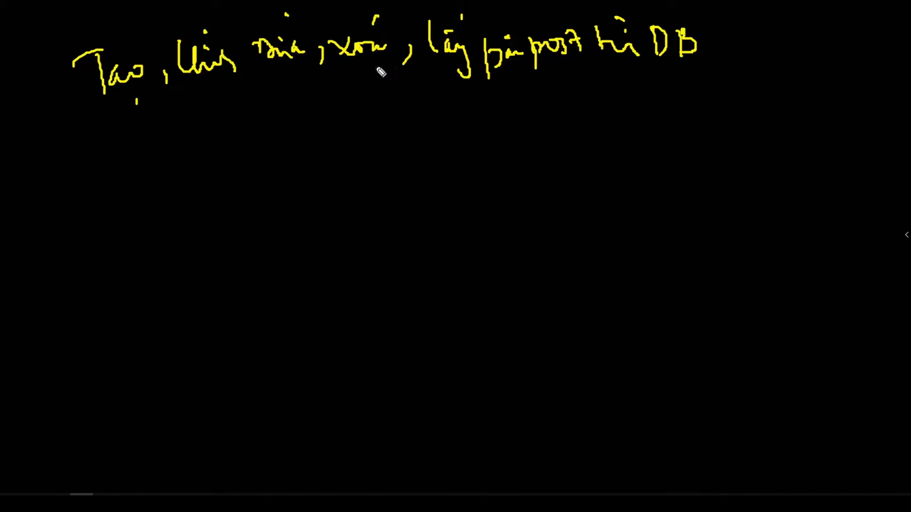

- Để tạo ra bài post thì user phải đăng ký/đăng nhập

- Mỗi bài post thì phải có content (nội dung), author (tác giả), created at (ngày tạo), updated at (ngày cập nhật).

  - Nhưng trong đó có created at và updated at là do mongoose db tạo tự động
  - Còn những mục khác thì nó sẽ tạo kiểu gì? Làm sao chúng ta có thể lấy được id, thông tin tác giả để lưu vào trong bài post?

- Các bạn hãy nhớ lại bài cũ. Khi user đăng ký/đăng nhập thì nó sẽ tạo ra `token key`. Thì trong `token key` này trong đó nó chứa 1 cái `user_id`. Cái `user_id` này nó đã được mã hóa bởi `APP_SECRET`

- Thế thì khi chúng ta tạo bài post thì ngoài lấy những thông tin như content, created at, updated at, và chúng ta lấy thêm author. Author đó nó nằm trong `token key` này.

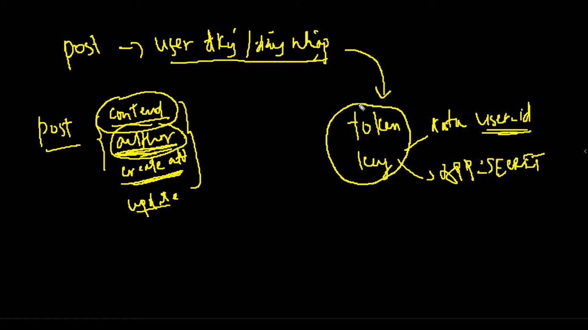

---

- Để các bạn hiểu thêm thì mình sẽ giải thích thêm:

- Khi chúng ta tạo bài post thì chúng ta cần phải cung cấp cho nó content, token key, ngày tạo, ngày cập nhật. Token này hiện tại nó đang được mã hóa. Thế thì, khi mà nó vào bước vào tạo post thì cái token key này nó cần được giải mã. Chính vì vậy mà chúng ta cần cái middleware (1 cái hàm ở giữa) để chúng ta giải mã token này, để chúng ta lấy được cái user_id. Và khi mà chúng ta lấy được cái user_id và cộng thêm những cái trước đó (nội dung, ngày tạo, ngày cập nhật) và sau đó chúng ta mới tạo được cái bài post. Trong bài post, có dạng (content, author: user_id, createdAt, updatedAt)

- Trên đó là tất cả quy trình khi chúng ta thực hiện tạo bài post. Ngoài ra, chúng ta vẫn có thể làm update, edit, delete thì cũng tương tự chúng ta vẫn sẽ cần middleware và bên client (browser) nó sẽ gửi token cho cái middleware, và trong middleware đó nó sẽ giải mã để lấy được thông tin của user hiện tại (user_id) mà đang tạo bài post này.

- Sau khi lấy xong, kết hợp với nội dung, ngày tạo, ngày cập nhật, thông tin, mà người ta điền vào trong cái input. Thì cuối cùng chúng ta tiến hành tạo, cũng như update hoặc là xóa

- Đó là những lưu ý mà chúng ta tạo bài post. Có nghĩa là chúng ta sẽ có thêm middleware chen vào giữa để chúng ta giải mã cái token. Bởi vì khi người dùng đăng ký/đăng nhập thành công thì server nó trả về cái token đã được mã hóa. Cho nên chúng ta sẽ giải mã nó, sau đó mới lấy được cái user_id, rồi mới tạo được bài post

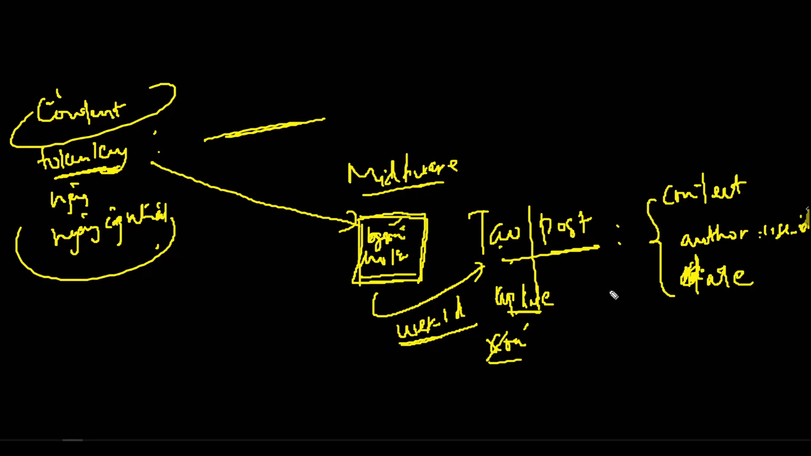

---

> Hôm nay chúng ta học bài #17

- Giải thích về phương thức `populate()` trong Mongoose DB?

- Bình thường khi lưu vào trong database thì `author` này chỉ lưu `user_id` của tác giả thôi. Tuy nhiên thì khi chúng ta lấy toàn bộ bài post thì ngoài user_id, chúng ta cần lấy thêm tên tác giả, hình ảnh,...

- Thì để khắc phục điều đó thì mình sử dụng thằng `populate()` để nó giải quyết tất cả các vấn đề trên. Nó lấy cái id của user lưu vào bài post này, và nó truy tìm đến collection (có nghĩa là cái nơi chứa cái thông tin về cái user và nó gán nó vào method find), và cuối cùng nó phản hồi lại cho cái bài post này

---

- Lưu ý:

- Khi chúng ta sử dụng phương thức find thì kết quả nó sẽ trả về 1 mảng. Thì khi đó mình có thể sử dụng `.length` này. Giống như bên trong JavaScript, để đếm xem có bao nhiêu bài post trong mảng đó

---

> Trong bài #18, chúng ta thực hiện test api bên trong ứng dụng Postman

Đây là page login

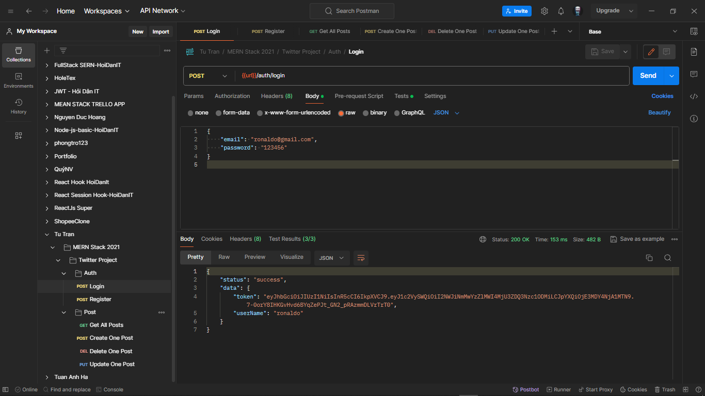

Đồng thời đó, chúng ta qua mục `Tests` để viết đoạn code này vào để nó thể khi user login vào thì token thì động lưu vào biến token

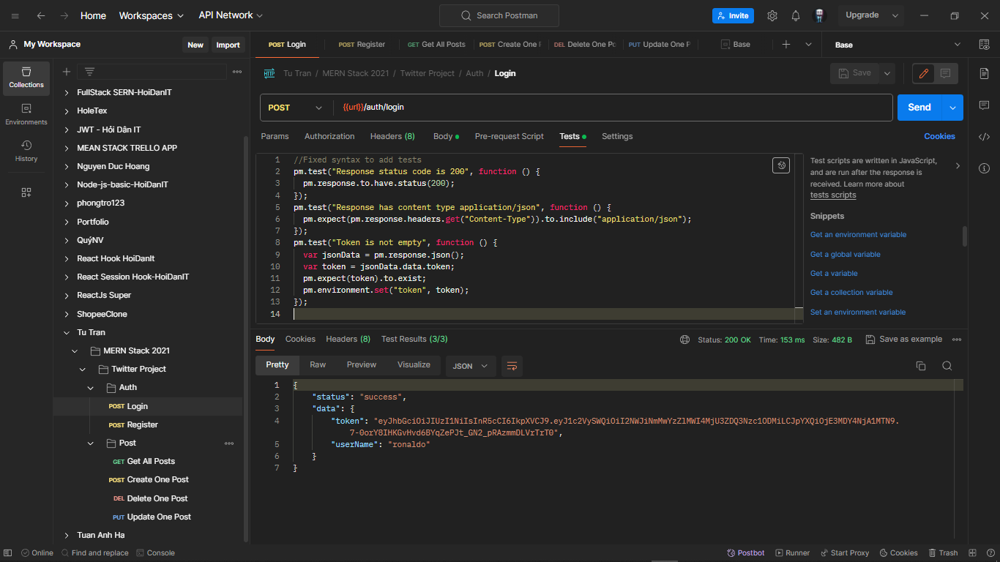

Trước tiên, chúng ta tạo thêm 1 field token để chứa token mỗi khi user đăng nhập vào

Ban đầu, nó sẽ trống trơn như thế này. Sau khi đăng nhập vào thì nó sẽ tự động import token đó vào như này

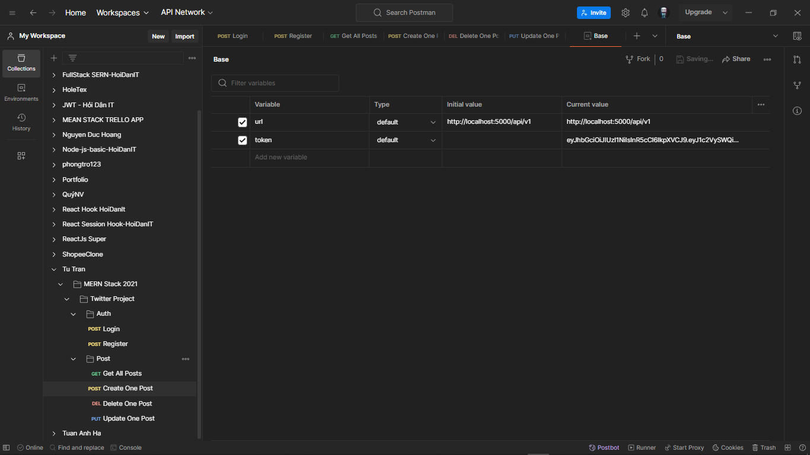

Sau đó, chúng ta vào page Create One Post để tạo 1 bài post và thiết lập Authorization (chọn vào type: Bearer) và page bên cạnh chọn cái `{{token}}` mà chúng ta vừa tạo để lưu token mỗi khi user đăng nhập

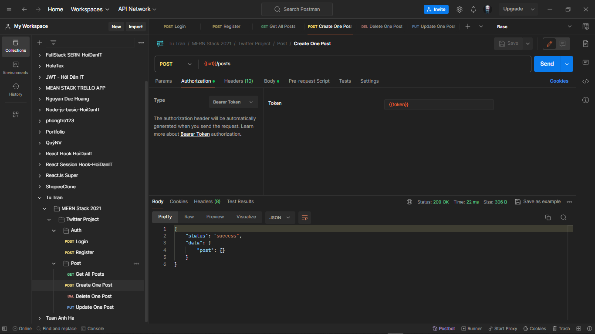

Đây là chức năng xóa bài post (Delete One Post)

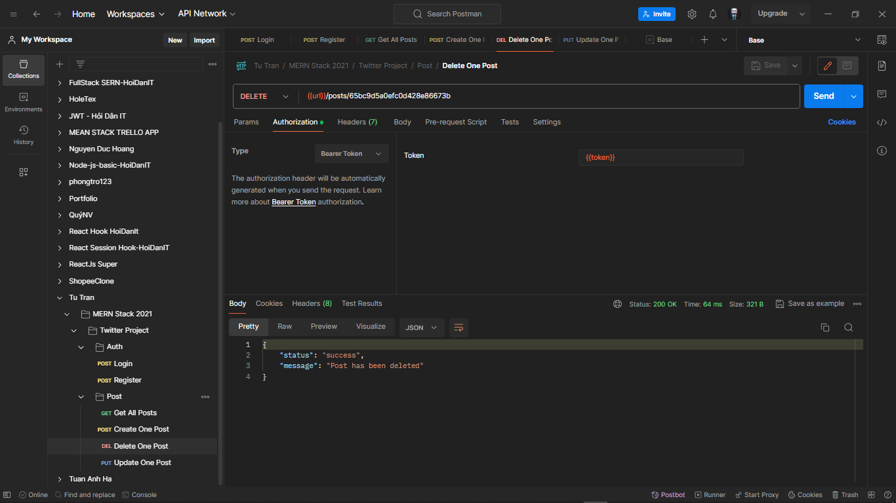

Đây là chức năng cập nhật bài post (Update One Post)

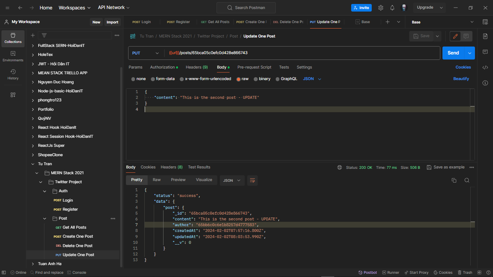

---

> Trong bài này (video #19) chúng ta sẽ học về cách xử lý lỗi (error handling)

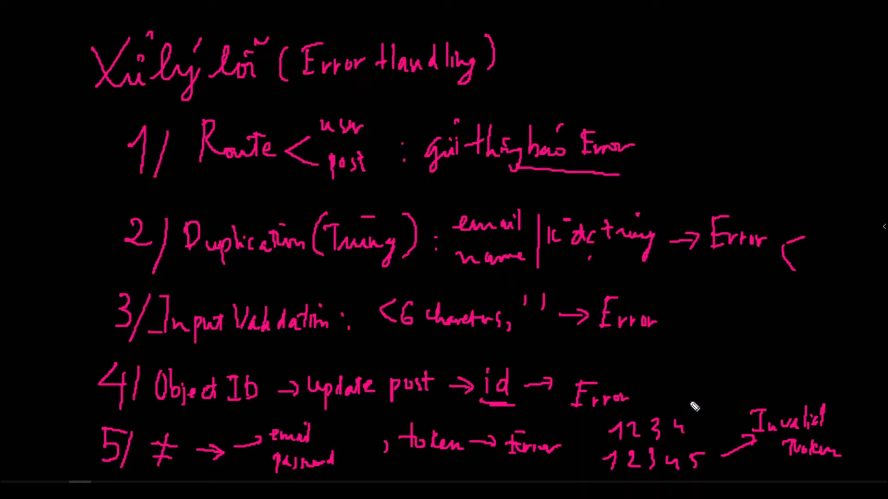

> Dù chúng ta code ngôn ngữ nào đi chăng nữa thì cũng có 5 error handling này. Quy trình này rất quan trọng

Trong project của chúng ta thì cũng có 5 cách xử lý lỗi (error handling)

**1. Route**

- Trong project lần này chúng ta có 2 route đó là `user` và `post`

- Nếu như user yêu cầu vào 2 route đó thì chúng ta có thể đáp ứng được. Thế nhưng khi người dùng vào các route mà nó không được tồn tại (chúng ta chưa tạo) như là: comment, like,...Thì chúng ta sẽ in ra thông báo lỗi

**2. Duplication (Trùng)**

- Khi mà user đăng kí thì cái email và name bắt buộc không được trùng

- Mà nếu mà chúng ta phát hiện user đó có email bị trùng thì chúng ta cũng phải xử lý và in ra thông báo lỗi như email đã tồn tại,...

**3. Input validation**

- Trong trường hợp user không điền email chẳng hạn, password không đủ 6 kí tự (yêu cầu lớn hơn 6 character) thì chúng ta cũng phải in ra 1 cái thông báo: email phải bắt buộc điền, password phải từ 6 kí tự trở lên,...

**4. Object ID**

- Trong trường hợp chúng ta update 1 cái bài post. Mà để update được thì chúng ta phải có id tương ứng với bài post đó, và chúng ta tìm và update bài post đó

- Nhưng trong trường hợp user truyền cái id không tồn tại thì sao? Không đúng id thì sẽ không tìm thấy trong database mà update? Thì lúc đó chúng ta sẽ giải quyết như thế nào? Lúc đó chúng ta phải thông báo 1 error trả về cho phía client là id này nhập vào không đúng, chúng tôi không biết id này là id nào để có thể update được

**5. Những lỗi không có trong những lỗi trên**

- Trong trường hợp user login chẳng hạn: email họ nhập không đúng, hoặc password họ nhập không đúng thì chúng ta cũng phải in ra thông báo lỗi

- Ngoài ra chúng ta nếu tạo được bài post thì bắt buộc chúng ta phải có `token key` ở trong `request header`. Nếu như mà chúng ta không tìm được `token key` thì chúng ta cũng phải in ra error.

- Nhưng trong trường hợp có `token key` nhưng `token key` đó nó bị lỗi. Ví dụ token key là `1234`, lỡ nhưng mà user sử dụng mẹo để thay đổi nó thành `12345` chẳng hạn, thì nó sẽ không đúng nữa, thì chúng ta cũng phải in ra thông báo `Invalid Token`

> **🎯 Những mục trên đó là 5 cái lỗi phổ biến và quan trọng nhất mà các bạn cần xử lý trong bất kỳ application nào đều phải có 5 error này**

---

> Như chúng ta đã trình bài ở trước thì có 5 loại error chính, thế thì làm sao để xử lý để nó in message có ý nghĩa.

- Nếu như chúng ta xử lý các loại đó 1 cách riêng biệt, có nghĩa là chúng ta tạo ra từng cái function ứng với từng loại lỗi và chúng ta xử lý trong từng cái function đó. Trong cách dùng đó thì nó không được tối ưu

- Trong ExpressJS thì nó có cách xử lý lỗi rất là hay, đó là bất kể cái lỗi gì, thì bạn có thể truyền cái lỗi đó vào trong function. `Function` đó thường đặt tên là `Error Handling` (có nghĩa là hàm để xử lý lỗi). Trong hàm đó nó xử lý toàn bộ lỗi (5 lỗi mà chúng ta đã nêu ở trên). Khi mà xảy ra error nào thì bên phía Express nó truyền cái lỗi đó trong cái function này (Error Handling)

- Trong cái function đó, nó sẽ phân loại ra. Ví dụ đó là loại 1 thì nó sẽ in ra lỗi 1, loại 2 thì sẽ in ra lỗi 2,...

- Khi nó tạo ra lỗi thì làm sao mà chúng ta truyền được cái lỗi đó vào `function Error Handling` để xử lý lỗi? Thì trong Express có cái `controller` nó có sẵn các tham số `req`, `res`, `next`. `Req` và `res` thì chúng ta dùng nhiều rồi: `req` là user gửi lên server, `res` là server trả dữ liệu về user. Còn `next` có tác dụng là nó sẽ truyền cái error (ví dụ `next(Error)`), thì ngay lập tức Express nó sẽ truyền vào cái `function Error Handling` và trong cái function đó ta lấy được cái lỗi và chúng ta phân loại nó

- Thì đó là cách mà Express hoạt động, nó xử lý lỗi. Có nghĩa là khi mà chúng ta gọi hàm `next` thì ngay lập tức thì nó sẽ truyền cái tham số lỗi vào `function Error Handling` và cái function này nó nhận cái error (đầu vào), tiếp tục nó phân loại từng error là như vậy

🎯 Đó là tất cả Express xử lý lỗi, cũng như chúng ta tìm hiểu về 5 loại lỗi thường gặp nhất trong mọi application và chúng ta bắt buộc phải xử lý nó

---

> Comments này hữu ích khi hỏi về 3 tham số trong controller (Video #20)

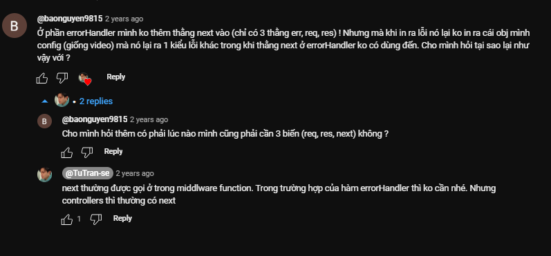

---

> Video #21

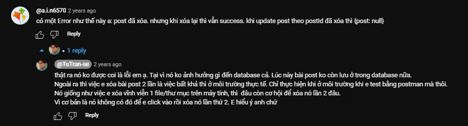

---

> Video #23

Đây là bước tìm hiểu về back-end cuối cùng của lộ trình MERN STACK này. Ở những video tiếp theo thì mình cùng nhau tìm hiểu về front-end

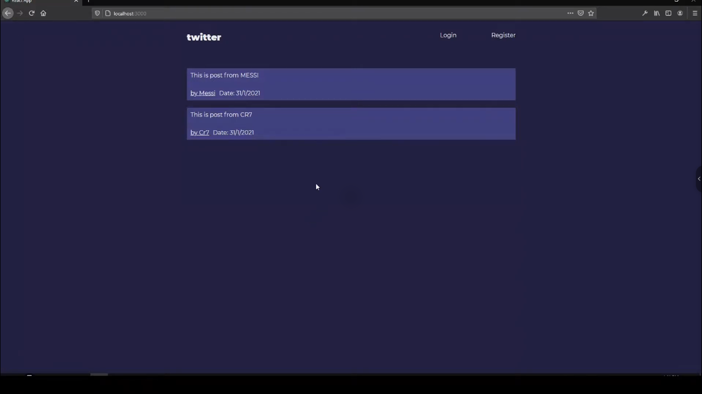

---

> Trong bài này chúng ta bắt đầu phân tích giao diện người dùng (UI: user interface). Video #24

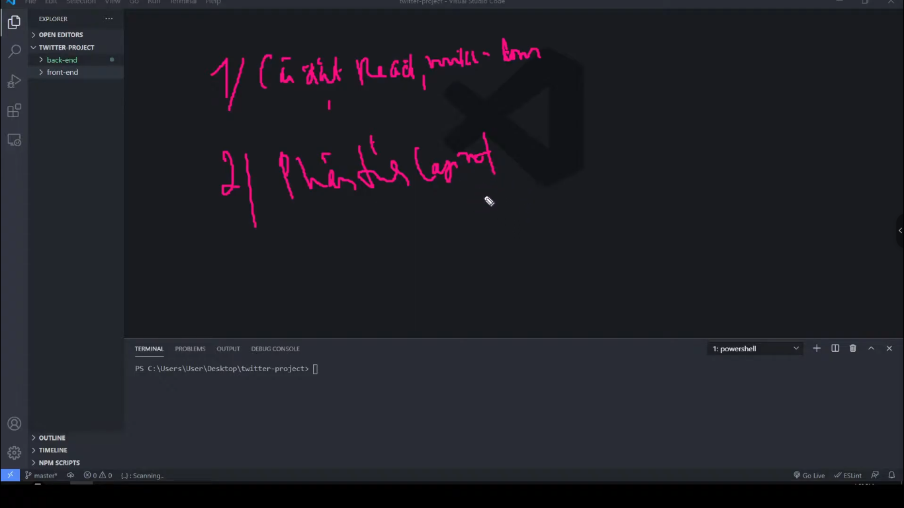

- Đây là giao diện chính của trang web

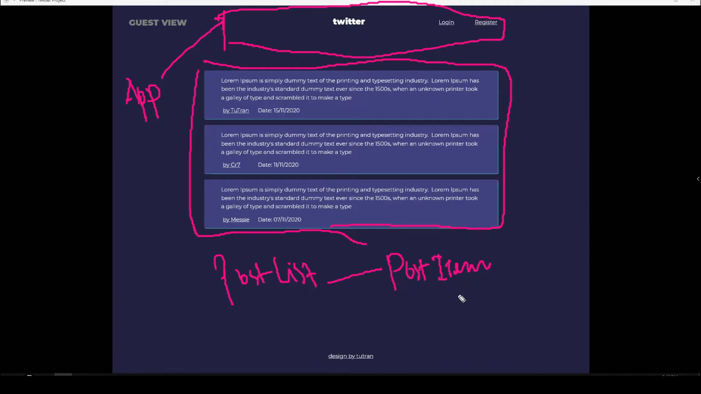

- Đây là giao diện của login

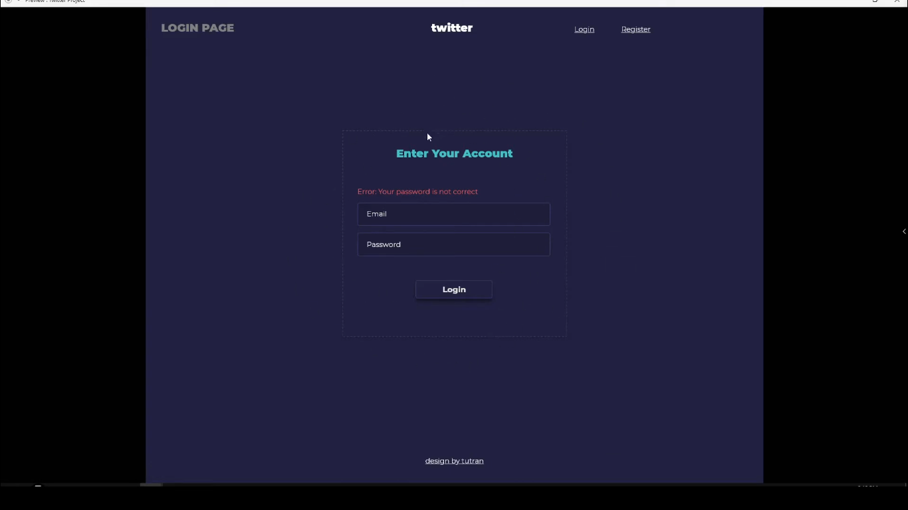

- Đây là giao diện của register

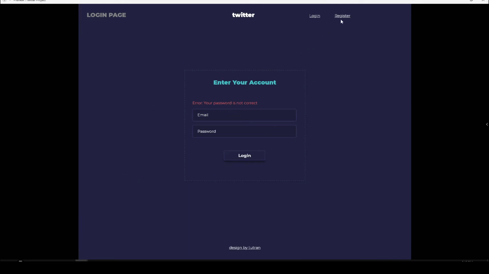

- Đây là giao diện của form tạo bài post

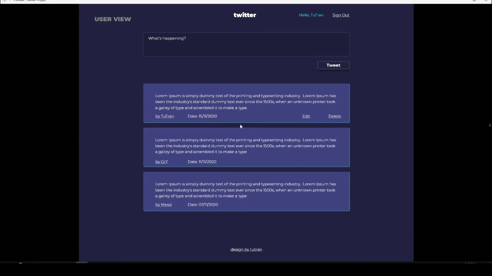

- Tất cả component trong website

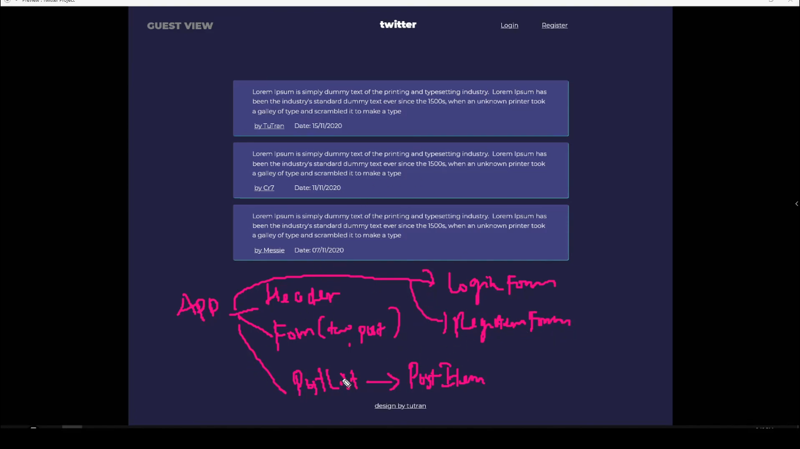

---

> Bình luận từ video #27

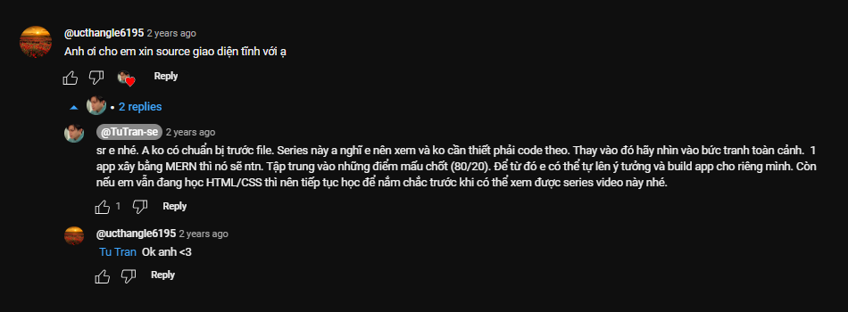

---

> Hôm nay chúng ta tìm hiểu về State, Context, Dispatch, Reducer (Video #30)

Nếu cảm thấy mình chưa hiểu về những khái niệm đó thì có thể lên search google và tìm hiểu nó

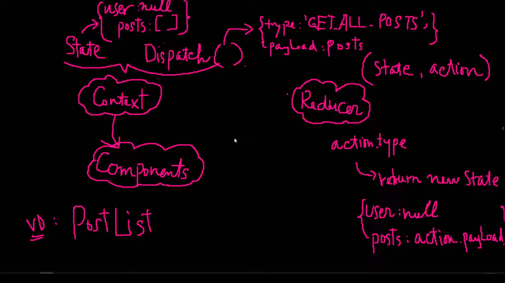
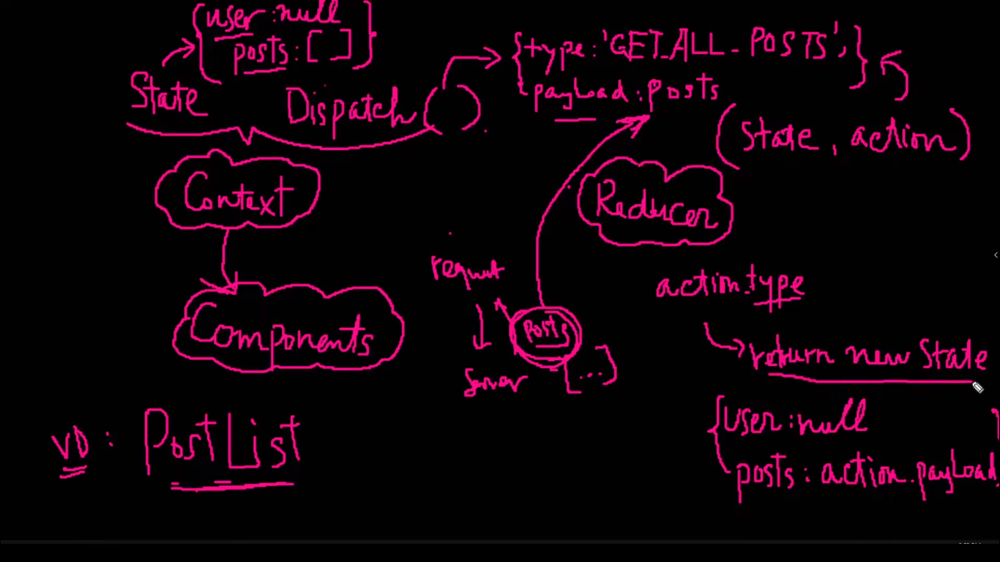
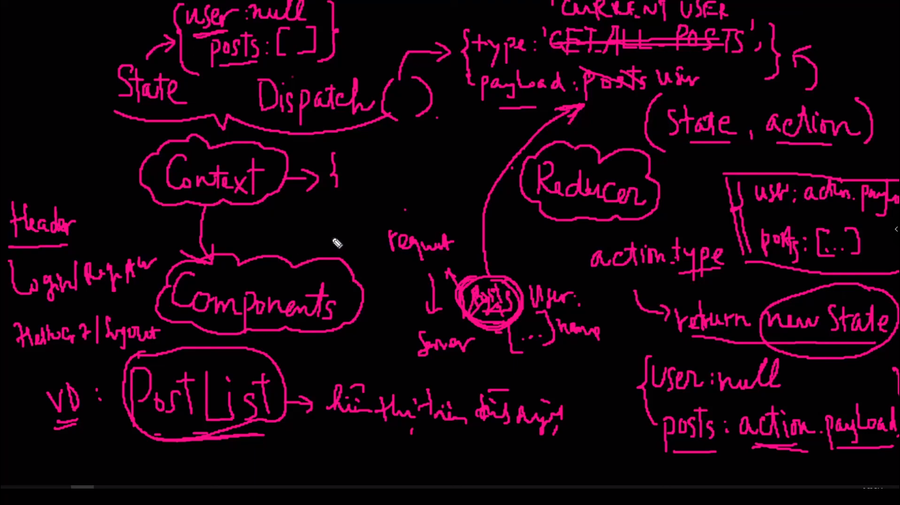

---

> Video #34

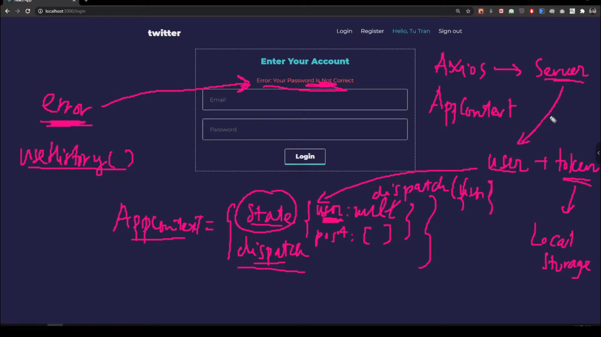

---

> Video #39

Trong bài này mình học về Update/Delete Post

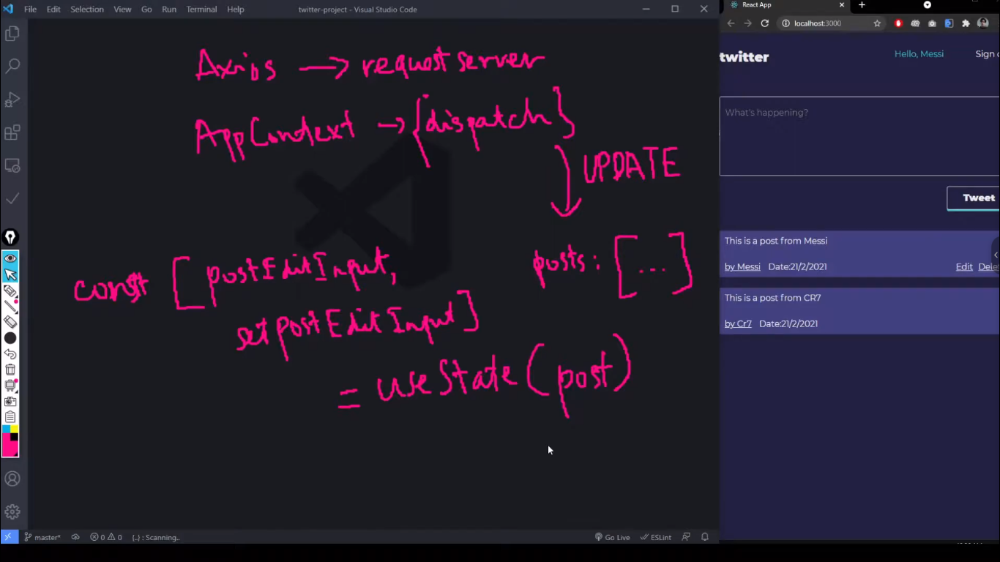

---
