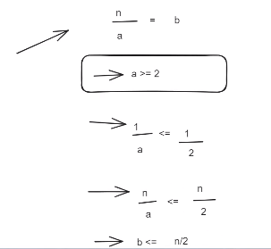
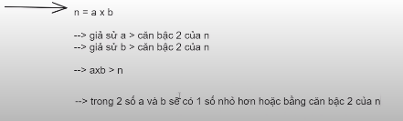

- Giả sử trong khoảng từ 2 đến n-1 có 1 số nào đấy mà n chia hết, mình gọi số trong khoảng được chia hết là a

- Từ cái điều này mình suy ra được kết luận:

  - Kiểu gì cũng tồn tại con số **b <= n/2** và thỏa mãn điều kiện **n/a = b**
  - Con số mà mình tính toán ra nó không thể lớn hơn **b <= n/2** được

- Chúng ta phân tích sâu hơn nữa nhé: n = a x b

  - Giả sử a > căn bậc 2 của n
  - Giả sử b > căn bậc 2 của n
  - Từ đó => **a x b > n**

  - Trong 2 số a và b sẽ có 1 số nhỏ hơn hoặc bằng căn bậc 2 của n

