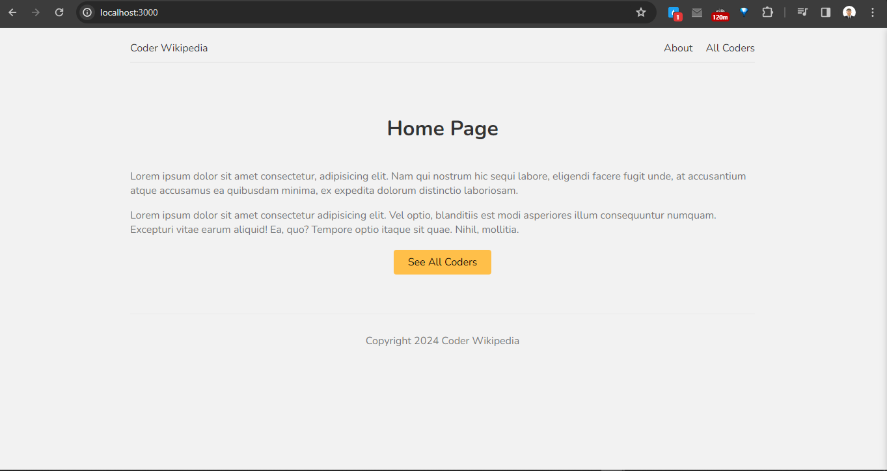
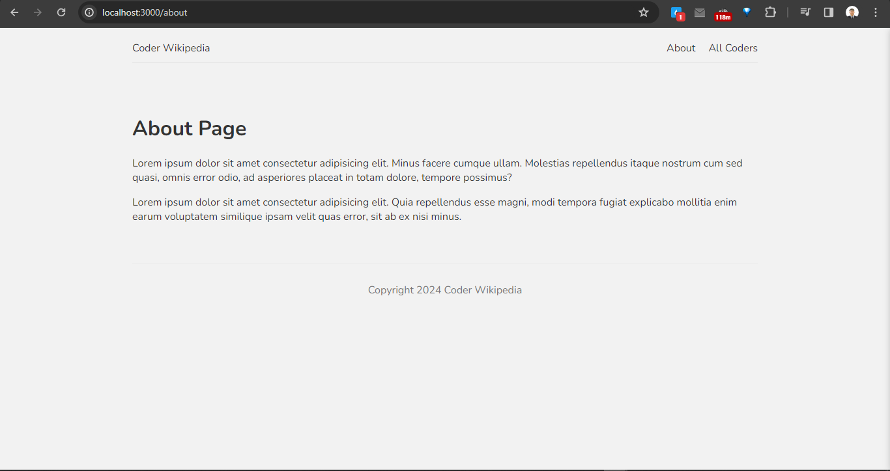
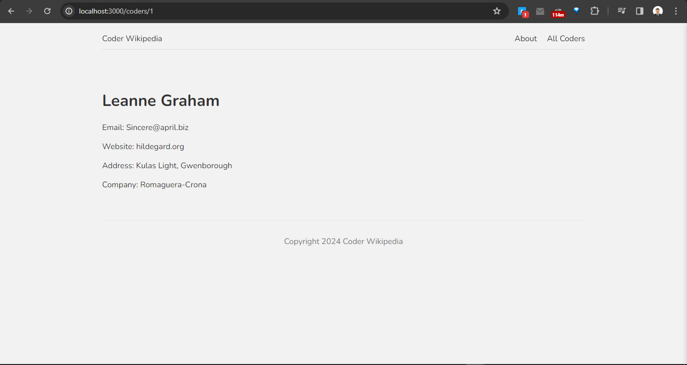

# This is a lesson in course NextJS

[Link tutorial](https://bom.so/TYUhqF)

---

> when running, then i open link http://localhost:3000/

## This is a Home Page, when application run finished

## This is a About Page, when i click into address About, then it navigation to link `/about`

## This is a All Coders Page, when i click into address All Coders, then it nagigation to link `/coders`

## when click into each item, then it will navigation to link `user detail` to see each users

> Example when i click into user 1, then it will have link `http://localhost:3000/coders/1`

---

Info author: 👨‍💻

Name: duynghiadev
Github: https://github.com/duynghiadev
Location: Da nang, Viet nam

---

Happy Coding!!! 🎉
