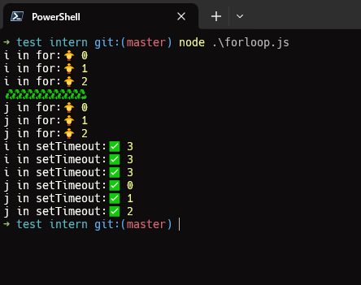

# Bài này là code của buổi phỏng vấn online của thằng Phương (29/2/2024)

- Bài này cũng thuộc 1 dạng bài toán về logic, cũng như các kiến thức về `closure` trong JavaScript

- Mình đã search và tìm hiểu đọc code mất 1h mới hiểu được vòng lặp thứ nhất (do có sử dụng biến var để lưu trữ giá trị, vô hình chung nó đã tạo ra `closure` và đã lưu giá trị đó lại). Ôn tập lại kiến thức `closure` trong JS nhé.

Hình ảnh khi run code:

Đây là link chat mà mình đã hỏi chat-pgt

[Link chat-gpt](https://chat.openai.com/share/079a7ff2-66b7-4746-bfa1-24573dd7f87d)
