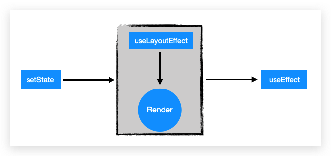

[Link Repo Github](https://github.com/GeekEast/react-hooks-examples)

### Variable

|           Feature            | `Plain Variable` | `State` | `Ref` |
| :--------------------------: | :--------------: | :-----: | :---: |
| Rendering Reference Sameness |        ❎        |   ❎    |   ✔   |
|        Can be Updated        |        ❎        |    ✔    |   ✔   |

### useContext vs redux

- Changes in useContext cause re-rendering of intermediate components.
- Changes in the store only trigger re-rendering of relevant components.

### useRef

- Persistent reference, only `current` is usable.
- Can be used to retrieve or add `DOM nodes`.

### useMemo vs useCallback vs memo

- `useMemo` is used to **cache values** of **expensive calculations**, and can also cache **components**.
- `useCallback` is used to **persist the reference** of a function.
- `memo` is used to cache **components**, avoiding **unnecessary re-rendering** caused by **parent component renders**.

### useEffect vs useLayoutEffect

<div style="text-align:center; margin:auto"></div>

- [Difference between useEffect and useLayoutEffect](https://juejin.im/post/5de38c76e51d455f9b335eff) 👉 Có ví dụ trong folder `Example-UseEffect-UseLayoutEffect`
- [React Hooks - useEffect](https://imweb.io/topic/5cd845cadcd62f86299fcd76) 👉 Link hỏng rồi ❌

### useContext

- Creating context
  - `defaultContext` is the default value passed to consumers or useContext when there is no provider. However, it is immutable and cannot be changed using setContext.

```javascript
// userContext.js
import { createContext } from 'react'

const UserContext = createContext([
  {
    firstName: 'Bob',
    lastName: 'Bobberson',
    suffix: 1,
    email: 'bobberson@example.com'
  },
  (obj) => obj
])
const { Provider } = UserContext
export { Provider, UserContext }
```

- Creating Provider

```jsx
const UseContext = () => {
  // This is the default value understood by humans and can be changed using setContext.
  const user = useState({
    firstName: 'James',
    lastName: 'Tan',
    suffix: 1,
    email: 'james@example.com'
  })

  return (
    <div>
      <Provider value={user}>
        <h1>1st level</h1>
        <Level2></Level2>
      </Provider>
    </div>
  )
}
```

- Creating Consumer

```jsx
const Level5 = () => {
  // Receiving context
  const [user, setUser] = useContext < any > UserContext
  return (
    <div>
      <h5>{`${user.firstName} ${user.lastName} the ${user.suffix} born`}</h5>
      <button
        onClick={() => {
          setUser({ ...user, suffix: user.suffix + 1 })
        }}
      >
        Increment
      </button>
    </div>
  )
}
```

### forwardRef

- Can be used with `useRef` to obtain the `DOM` of the child component.
- In the parent component, create a `ref`, pass it to the child component, and get the `DOM` in the parent component.

```jsx
const FancyButton = React.forwardRef((props, ref) => (
  <button ref={ref} className='FancyButton'>
    {props.children}
  </button>
))

// You can now get a ref directly to the DOM button:
const ref = React.createRef()
;<FancyButton ref={ref}>Click me!</FancyButton>
```

### useImperativeHandle

- Combining `useRef` and `forwardRef`, allows the child component to pass the functions that operate on its own `DOM` to the parent component (upward).

### Miscellaneous

- `htmlFor` for `for`.
- `Context` + `useReducer` = `Redux`; In fact, the Redux solution is better, and context is just a simplification of multiple props passing.
- `styled-components`: `emotion.sh` increases the granularity of CSS reuse from tag level to component level, speeding up development. Suitable for small projects.
- `styled-components` highlighting plugin: `vscode-styled-component`.
- `sass`: `yarn add node-sass`.
- `setState`: Hooks are another layer outside the function. The order written in the code is not necessarily its real execution order.
